# Diagrama de clases · Backend · Librería Mi Sueño

## Introducción

Este documento presenta el diseño del backend del sistema de e-commerce para Librería Mi Sueño a través de sus diagramas de clases, organizados por módulo y por capa. Además de las clases, se detallan las reglas de negocio, los flujos principales, los endpoints de la API y las decisiones técnicas que dan forma a la solución.

El backend está desarrollado con NestJS y TypeScript, utiliza Drizzle ORM para el acceso a datos y PostgreSQL (alojado en Supabase) como base de datos, dentro del schema `libreria`. Su estructura sigue los principios de Clean Architecture, con cuatro capas —dominio, aplicación, infraestructura y presentación— y una regla de dependencias única: las capas externas dependen de las internas, nunca al revés. De esta forma, las reglas de negocio quedan aisladas del framework, de la base de datos y de los servicios externos.

El sistema se divide en dos módulos principales:

- **`identity`**: gestiona los usuarios del panel, la autenticación, las sesiones y las contraseñas.
- **`catalog`**: gestiona las categorías, los productos, sus imágenes y las búsquedas del catálogo público.

Ambos módulos comparten un núcleo común (_shared kernel_) con las abstracciones básicas utilizadas en todo el sistema, como entidades base, manejo de errores, transacciones y eventos.

---

## 1. Capas y regla de dependencias

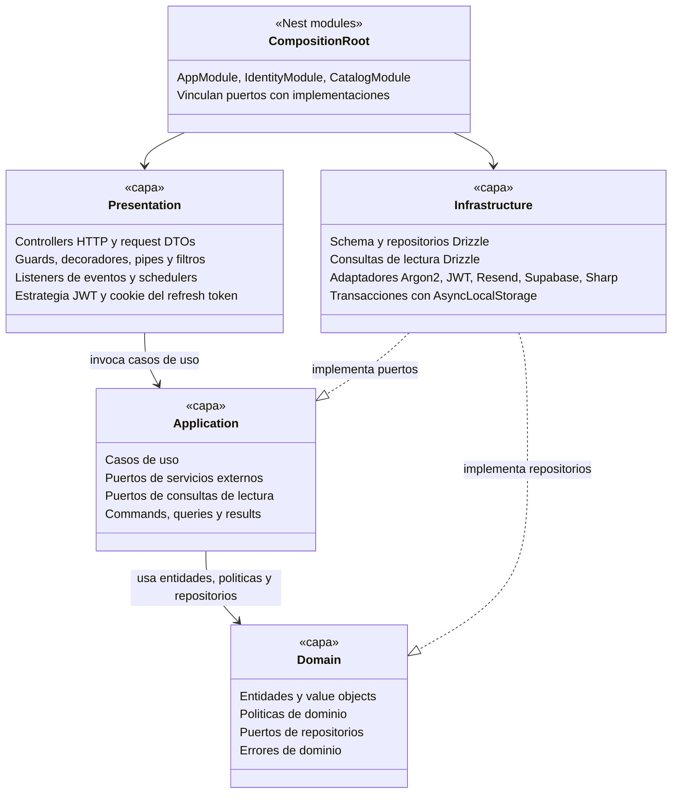

## 1. Capas y regla de dependencias

### Descripción de las capas

El diagrama representa la organización general del backend en capas. Cada elemento agrupa un conjunto de responsabilidades bien delimitadas:

- **Presentation (Presentación)**: es el punto de entrada al sistema. Recibe las solicitudes HTTP a través de los controladores, valida los datos de entrada mediante DTOs y pipes, y controla el acceso con guards y decoradores. También incluye los listeners de eventos, las tareas programadas (schedulers), la estrategia de autenticación JWT y el manejo de la cookie del refresh token. Su función es traducir las solicitudes externas en invocaciones a los casos de uso.

- **Application (Aplicación)**: contiene los casos de uso del sistema, es decir, las operaciones que puede realizar cada actor (dar de alta un producto, iniciar sesión, reordenar imágenes, entre otras). Orquesta la lógica de cada operación utilizando las entidades del dominio y define los puertos (interfaces) de los servicios externos y de las consultas de lectura que necesita, sin depender de su implementación concreta.

- **Domain (Dominio)**: es el núcleo del sistema. Contiene las entidades, los value objects, las políticas de negocio, los contratos de los repositorios y los errores propios del dominio. Aquí residen las reglas que definen el comportamiento del negocio, independientes de cualquier tecnología.

- **Infrastructure (Infraestructura)**: implementa los contratos definidos por las capas internas. Incluye el schema y los repositorios de Drizzle, las consultas de lectura, los adaptadores de servicios externos (Argon2 para contraseñas, JWT para tokens, Resend para mails, Supabase Storage para archivos y Sharp para el procesamiento de imágenes) y el manejo de transacciones.

- **CompositionRoot (Raíz de composición)**: corresponde a los módulos de NestJS (`AppModule`, `IdentityModule` y `CatalogModule`). Es el único componente que conoce tanto los contratos como sus implementaciones, y se encarga de vincularlos al iniciar la aplicación.

### Relaciones entre capas

- **Presentation → Application**: la capa de presentación invoca los casos de uso; no contiene lógica de negocio.
- **Application → Domain**: los casos de uso operan sobre las entidades, políticas y repositorios definidos en el dominio.
- **Infrastructure implementa Domain y Application**: la infraestructura provee las implementaciones concretas de los repositorios (definidos en el dominio) y de los puertos de servicios externos y consultas (definidos en la aplicación).
- **CompositionRoot → Presentation e Infrastructure**: los módulos de NestJS registran los controladores y vinculan cada contrato con su implementación.

### Reglas de arquitectura

1. **Dirección única de dependencias.** Las dependencias apuntan siempre hacia el núcleo del sistema. La capa de dominio no depende de ninguna otra capa; la capa de aplicación depende únicamente del dominio; y las capas de infraestructura y presentación dependen de las capas internas, sin depender entre sí.

2. **Independencia del framework en el núcleo.** Las capas de dominio y aplicación no utilizan NestJS, Drizzle, Express ni ninguna otra librería de infraestructura. Los casos de uso se implementan como clases TypeScript sin dependencias externas, lo que facilita su prueba y su mantenimiento.

3. **Contratos definidos como clases abstractas.** Los repositorios y servicios externos se declaran como clases abstractas. Esto permite que NestJS las utilice directamente como identificadores para la inyección de dependencias, y que TypeScript verifique en tiempo de compilación que cada implementación cumpla el contrato.

4. **Composición centralizada en los módulos.** Cada módulo de NestJS registra sus casos de uso e inyecta las implementaciones concretas correspondientes. Es el único punto del sistema donde se conocen simultáneamente los contratos y sus implementaciones.

5. **Separación entre operaciones de escritura y de lectura.** Las operaciones de escritura obtienen las entidades a través de los repositorios y validan las reglas de negocio antes de persistir los cambios. Las operaciones de lectura (listados y búsquedas) utilizan puertos de consulta específicos que devuelven los datos con el formato requerido por la respuesta, sin reconstruir entidades, lo que mejora el rendimiento.

6. **Control automático de dependencias.** Se incorpora una herramienta de análisis estático (`eslint-plugin-boundaries` o `dependency-cruiser`) para que el proceso de integración continua rechace cualquier importación que viole la dirección de dependencias entre capas.

Estructura de carpetas:

```text
src/
├── main.ts
├── app.module.ts
├── config/                                   # validación de variables de entorno
├── shared/
│   ├── domain/                               # Entity, errores, Money, Slug
│   ├── application/                          # TransactionManager, Clock, EventPublisher, Page, UniqueSlugGenerator
│   ├── infrastructure/
│   │   ├── database/
│   │   │   ├── drizzle.module.ts
│   │   │   ├── drizzle-executor.ts           # AsyncLocalStorage
│   │   │   ├── drizzle-transaction-manager.ts
│   │   │   ├── schema/                       # identity.schema.ts, catalog.schema.ts
│   │   │   └── migrations/                   # drizzle-kit + SQL manual (funciones y triggers)
│   │   ├── system-clock.ts
│   │   └── nest-event-publisher.ts
│   └── presentation/                         # guards, decoradores, filtros, pipes, DTO de paginación
└── modules/
    ├── identity/
    │   ├── domain/          entities/ value-objects/ services/ repositories/ errors/
    │   ├── application/     ports/ use-cases/ dto/
    │   ├── infrastructure/  persistence/ security/ notifications/
    │   ├── presentation/    http/ schedulers/
    │   └── identity.module.ts
    └── catalog/
        ├── domain/          category/ product/ product-image/
        ├── application/     ports/ services/ use-cases/{categories,products,product-images,search}/ dto/
        ├── infrastructure/  persistence/ storage/ images/
        ├── presentation/    http/ listeners/ schedulers/
        └── catalog.module.ts
```

---

## 2. Shared kernel

El _shared kernel_ (núcleo compartido) reúne las clases y abstracciones que utilizan todos los módulos del sistema, tanto `identity` como `catalog`. Su objetivo es evitar la duplicación de código y garantizar que aspectos comunes —como el manejo de errores, las transacciones o la paginación— se resuelvan de la misma forma en todo el backend.

Al igual que el resto del sistema, el núcleo compartido respeta la división en capas:

- **Dominio**: la entidad base de la que heredan todas las entidades, la jerarquía de errores de negocio y los value objects de uso general, como `Money` (montos monetarios) y `Slug` (identificadores legibles para las URL).
- **Aplicación**: la interfaz común de los casos de uso y los contratos de servicios transversales, como el manejo de transacciones, la obtención de la fecha y hora actual, la publicación de eventos, la generación de slugs únicos y las estructuras de paginación.
- **Infraestructura**: las implementaciones concretas de esos contratos, basadas en Drizzle ORM para las transacciones y en el sistema de eventos de NestJS.
- **Presentación**: los guards, decoradores y filtros que se aplican de forma global a todos los endpoints, encargados de la autenticación, la autorización por roles, la limitación de solicitudes y la conversión de los errores internos en respuestas HTTP con el código correspondiente.

```mermaid
classDiagram
    class Entity {
        <<abstract domain>>
        #id: string
        +getId() string
        +equals(other: Entity) boolean
    }

    class DomainError {
        <<abstract domain>>
        +code: string
        +message: string
    }
    class EntityNotFoundError { <<domain>> }
    class ConflictError { <<domain>> }
    class BusinessRuleViolationError { <<domain>> }
    class InvalidValueError { <<domain>> }
    class AuthenticationError { <<application>> }
    class ForbiddenActionError { <<application>> }

    class Money {
        <<value object domain>>
        -cents: number
        +fromDecimal(value: string)$ Money
        +fromCents(cents: number)$ Money
        +toDecimalString() string
        +toNumber() number
        +isPositive() boolean
        +isLessThan(other: Money) boolean
    }
    class Slug {
        <<value object domain>>
        -value: string
        +fromText(text: string)$ Slug
        +fromValue(value: string)$ Slug
        +withSuffix(n: number) Slug
        +toString() string
    }

    class UseCase {
        <<interface application>>
        +execute(input: TInput) Promise~TOutput~
    }
    class TransactionManager {
        <<abstract application>>
        +run(work: TransactionalWork) Promise~T~
    }
    class Clock {
        <<abstract application>>
        +now() Date
    }
    class EventPublisher {
        <<abstract application>>
        +publish(event: ApplicationEvent) Promise~void~
    }
    class UniqueSlugGenerator {
        <<service application>>
        +generate(text: string, exists: SlugExistsFn) Promise~Slug~
    }
    class PageRequest {
        <<application>>
        +page: number
        +limit: number
    }
    class Page~T~ {
        <<application>>
        +items: T[]
        +page: number
        +limit: number
        +totalItems: number
        +totalPages: number
    }
    class SortDirection {
        <<enumeration>>
        ASC
        DESC
    }
    class RecordStatusFilter {
        <<enumeration>>
        ACTIVE
        INACTIVE
        DELETED
        ALL
    }

    class DrizzleClient {
        <<infrastructure>>
        +db: NodePgDatabase~Schema~
    }
    class DrizzleExecutor {
        <<infrastructure>>
        -storage: AsyncLocalStorage~PgTransaction~
        -client: DrizzleClient
        +current() DbExecutor
        +runInContext(tx: PgTransaction, work: TransactionalWork) Promise~T~
    }
    class DrizzleTransactionManager {
        <<infrastructure>>
        -client: DrizzleClient
        -executor: DrizzleExecutor
        +run(work: TransactionalWork) Promise~T~
    }
    class SystemClock {
        <<infrastructure>>
        +now() Date
    }
    class NestEventPublisher {
        <<infrastructure>>
        -emitter: EventEmitter2
        +publish(event: ApplicationEvent) Promise~void~
    }

    class AuthUser {
        <<interface presentation>>
        +id: string
        +email: string
        +name: string
        +role: UserRole
        +mustChangePassword: boolean
    }
    class Public { <<decorator presentation>> }
    class Roles { <<decorator presentation>> }
    class AllowPendingPasswordChange { <<decorator presentation>> }
    class CurrentUser { <<decorator presentation>> }
    class ThrottlerGuard { <<guard presentation>> }
    class JwtAuthGuard {
        <<guard presentation>>
        +canActivate(context: ExecutionContext) Promise~boolean~
    }
    class MustChangePasswordGuard {
        <<guard presentation>>
        +canActivate(context: ExecutionContext) boolean
    }
    class RolesGuard {
        <<guard presentation>>
        +canActivate(context: ExecutionContext) boolean
    }
    class OriginGuard {
        <<guard presentation>>
        -allowedOrigins: string[]
        +canActivate(context: ExecutionContext) boolean
    }
    class PaginationRequestDto {
        <<presentation>>
        +page: number
        +limit: number
    }
    class ErrorResponseFilter {
        <<filter presentation>>
        +catch(exception: unknown, host: ArgumentsHost) void
        -fromDomainError(error: DomainError) HttpException
        -fromApplicationError(error: Error) HttpException
        -fromDatabaseError(error: DatabaseError) HttpException
    }

    DomainError <|-- EntityNotFoundError
    DomainError <|-- ConflictError
    DomainError <|-- BusinessRuleViolationError
    DomainError <|-- InvalidValueError
    DomainError <|-- AuthenticationError
    DomainError <|-- ForbiddenActionError
    DrizzleTransactionManager ..|> TransactionManager
    DrizzleTransactionManager --> DrizzleExecutor
    DrizzleExecutor --> DrizzleClient
    SystemClock ..|> Clock
    NestEventPublisher ..|> EventPublisher
    UniqueSlugGenerator ..> Slug
    JwtAuthGuard ..> Public
    MustChangePasswordGuard ..> AllowPendingPasswordChange
    RolesGuard ..> Roles
    CurrentUser ..> AuthUser
    ErrorResponseFilter ..> DomainError
```

### Clases principales

#### Dominio

- **`Entity`**: clase base abstracta de la que heredan todas las entidades del sistema (usuarios, productos, categorías, imágenes). Define el identificador único y el criterio de igualdad entre entidades: dos entidades son iguales si tienen el mismo identificador, aunque el resto de sus datos difiera.

- **`DomainError`**: clase base de todos los errores del sistema. Cada error tiene un código y un mensaje, y se especializa según su naturaleza:
  - `EntityNotFoundError`: el recurso solicitado no existe.
  - `ConflictError`: la operación entra en conflicto con datos existentes (por ejemplo, un email ya registrado).
  - `BusinessRuleViolationError`: la operación viola una regla de negocio (por ejemplo, eliminar la última imagen de un producto).
  - `InvalidValueError`: un dato no cumple el formato o rango esperado.

  Existen además dos errores propios de la capa de aplicación que heredan de esta misma clase: `AuthenticationError` (credenciales inválidas) y `ForbiddenActionError` (acción no permitida para el usuario).

- **`Money`**: value object que representa montos en pesos. Internamente trabaja con centavos enteros para evitar los errores de redondeo propios de los números decimales, y ofrece operaciones de comparación, como verificar que el precio de oferta sea menor al precio regular.

- **`Slug`**: value object que representa el identificador legible de un producto o categoría en la URL (por ejemplo, `cuaderno-rayado-a4`). Se genera a partir de un texto y garantiza un formato válido: minúsculas, sin tildes ni espacios.

#### Aplicación

- **`UseCase`**: interfaz común que implementan todos los casos de uso del sistema, con un único método `execute`. Esto le da una estructura uniforme a todas las operaciones.

- **`TransactionManager`**: contrato para ejecutar un conjunto de operaciones dentro de una misma transacción de base de datos. Si alguna falla, se revierten todas. Los casos de uso lo utilizan sin conocer cómo se implementa.

- **`Clock`**: contrato para obtener la fecha y hora actual. Permite controlar el tiempo en las pruebas automatizadas, por ejemplo, para verificar el vencimiento de una clave temporal o de una oferta.

- **`EventPublisher`**: contrato para publicar eventos del sistema. Permite desacoplar acciones secundarias de la operación principal; por ejemplo, al subir una imagen se publica un evento y su procesamiento se realiza de forma asincrónica.

- **`UniqueSlugGenerator`**: servicio que genera un slug único; si ya existe uno igual, le agrega un sufijo numérico (`cuaderno-rayado-a4-2`).

- **`Page` y `PageRequest`**: estructuras de paginación. `PageRequest` indica la página y la cantidad de elementos solicitados, y `Page` devuelve los resultados junto con el total de elementos y de páginas.

#### Infraestructura

- **`DrizzleTransactionManager`**: implementación de `TransactionManager` con Drizzle ORM. Abre la transacción y la almacena en un contexto de ejecución (`AsyncLocalStorage`), de modo que todos los repositorios involucrados en la operación la utilicen automáticamente sin necesidad de recibirla como parámetro.

- **`DrizzleExecutor`**: provee a los repositorios la conexión que deben usar: la transacción activa, si existe, o la conexión normal en caso contrario.

- **`SystemClock`** y **`NestEventPublisher`**: implementaciones concretas de `Clock` y `EventPublisher`, basadas en el reloj del sistema y en el módulo de eventos de NestJS.

#### Presentación

- **Guards globales**: se ejecutan en orden antes de cada solicitud:
  1. `ThrottlerGuard`: limita la cantidad de solicitudes para prevenir abusos.
  2. `JwtAuthGuard`: verifica que el usuario esté autenticado, salvo en los endpoints marcados como públicos.
  3. `MustChangePasswordGuard`: bloquea el acceso si el usuario tiene pendiente el cambio de su contraseña temporal.
  4. `RolesGuard`: verifica que el rol del usuario (`ADMIN` o `SELLER`) tenga permiso para la operación.

  Además, `OriginGuard` controla el origen de la solicitud en los endpoints que utilizan la cookie del refresh token.

- **Decoradores** (`@Public`, `@Roles`, `@AllowPendingPasswordChange`, `@CurrentUser`): marcan cada endpoint con la información que necesitan los guards, como si es público o qué roles pueden acceder, y permiten obtener los datos del usuario autenticado.

- **`ErrorResponseFilter`**: intercepta todos los errores y los convierte en respuestas HTTP con el código correspondiente, sin exponer detalles internos del sistema.

### Relación con el resto del sistema

Los módulos `identity` y `catalog` se construyen sobre este núcleo compartido: todas sus entidades heredan de `Entity`, todos sus errores de `DomainError`, y todos sus casos de uso implementan `UseCase` y utilizan `TransactionManager`, `Clock` y `EventPublisher` sin depender de su implementación concreta. A continuación se detallan los tres mecanismos transversales que el núcleo aplica sobre todo el sistema.

#### Manejo de transacciones

Cuando un caso de uso necesita ejecutar varias operaciones de forma atómica, utiliza `TransactionManager`. Su implementación abre una transacción en la base de datos y la almacena en un contexto de ejecución (`AsyncLocalStorage`). Cada repositorio obtiene, a través de `DrizzleExecutor`, la transacción activa si existe, o la conexión habitual en caso contrario.

Este mecanismo tiene dos ventajas: los casos de uso no necesitan transmitir la transacción como parámetro entre los distintos repositorios, y la capa de dominio permanece completamente ajena a la existencia de transacciones.

Los archivos almacenados en Supabase Storage no forman parte de la transacción de base de datos. Por ese motivo se aplica una estrategia de **compensación**: los archivos se suben antes de iniciar la transacción y, si esta falla, el caso de uso los elimina para no dejar archivos huérfanos. En sentido inverso, la eliminación de archivos se realiza únicamente después de que la transacción se confirma correctamente.

#### Mapeo de errores

`ErrorResponseFilter` intercepta todos los errores del sistema y los convierte en respuestas HTTP con el código correspondiente. Además de los errores propios de la aplicación, traduce las violaciones de restricciones detectadas por PostgreSQL, de modo que las reglas aplicadas en la base de datos también lleguen al cliente con un mensaje adecuado.

| Error                                                                                                    | Código HTTP                        |
| :------------------------------------------------------------------------------------------------------- | :--------------------------------- |
| `InvalidValueError` y errores de validación de datos de entrada                                          | 400                                |
| `AuthenticationError`                                                                                    | 401                                |
| `ForbiddenActionError`                                                                                   | 403                                |
| `EntityNotFoundError`                                                                                    | 404                                |
| `ConflictError` y errores de PostgreSQL `23505` (valor duplicado) y `23503` (referencia inválida)        | 409                                |
| `BusinessRuleViolationError` y error de PostgreSQL `23514` (restricción `CHECK` o trigger de validación) | 422                                |
| Cualquier otro error                                                                                     | 500, sin exponer detalles internos |

#### Orden de ejecución de los guards

Los guards globales se ejecutan en el siguiente orden antes de cada solicitud:

1. `ThrottlerGuard`: limita la cantidad de solicitudes para prevenir abusos.
2. `JwtAuthGuard`: verifica que el usuario esté autenticado, salvo en los endpoints marcados como públicos.
3. `MustChangePasswordGuard`: bloquea el acceso si el usuario tiene pendiente el cambio de su contraseña temporal.
4. `RolesGuard`: verifica que el rol del usuario (`ADMIN` o `SELLER`) tenga permiso para la operación.

`OriginGuard` no es global: se aplica únicamente en los endpoints que leen la cookie del refresh token, para verificar que la solicitud provenga del dominio del frontend.

---

## 3. Identity · Dominio

El módulo `identity` es el responsable de la gestión de los usuarios del panel de administración, su autenticación y el control de sus sesiones. Esta sección presenta su capa de dominio, donde se definen las entidades, los value objects y las reglas de negocio que gobiernan el ciclo de vida de un usuario.

El elemento central es la entidad **`User`**, que concentra toda la lógica relacionada con los datos del usuario, su rol, su estado, sus contraseñas —tanto la definitiva como las temporales— y su baja lógica y reactivación. Se complementa con la entidad **`Session`**, que representa cada sesión iniciada a partir de un refresh token y permite revocarla cuando corresponde.

Las reglas que involucran a más de un usuario, como impedir que un administrador se modifique a sí mismo o garantizar que el sistema nunca quede sin un administrador activo, se resuelven en servicios de dominio específicos. De esta forma, las restricciones más sensibles del sistema en materia de seguridad y acceso quedan protegidas en el núcleo de la aplicación, con independencia de cómo se invoquen.

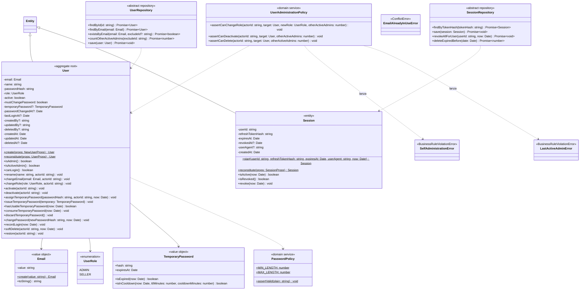

### Clases principales

#### Entidades

- **`User`**: entidad principal del módulo y raíz de agregado, es decir, el único punto de acceso para modificar los datos de un usuario. Contiene su email, nombre, rol, estado, contraseña (almacenada siempre como hash), clave temporal pendiente y datos de auditoría (quién lo creó, modificó o dio de baja, y cuándo). Todas las modificaciones se realizan a través de sus métodos, que validan las reglas de negocio antes de aplicar cualquier cambio.

- **`Session`**: representa una sesión iniciada por un usuario. Almacena el hash del refresh token, su fecha de vencimiento, el dispositivo desde el que se inició y, si corresponde, la fecha en que fue revocada. Una sesión es válida mientras no haya vencido ni haya sido revocada.

#### Value objects y enumeraciones

- **`Email`**: garantiza que todo email del sistema tenga un formato válido y esté normalizado en minúsculas, lo que evita registros duplicados por diferencias de mayúsculas.

- **`TemporaryPassword`**: representa la clave temporal generada por el flujo de "olvidé mi contraseña", compuesta por su hash y su fecha de vencimiento. Permite verificar si la clave está vencida y si se encuentra dentro del período de espera que impide solicitar una nueva clave de forma reiterada.

- **`UserRole`**: enumeración con los dos roles del sistema: `ADMIN` y `SELLER`.

#### Servicios de dominio

- **`PasswordPolicy`**: define los requisitos que debe cumplir toda contraseña.

- **`UserAdministrationPolicy`**: concentra las reglas que involucran a más de un usuario, como las acciones que un administrador no puede realizar sobre sí mismo o la obligación de que siempre exista al menos un administrador activo.

#### Repositorios

- **`UserRepository`** y **`SessionRepository`**: contratos que definen cómo se obtienen y almacenan usuarios y sesiones. Incluyen operaciones específicas del negocio, como contar los administradores activos, verificar si un email ya está en uso, revocar todas las sesiones de un usuario o eliminar las sesiones vencidas. Su implementación concreta se encuentra en la capa de infraestructura.

#### Errores de dominio

- **`EmailAlreadyInUseError`**: el email ya pertenece a otro usuario (error de conflicto).
- **`SelfAdministrationError`**: un administrador intenta realizar sobre sí mismo una acción no permitida (violación de regla de negocio).
- **`LastActiveAdminError`**: la operación dejaría al sistema sin administradores activos (violación de regla de negocio).

### Reglas de negocio protegidas por el dominio

#### Datos del usuario

- El email debe tener un formato válido y se almacena normalizado en minúsculas.
- Toda contraseña debe tener entre 8 y 128 caracteres. Esta validación se aplica antes de generar el hash, tanto para las contraseñas definitivas como para las claves temporales asignadas por un administrador.

#### Gestión de contraseñas

El sistema distingue tres situaciones:

- **Alta o reseteo por parte de un administrador** (`assignTemporaryPassword`): la nueva clave reemplaza a la contraseña actual, se marca la obligación de cambiarla en el próximo ingreso y se descarta cualquier clave temporal pendiente por olvido.

- **Olvido de contraseña** (`issueTemporaryPassword`): se genera una clave temporal que convive con la contraseña actual, sin reemplazarla. De esta forma, si el usuario recuerda su contraseña o la solicitud no fue realizada por él, puede seguir ingresando normalmente.

- **Uso de la clave temporal** (`consumeTemporaryPassword`): al ingresar con la clave temporal, esta pasa a ser la contraseña del usuario, se marca la obligación de cambiarla y se elimina, ya que es de un solo uso. La operación se rechaza si la clave está vencida.

Cuando el usuario define su nueva contraseña (`changePassword`), se elimina la obligación de cambio, se descarta cualquier clave temporal pendiente y se registra la fecha del cambio.

#### Baja y reactivación

- **Baja** (`softDelete`): se registra la fecha y el usuario que realizó la baja, y la cuenta queda desactivada. El sistema no contempla la eliminación definitiva de usuarios.
- **Reactivación** (`restore`): se eliminan los datos de la baja, se vuelve a activar la cuenta y se registra quién realizó la modificación. La operación se rechaza si el usuario no estaba dado de baja.

#### Reglas de administración

- Un administrador no puede cambiar su propio rol, desactivarse ni darse de baja a sí mismo.
- Ninguna operación puede dejar al sistema sin al menos un administrador activo.

Estas reglas se validan en el dominio y, de forma complementaria, en la base de datos mediante triggers, lo que garantiza su cumplimiento aun ante un error en la aplicación.

### Relación con el resto del sistema

El dominio de `identity` es la base sobre la que se construyen la autenticación y el control de acceso de todo el backend. Se vincula con los demás componentes de la siguiente manera:

- **Con el núcleo compartido**: `User` y `Session` heredan de `Entity`, y los errores del módulo especializan los errores base del sistema. Gracias a esto, `ErrorResponseFilter` los convierte automáticamente en la respuesta HTTP correspondiente: `EmailAlreadyInUseError` se devuelve como `409` y los errores de reglas de administración como `422`.

- **Con la capa de aplicación**: los casos de uso del módulo —como el inicio de sesión, la renovación de la sesión, el alta, edición, baja y reactivación de usuarios, o el reseteo de contraseñas— obtienen las entidades a través de los repositorios, ejecutan sus métodos y aplican las políticas de dominio antes de guardar los cambios. El dominio define qué operaciones son válidas; la aplicación decide cuándo y en qué orden se ejecutan.

- **Con la capa de infraestructura**: los repositorios se implementan con Drizzle ORM sobre las tablas `users` y `sessions`. Las contraseñas se validan con `PasswordPolicy` y luego se transforman en hash mediante Argon2id, de modo que el dominio nunca maneja ni almacena contraseñas en texto plano.

- **Con la capa de presentación**: los datos del usuario autenticado —su rol y la obligación de cambiar la contraseña— son los que utilizan los guards globales para autorizar o bloquear cada solicitud. Además, el identificador del usuario que realiza cada acción se obtiene siempre de la sesión autenticada y nunca de los datos enviados por el cliente, lo que impide suplantar al autor de una operación.

- **Con el módulo `catalog`**: los productos registran qué usuario los creó y quién realizó la última modificación, a partir del identificador del usuario autenticado. De esta forma, `identity` aporta la trazabilidad de las operaciones realizadas sobre el catálogo.

- **Con la base de datos**: las reglas más críticas del dominio se refuerzan mediante triggers, que impiden dejar al sistema sin un administrador activo y revocan automáticamente las sesiones de un usuario cuando cambia su contraseña, su rol o su estado, o cuando es dado de baja.

## 4. Identity · Aplicación

Esta sección presenta la capa de aplicación del módulo `identity`, donde se definen los casos de uso que permiten a los usuarios autenticarse y a los administradores gestionar las cuentas del panel. Cada caso de uso representa una operación concreta del sistema y se encarga de coordinar las entidades y reglas del dominio con los servicios externos necesarios para llevarla a cabo.

Los casos de uso se agrupan en dos conjuntos:

- **Autenticación y sesiones**: inicio y cierre de sesión, renovación de la sesión mediante el refresh token, recuperación de contraseña olvidada, cambio de contraseña y validación del usuario autenticado en cada solicitud.
- **Administración de usuarios** (exclusivos del rol `ADMIN`): listado, consulta, alta, edición, baja, reactivación y envío de una contraseña temporal a otro usuario.

Para comunicarse con servicios externos —como la generación de hashes de contraseñas, la emisión de tokens o el envío de mails—, la capa de aplicación define contratos propios (puertos) cuya implementación concreta se resuelve en la capa de infraestructura. Esto permite que la lógica de cada operación sea independiente de la tecnología utilizada y que pueda probarse de forma aislada.

Además del diagrama de clases, la sección describe paso a paso los flujos principales del módulo, con especial atención a las medidas de seguridad aplicadas en cada uno.

```mermaid
classDiagram
    class PasswordHasher {
        <<abstract port>>
        +hash(plain: string) Promise~string~
        +verify(hash: string, plain: string) Promise~boolean~
    }
    class TemporaryPasswordGenerator {
        <<abstract port>>
        +generate() string
    }
    class AccessTokenService {
        <<abstract port>>
        +issue(user: User) AccessToken
    }
    class RefreshTokenService {
        <<abstract port>>
        +generate() string
        +hash(token: string) string
    }
    class PasswordResetNotifier {
        <<abstract port>>
        +sendTemporaryPassword(to: string, name: string, temporaryPassword: string, expiresAt: Date) Promise~void~
    }
    class UserQueries {
        <<abstract port>>
        +findPage(query: ListUsersQuery) Promise~Page~UserResult~~
        +findById(id: string) Promise~UserResult~
    }
    class AuthSettings {
        <<settings>>
        +accessTokenTtlSeconds: number
        +refreshTokenTtlDays: number
        +temporaryPasswordTtlMinutes: number
        +passwordResetCooldownMinutes: number
    }
    class AccessToken {
        +token: string
        +expiresInSeconds: number
    }

    class SessionIssuer {
        <<application service>>
        -sessions: SessionRepository
        -accessTokens: AccessTokenService
        -refreshTokens: RefreshTokenService
        -clock: Clock
        -settings: AuthSettings
        +issue(user: User, userAgent: string) Promise~AuthSessionResult~
    }

    class LoginUseCase {
        -users: UserRepository
        -hasher: PasswordHasher
        -sessionIssuer: SessionIssuer
        -transaction: TransactionManager
        -clock: Clock
        +execute(command: LoginCommand) Promise~AuthSessionResult~
    }
    class RefreshSessionUseCase {
        -users: UserRepository
        -sessions: SessionRepository
        -refreshTokens: RefreshTokenService
        -sessionIssuer: SessionIssuer
        -transaction: TransactionManager
        -clock: Clock
        +execute(command: RefreshSessionCommand) Promise~AuthSessionResult~
    }
    class LogoutUseCase {
        -sessions: SessionRepository
        -refreshTokens: RefreshTokenService
        -clock: Clock
        +execute(command: LogoutCommand) Promise~void~
    }
    class RequestPasswordResetUseCase {
        -users: UserRepository
        -generator: TemporaryPasswordGenerator
        -hasher: PasswordHasher
        -notifier: PasswordResetNotifier
        -clock: Clock
        -settings: AuthSettings
        +execute(command: RequestPasswordResetCommand) Promise~void~
    }
    class ChangePasswordUseCase {
        -users: UserRepository
        -hasher: PasswordHasher
        -sessionIssuer: SessionIssuer
        -transaction: TransactionManager
        -clock: Clock
        +execute(command: ChangePasswordCommand) Promise~AuthSessionResult~
    }
    class ResolveAuthenticatedUserUseCase {
        -users: UserRepository
        +execute(query: ResolveAuthenticatedUserQuery) Promise~AuthenticatedUserResult~
    }
    class GetCurrentUserUseCase {
        -queries: UserQueries
        +execute(userId: string) Promise~UserResult~
    }
    class PurgeExpiredSessionsUseCase {
        -sessions: SessionRepository
        -clock: Clock
        +execute() Promise~number~
    }

    class ListUsersUseCase {
        -queries: UserQueries
        +execute(query: ListUsersQuery) Promise~Page~UserResult~~
    }
    class GetUserUseCase {
        -queries: UserQueries
        +execute(userId: string) Promise~UserResult~
    }
    class CreateUserUseCase {
        -users: UserRepository
        -hasher: PasswordHasher
        -queries: UserQueries
        -clock: Clock
        +execute(command: CreateUserCommand) Promise~UserResult~
    }
    class UpdateUserUseCase {
        -users: UserRepository
        -policy: UserAdministrationPolicy
        -queries: UserQueries
        -transaction: TransactionManager
        +execute(command: UpdateUserCommand) Promise~UserResult~
    }
    class ResetUserPasswordUseCase {
        -users: UserRepository
        -generator: TemporaryPasswordGenerator
        -hasher: PasswordHasher
        -notifier: PasswordResetNotifier
        -transaction: TransactionManager
        -clock: Clock
        +execute(command: ResetUserPasswordCommand) Promise~void~
    }
    class DeleteUserUseCase {
        -users: UserRepository
        -policy: UserAdministrationPolicy
        -transaction: TransactionManager
        -clock: Clock
        +execute(command: DeleteUserCommand) Promise~void~
    }
    class RestoreUserUseCase {
        -users: UserRepository
        -queries: UserQueries
        -transaction: TransactionManager
        +execute(command: RestoreUserCommand) Promise~UserResult~
    }

    class LoginCommand {
        +email: string
        +password: string
        +userAgent: string
    }
    class RefreshSessionCommand {
        +refreshToken: string
        +userAgent: string
    }
    class LogoutCommand {
        +refreshToken: string
    }
    class RequestPasswordResetCommand {
        +email: string
    }
    class ChangePasswordCommand {
        +userId: string
        +currentPassword: string
        +newPassword: string
        +userAgent: string
    }
    class ResolveAuthenticatedUserQuery {
        +userId: string
        +tokenIssuedAt: Date
    }
    class CreateUserCommand {
        +actorId: string
        +email: string
        +name: string
        +role: UserRole
        +temporaryPassword: string
    }
    class UpdateUserCommand {
        +actorId: string
        +userId: string
        +email?: string
        +name?: string
        +role?: UserRole
        +isActive?: boolean
    }
    class ResetUserPasswordCommand {
        +actorId: string
        +userId: string
    }
    class DeleteUserCommand {
        +actorId: string
        +userId: string
    }
    class RestoreUserCommand {
        +actorId: string
        +userId: string
    }
    class ListUsersQuery {
        +q?: string
        +role?: UserRole
        +status: RecordStatusFilter
        +sortDir: SortDirection
        +page: number
        +limit: number
    }

    class AuthSessionResult {
        +accessToken: string
        +accessTokenExpiresIn: number
        +refreshToken: string
        +refreshTokenExpiresAt: Date
        +user: AuthenticatedUserResult
    }
    class AuthenticatedUserResult {
        +id: string
        +email: string
        +name: string
        +role: UserRole
        +mustChangePassword: boolean
    }
    class UserResult {
        +id: string
        +email: string
        +name: string
        +role: UserRole
        +isActive: boolean
        +mustChangePassword: boolean
        +lastLoginAt?: Date
        +createdAt: Date
        +updatedAt: Date
        +deletedAt?: Date
    }
    class UserSummaryResult {
        +id: string
        +name: string
    }

    SessionIssuer --> AccessTokenService
    SessionIssuer --> RefreshTokenService
    SessionIssuer ..> AuthSessionResult
    LoginUseCase --> SessionIssuer
    LoginUseCase --> PasswordHasher
    RefreshSessionUseCase --> SessionIssuer
    RefreshSessionUseCase --> RefreshTokenService
    LogoutUseCase --> RefreshTokenService
    ChangePasswordUseCase --> SessionIssuer
    ChangePasswordUseCase --> PasswordHasher
    RequestPasswordResetUseCase --> TemporaryPasswordGenerator
    RequestPasswordResetUseCase --> PasswordHasher
    RequestPasswordResetUseCase --> PasswordResetNotifier
    RequestPasswordResetUseCase --> AuthSettings
    SessionIssuer --> AuthSettings
    AccessTokenService ..> AccessToken
    GetCurrentUserUseCase --> UserQueries
    ListUsersUseCase --> UserQueries
    GetUserUseCase --> UserQueries
    CreateUserUseCase --> PasswordHasher
    ResetUserPasswordUseCase --> PasswordHasher
    ResetUserPasswordUseCase --> TemporaryPasswordGenerator
    ResetUserPasswordUseCase --> PasswordResetNotifier
    RestoreUserUseCase --> UserQueries
    AuthSessionResult --> AuthenticatedUserResult
```

### Clases principales

#### Puertos (contratos con servicios externos)

- **`PasswordHasher`**: genera el hash de una contraseña y verifica si una contraseña coincide con un hash almacenado.
- **`TemporaryPasswordGenerator`**: genera claves temporales aleatorias.
- **`AccessTokenService`**: emite el access token (JWT) que el usuario utiliza para autenticarse en cada solicitud.
- **`RefreshTokenService`**: genera los refresh tokens y calcula su hash, ya que en la base de datos nunca se almacena el token real.
- **`PasswordResetNotifier`**: envía por mail las claves temporales.
- **`UserQueries`**: resuelve las consultas de lectura de usuarios (listados paginados y consulta individual) sin reconstruir entidades.

#### Servicios y configuración

- **`SessionIssuer`**: servicio de aplicación que centraliza la creación de una sesión: genera el access token y el refresh token, y registra la sesión en la base de datos. Lo utilizan el inicio de sesión, la renovación de sesión y el cambio de contraseña, lo que evita duplicar esta lógica.
- **`AuthSettings`**: agrupa los parámetros configurables de la autenticación: duración del access token, del refresh token y de la clave temporal, y el período de espera entre solicitudes de recuperación de contraseña.

#### Casos de uso

Cada operación del módulo se implementa como un caso de uso independiente:

| Grupo                      | Casos de uso                                                                                                                                                                                                |
| :------------------------- | :---------------------------------------------------------------------------------------------------------------------------------------------------------------------------------------------------------- |
| Autenticación y sesiones   | `LoginUseCase`, `RefreshSessionUseCase`, `LogoutUseCase`, `RequestPasswordResetUseCase`, `ChangePasswordUseCase`, `ResolveAuthenticatedUserUseCase`, `GetCurrentUserUseCase`, `PurgeExpiredSessionsUseCase` |
| Administración de usuarios | `ListUsersUseCase`, `GetUserUseCase`, `CreateUserUseCase`, `UpdateUserUseCase`, `ResetUserPasswordUseCase`, `DeleteUserUseCase`, `RestoreUserUseCase`                                                       |

#### Estructuras de datos

- **Commands y queries**: representan los datos de entrada de cada caso de uso (por ejemplo, `LoginCommand` o `ListUsersQuery`). Las operaciones administrativas incluyen el identificador del usuario que las realiza (`actorId`), utilizado para la auditoría.
- **Results**: representan los datos de salida. `AuthSessionResult` contiene los tokens de la sesión y los datos del usuario autenticado; `UserResult` contiene los datos de un usuario para su visualización en el panel. Ninguno incluye información sensible, como hashes de contraseñas.

### Flujos principales

#### Inicio de sesión

Se ejecuta dentro de una transacción, en los siguientes pasos:

1. Se busca el usuario por email, excluyendo a los dados de baja.
2. Si la contraseña ingresada coincide con la contraseña actual y existe una clave temporal pendiente, esta se descarta, ya que el usuario recordó su contraseña.
3. Si no coincide, se compara con la clave temporal vigente. Si coincide, la clave temporal pasa a ser la contraseña del usuario, con la obligación de cambiarla.
4. Se verifica que el usuario esté habilitado para ingresar, se registra la fecha del inicio de sesión, se guardan los cambios y, por último, se crea la sesión.

El orden del último paso es deliberado: la base de datos revoca automáticamente las sesiones de un usuario cuando cambia su contraseña, por lo que la nueva sesión debe crearse después de guardar el usuario para no ser revocada.

Por seguridad, ante un email inexistente, una contraseña incorrecta o un usuario inactivo, el sistema devuelve siempre el mismo error, sin indicar cuál fue la causa. Además, en todos los casos se ejecuta una verificación de hash, de modo que el tiempo de respuesta sea similar y no permita deducir qué cuentas existen.

#### Renovación de sesión (rotación del refresh token)

1. Se busca la sesión a partir del hash del refresh token recibido. Si no existe o está vencida, se rechaza la solicitud.
2. Si la sesión existe pero ya había sido revocada, se interpreta como un posible robo del token: se revocan todas las sesiones del usuario y se rechaza la solicitud.
3. Si la sesión es válida, se revoca, se verifica que el usuario siga habilitado y se emite una sesión nueva con un nuevo refresh token.

De esta forma, cada refresh token puede utilizarse una única vez, y cualquier intento de reutilización cierra todas las sesiones del usuario.

#### Cierre de sesión

Se revoca la sesión asociada al refresh token recibido. La operación es idempotente: si el token no existe o ya fue revocado, finaliza sin error.

#### Recuperación de contraseña olvidada

1. La operación finaliza siempre sin error, exista o no el email ingresado, para no revelar qué cuentas están registradas.
2. Si el usuario existe, está habilitado y no realizó otra solicitud en los últimos 5 minutos, se genera una clave temporal, se almacena como hash con un vencimiento de 30 minutos y se envía por mail.
3. No se revocan las sesiones activas ni se invalida la contraseña actual, ya que la solicitud podría no haber sido realizada por el titular de la cuenta.

#### Cambio de contraseña

Disponible para cualquier rol. Se verifica la contraseña actual, se valida que la nueva cumpla los requisitos de `PasswordPolicy` y que sea distinta de la anterior, y se guarda el cambio. Como la base de datos revoca automáticamente las sesiones existentes, se emite una sesión nueva después de guardar, para que el usuario no deba volver a iniciar sesión.

#### Validación del usuario autenticado

Se ejecuta en cada solicitud a un endpoint protegido. La solicitud se rechaza si el usuario no existe, fue dado de baja, está inactivo, o si el access token fue emitido antes del último cambio de contraseña. El rol y la obligación de cambio de contraseña se obtienen siempre de la base de datos y no del token, de modo que cualquier cambio sobre el usuario tiene efecto inmediato.

#### Alta de usuario

El administrador define una contraseña inicial, que el frontend solicita confirmar. El caso de uso valida la contraseña, verifica que el email no esté en uso, genera el hash y la asigna como clave temporal, por lo que el nuevo usuario debe cambiarla en su primer ingreso.

#### Envío de contraseña temporal a otro usuario

Dentro de una transacción, el sistema genera una clave temporal, la almacena como hash reemplazando la contraseña anterior y la envía por mail. Al cambiar la contraseña, la base de datos revoca las sesiones activas del usuario. Si el envío del mail falla, la transacción se revierte: el usuario conserva su contraseña anterior y el administrador recibe el error para reintentar la operación.

#### Reactivación de usuario

Se verifica que el email del usuario no esté siendo utilizado por otro usuario activo; en ese caso, la operación se rechaza con `EmailAlreadyInUseError`. Si el email está disponible, se reactiva la cuenta.

#### Edición y baja de usuario

Dentro de una transacción, se obtiene el usuario, se cuenta la cantidad de otros administradores activos y se consulta `UserAdministrationPolicy` antes de aplicar cualquier cambio, para garantizar que un administrador no se modifique a sí mismo y que el sistema no quede sin administradores activos.

### Relación con el resto del sistema

- **Con el dominio**: los casos de uso no contienen reglas de negocio propias; obtienen las entidades a través de los repositorios, invocan sus métodos y consultan las políticas de dominio. La capa de aplicación define el orden de las operaciones; el dominio define cuáles son válidas.

- **Con el núcleo compartido**: los casos de uso utilizan `TransactionManager` para garantizar la atomicidad de las operaciones y `Clock` para obtener la fecha actual, lo que permite probar los vencimientos de claves y sesiones de forma controlada.

- **Con la capa de infraestructura**: cada puerto se implementa con una tecnología concreta: Argon2id para el hash de contraseñas, JWT para el access token, SHA-256 para el hash de los refresh tokens y Resend para el envío de mails.

- **Con la capa de presentación**: los controladores reciben las solicitudes, construyen los commands y queries —completando el identificador del usuario autenticado a partir de la sesión y nunca de los datos enviados por el cliente— e invocan el caso de uso correspondiente. La estrategia JWT utiliza `ResolveAuthenticatedUserUseCase` para validar al usuario en cada solicitud, y una tarea programada ejecuta `PurgeExpiredSessionsUseCase` para eliminar periódicamente las sesiones vencidas.

- **Con la base de datos**: varios flujos dependen de los triggers que revocan sesiones al cambiar la contraseña, el rol o el estado de un usuario, lo que determina el orden en que se guardan los cambios y se crean las nuevas sesiones.

---

## 5. Identity · Infraestructura y presentación

Esta sección presenta las dos capas externas del módulo `identity`, encargadas de conectar la lógica de negocio con el mundo exterior.

La **capa de infraestructura** contiene las implementaciones concretas de los contratos definidos en el dominio y en la aplicación. Incluye los repositorios y consultas que acceden a la base de datos mediante Drizzle ORM, los mappers que convierten los registros de la base en entidades y viceversa, y los adaptadores de los servicios externos utilizados por el módulo: Argon2id para el hash de contraseñas, JWT para la emisión del access token, SHA-256 para el hash de los refresh tokens, un generador criptográfico de claves temporales y Resend para el envío de mails.

La **capa de presentación** expone el módulo a través de la API REST. Está compuesta por dos controladores —uno para la autenticación y otro para la administración de usuarios, este último restringido al rol `ADMIN`—, los DTOs que validan los datos recibidos en cada solicitud, el manejo de la cookie que almacena el refresh token, la estrategia de autenticación JWT y la tarea programada que elimina periódicamente las sesiones vencidas.

Por último, el módulo de NestJS `IdentityModule` reúne todos estos componentes y vincula cada contrato con su implementación correspondiente.

```mermaid
classDiagram
    class DrizzleUserRepository {
        <<repository>>
        -executor: DrizzleExecutor
        +findById(id: string) Promise~User~
        +findByEmail(email: Email) Promise~User~
        +existsByEmail(email: Email, excludeId?: string) Promise~boolean~
        +countOtherActiveAdmins(excludeId: string) Promise~number~
        +save(user: User) Promise~void~
    }
    class DrizzleSessionRepository {
        <<repository>>
        -executor: DrizzleExecutor
        +findByTokenHash(tokenHash: string) Promise~Session~
        +save(session: Session) Promise~void~
        +revokeAllForUser(userId: string, now: Date) Promise~void~
        +deleteExpiredBefore(date: Date) Promise~number~
    }
    class DrizzleUserQueries {
        <<queries>>
        -executor: DrizzleExecutor
        +findPage(query: ListUsersQuery) Promise~Page~UserResult~~
        +findById(id: string) Promise~UserResult~
    }
    class UserMapper {
        +toDomain(row: UserRow)$ User
        +toPersistence(user: User)$ NewUserRow
        +toResult(row: UserRow)$ UserResult
    }
    class SessionMapper {
        +toDomain(row: SessionRow)$ Session
        +toPersistence(session: Session)$ NewSessionRow
    }
    class Argon2PasswordHasher {
        <<adapter>>
        +hash(plain: string) Promise~string~
        +verify(hash: string, plain: string) Promise~boolean~
    }
    class CryptoTemporaryPasswordGenerator {
        <<adapter>>
        +generate() string
    }
    class JwtAccessTokenService {
        <<adapter>>
        -jwtService: JwtService
        -settings: AuthSettings
        +issue(user: User) AccessToken
    }
    class Sha256RefreshTokenService {
        <<adapter>>
        +generate() string
        +hash(token: string) string
    }
    class ResendPasswordResetNotifier {
        <<adapter>>
        -client: Resend
        -from: string
        -frontendLoginUrl: string
        +sendTemporaryPassword(to: string, name: string, temporaryPassword: string, expiresAt: Date) Promise~void~
    }

    class AuthController {
        <<controller>>
        -login: LoginUseCase
        -refreshSession: RefreshSessionUseCase
        -logoutUseCase: LogoutUseCase
        -requestPasswordReset: RequestPasswordResetUseCase
        -changePasswordUseCase: ChangePasswordUseCase
        -getCurrentUser: GetCurrentUserUseCase
        -cookie: RefreshTokenCookie
        +login(body: LoginRequestDto, userAgent: string, res: Response) Promise~AccessTokenResponseDto~
        +refresh(req: Request, userAgent: string, res: Response) Promise~AccessTokenResponseDto~
        +logout(req: Request, res: Response) Promise~void~
        +forgotPassword(body: ForgotPasswordRequestDto) Promise~void~
        +changePassword(user: AuthUser, body: ChangePasswordRequestDto, userAgent: string, res: Response) Promise~AccessTokenResponseDto~
        +me(user: AuthUser) Promise~UserResult~
    }
    class UsersController {
        <<controller>>
        -listUsers: ListUsersUseCase
        -getUser: GetUserUseCase
        -createUser: CreateUserUseCase
        -updateUser: UpdateUserUseCase
        -resetUserPassword: ResetUserPasswordUseCase
        -deleteUser: DeleteUserUseCase
        -restoreUser: RestoreUserUseCase
        +findAll(query: ListUsersRequestDto) Promise~Page~UserResult~~
        +findOne(id: string) Promise~UserResult~
        +create(body: CreateUserRequestDto, actor: AuthUser) Promise~UserResult~
        +update(id: string, body: UpdateUserRequestDto, actor: AuthUser) Promise~UserResult~
        +resetPassword(id: string, actor: AuthUser) Promise~void~
        +remove(id: string, actor: AuthUser) Promise~void~
        +restore(id: string, actor: AuthUser) Promise~UserResult~
    }
    class RefreshTokenCookie {
        <<presentation>>
        -name: string
        -path: string
        -secure: boolean
        -sameSite: string
        +write(res: Response, token: string, expiresAt: Date) void
        +read(req: Request) string
        +clear(res: Response) void
    }
    class JwtStrategy {
        <<strategy>>
        -resolveUser: ResolveAuthenticatedUserUseCase
        +validate(payload: JwtPayload) Promise~AuthUser~
    }
    class SessionsCleanupScheduler {
        <<scheduler>>
        -purgeExpiredSessions: PurgeExpiredSessionsUseCase
        +run() Promise~void~
    }
    class AccessTokenResponseDto {
        +accessToken: string
        +expiresIn: number
        +user: AuthenticatedUserResult
    }
    class LoginRequestDto { <<implements LoginCommand sin userAgent>> }
    class ForgotPasswordRequestDto { <<implements RequestPasswordResetCommand>> }
    class ChangePasswordRequestDto { <<implements ChangePasswordCommand sin userId ni userAgent>> }
    class CreateUserRequestDto { <<implements CreateUserCommand sin actorId>> }
    class UpdateUserRequestDto { <<implements UpdateUserCommand sin actorId ni userId>> }
    class ListUsersRequestDto { <<implements ListUsersQuery>> }
    class IdentityModule { <<Module>> }

    DrizzleUserRepository ..|> UserRepository
    DrizzleSessionRepository ..|> SessionRepository
    DrizzleUserQueries ..|> UserQueries
    DrizzleUserRepository ..> UserMapper
    DrizzleSessionRepository ..> SessionMapper
    DrizzleUserQueries ..> UserMapper
    Argon2PasswordHasher ..|> PasswordHasher
    CryptoTemporaryPasswordGenerator ..|> TemporaryPasswordGenerator
    JwtAccessTokenService ..|> AccessTokenService
    Sha256RefreshTokenService ..|> RefreshTokenService
    ResendPasswordResetNotifier ..|> PasswordResetNotifier
    AuthController --> RefreshTokenCookie
    AuthController ..> AccessTokenResponseDto
    AuthController ..> LoginRequestDto
    AuthController ..> ForgotPasswordRequestDto
    AuthController ..> ChangePasswordRequestDto
    UsersController ..> CreateUserRequestDto
    UsersController ..> UpdateUserRequestDto
    UsersController ..> ListUsersRequestDto
    IdentityModule --> AuthController
    IdentityModule --> UsersController
    IdentityModule --> JwtStrategy
    IdentityModule --> SessionsCleanupScheduler
```

### Clases principales

#### Infraestructura: persistencia

- **`DrizzleUserRepository`** y **`DrizzleSessionRepository`**: implementan los contratos `UserRepository` y `SessionRepository` definidos en el dominio. Acceden a las tablas `users` y `sessions` mediante Drizzle ORM y operan siempre sobre la transacción activa, si existe, a través de `DrizzleExecutor`.
- **`DrizzleUserQueries`**: implementa `UserQueries` y resuelve los listados y consultas de usuarios del panel, devolviendo directamente los datos con el formato de la respuesta, sin reconstruir entidades.
- **`UserMapper`** y **`SessionMapper`**: convierten los registros de la base de datos en entidades del dominio y viceversa. Esto evita que el dominio dependa de la estructura de las tablas y centraliza la traducción en un único lugar.

#### Infraestructura: adaptadores de servicios externos

- **`Argon2PasswordHasher`**: implementa `PasswordHasher` con el algoritmo Argon2id, recomendado actualmente para el almacenamiento de contraseñas por su resistencia a ataques de fuerza bruta.
- **`CryptoTemporaryPasswordGenerator`**: implementa `TemporaryPasswordGenerator`. Genera claves de 12 caracteres mediante un generador criptográficamente seguro, excluyendo los caracteres que pueden confundirse visualmente (`0` y `O`, `1`, `l` e `I`), para facilitar su lectura y transcripción desde el mail.
- **`JwtAccessTokenService`**: implementa `AccessTokenService`. Emite access tokens firmados con el algoritmo HS256, con una duración de 15 minutos, que contienen únicamente el identificador del usuario. El rol y el estado no se incluyen en el token, sino que se consultan en la base de datos en cada solicitud.
- **`Sha256RefreshTokenService`**: implementa `RefreshTokenService`. Genera refresh tokens de 32 bytes aleatorios y almacena en la base de datos únicamente su hash SHA-256. A diferencia de las contraseñas, no requiere un algoritmo de hash lento, ya que el token es aleatorio y de alta entropía, lo que hace inviable un ataque de fuerza bruta.
- **`ResendPasswordResetNotifier`**: implementa `PasswordResetNotifier` mediante el servicio Resend. Envía un mail, en formato de texto y HTML, con la clave temporal, su vencimiento y el enlace de acceso al panel.

#### Presentación

- **`AuthController`**: expone los endpoints de autenticación: inicio y cierre de sesión, renovación de sesión, recuperación y cambio de contraseña, y consulta de los datos del usuario autenticado.
- **`UsersController`**: expone los endpoints de administración de usuarios. Está restringido en su totalidad al rol `ADMIN`, mediante una única declaración a nivel de clase que se aplica a todos sus endpoints.
- **`RefreshTokenCookie`**: centraliza la escritura, lectura y eliminación de la cookie que almacena el refresh token. La cookie se configura como `HttpOnly` (inaccesible desde JavaScript), `Secure` (solo se transmite por HTTPS), `SameSite=Strict` (no se envía en solicitudes originadas en otros sitios) y con alcance limitado a las rutas de autenticación.
- **`JwtStrategy`**: valida el access token de cada solicitud y, mediante `ResolveAuthenticatedUserUseCase`, obtiene los datos actualizados del usuario desde la base de datos.
- **`SessionsCleanupScheduler`**: tarea programada que ejecuta periódicamente `PurgeExpiredSessionsUseCase` para eliminar las sesiones vencidas.
- **DTOs de solicitud**: validan los datos recibidos en cada endpoint mediante `class-validator`. Cada DTO contiene los mismos campos que el command o query que representa, salvo el identificador del usuario que realiza la acción, el identificador del usuario afectado y el dispositivo de origen. Estos datos los completa el controlador a partir del usuario autenticado, de la ruta y de los encabezados de la solicitud, y nunca se aceptan desde el cuerpo enviado por el cliente, lo que impide que un usuario se haga pasar por otro.
- **`AccessTokenResponseDto`**: estructura de la respuesta de los endpoints que inician o renuevan una sesión. Incluye el access token, su duración y los datos del usuario. El refresh token no forma parte de la respuesta, ya que se envía exclusivamente en la cookie.

#### Composición

- **`IdentityModule`**: módulo de NestJS que registra los controladores, la estrategia JWT y la tarea programada, y vincula cada contrato del dominio y de la aplicación con su implementación concreta.

### Relación con el resto del sistema

- **Con el dominio y la aplicación**: todas las clases de infraestructura implementan contratos definidos en las capas internas, sin que estas conozcan su existencia. Reemplazar una tecnología —por ejemplo, el proveedor de mails— solo requiere una nueva implementación del contrato y su registro en `IdentityModule`, sin modificar los casos de uso.

- **Con el núcleo compartido**: los repositorios utilizan `DrizzleExecutor` para participar de las transacciones abiertas por los casos de uso. Los controladores quedan protegidos por los guards globales, y `OriginGuard` se aplica en los endpoints que leen la cookie del refresh token. Los errores que se producen en cualquier capa se convierten en respuestas HTTP mediante `ErrorResponseFilter`.

- **Con el frontend**: el access token se entrega en el cuerpo de la respuesta y el frontend lo conserva únicamente en memoria. El refresh token viaja en la cookie, que el navegador envía automáticamente al renovar la sesión. Para que esto funcione, el frontend y la API deben compartir el mismo dominio (el sitio en el dominio principal y la API en el subdominio `api`).

- **Con el resto de los módulos**: `JwtStrategy` y los guards globales protegen todos los endpoints del sistema, incluidos los del módulo `catalog`. De esta forma, el módulo `identity` provee la autenticación y la autorización para toda la API.

---

## 6. Catalog · Dominio

El módulo `catalog` es el responsable de la gestión de todo el contenido que se exhibe en la tienda: las categorías, los productos y sus imágenes. Esta sección presenta su capa de dominio, donde se definen las entidades, los value objects y las reglas de negocio que garantizan la coherencia del catálogo.

El dominio se organiza en tres agregados, cada uno con su propia entidad principal:

- **`Category`**: representa las categorías del catálogo, organizadas de forma jerárquica en categorías y subcategorías.
- **`Product`**: representa los productos a la venta, con sus precios, ofertas, stock, marcas de destacado y novedad, categorías asignadas y productos similares.
- **`ProductImage`**: representa las imágenes de cada producto, con su posición y su estado de procesamiento. Se modela como un agregado independiente del producto porque tiene sus propias operaciones de alta, reemplazo, reordenamiento y eliminación, y un ciclo de procesamiento asincrónico propio.

Las reglas que requieren información externa a una sola entidad —como impedir la baja de una categoría que todavía está en uso o controlar la cantidad de imágenes de un producto— se resuelven en servicios de dominio específicos. Al igual que en el módulo `identity`, las reglas más importantes se refuerzan además en la base de datos, de modo que el catálogo mantenga su integridad aun ante un error en la aplicación.

```mermaid
classDiagram
    class ImageStatus {
        <<enumeration>>
        PENDING
        PROCESSED
        FAILED
    }

    class Category {
        <<aggregate root>>
        -parentId?: string
        -name: string
        -slug: Slug
        -description?: string
        -sortOrder: number
        -active: boolean
        -createdAt: Date
        -updatedAt: Date
        -deletedAt?: Date
        +create(props: NewCategoryProps)$ Category
        +reconstitute(props: CategoryProps)$ Category
        +rename(name: string) void
        +describe(description?: string) void
        +moveTo(parentId: string, ancestorIdsOfParent: string[]) void
        +moveToRoot() void
        +changeSortOrder(order: number) void
        +activate() void
        +deactivate() void
        +softDelete(now: Date) void
        +restore(parentIsAvailable: boolean) void
        +isVisible() boolean
    }

    class CategoryDeletionPolicy {
        <<domain service>>
        +assertCanDelete(activeChildren: number, productsWithOnlyThisCategory: number) void
    }

    class CategoryRepository {
        <<abstract repository>>
        +findById(id: string) Promise~Category~
        +findVisibleByIds(ids: string[]) Promise~Category[]~
        +existsByName(name: string, excludeId?: string) Promise~boolean~
        +existsBySlug(slug: Slug) Promise~boolean~
        +findAncestorIds(id: string) Promise~string[]~
        +countActiveChildren(id: string) Promise~number~
        +countProductsWhereOnlyCategory(id: string) Promise~number~
        +save(category: Category) Promise~void~
    }

    class Sku {
        <<value object>>
        -value: string
        +fromValue(value: string)$ Sku
        +toString() string
    }

    class CategoryAssignment {
        <<value object>>
        +categoryId: string
        +isPrimary: boolean
        +fromIds(categoryIds: string[], primaryCategoryId: string)$ CategoryAssignment[]
    }

    class Product {
        <<aggregate root>>
        -sku: Sku
        -title: string
        -slug: Slug
        -description?: string
        -price: Money
        -salePrice?: Money
        -onSale: boolean
        -saleEndsAt?: Date
        -stock: number
        -featured: boolean
        -isNewFlag: boolean
        -newUntil?: Date
        -sortOrder: number
        -active: boolean
        -categories: CategoryAssignment[]
        -relatedProductIds: string[]
        -createdBy?: string
        -updatedBy?: string
        -createdAt: Date
        -updatedAt: Date
        -deletedAt?: Date
        +create(props: NewProductProps)$ Product
        +reconstitute(props: ProductProps)$ Product
        +changeTitle(title: string) void
        +changeDescription(description?: string) void
        +changePrice(price: Money) void
        +startSale(salePrice: Money, endsAt?: Date) void
        +endSale() void
        +setStock(quantity: number) void
        +setFeatured(featured: boolean) void
        +markAsNew(until?: Date) void
        +unmarkAsNew() void
        +changeSortOrder(order: number) void
        +assignCategories(assignments: CategoryAssignment[]) void
        +setRelatedProducts(productIds: string[]) void
        +activate() void
        +deactivate() void
        +markUpdatedBy(actorId: string) void
        +softDelete(actorId: string, now: Date) void
        +restore(actorId: string) void
        +isSaleActive(now: Date) boolean
        +isNewActive(now: Date) boolean
        +getPrimaryCategoryId() string
    }

    class ProductRepository {
        <<abstract repository>>
        +findById(id: string) Promise~Product~
        +existsBySlug(slug: Slug) Promise~boolean~
        +findExistingIds(ids: string[]) Promise~string[]~
        +save(product: Product) Promise~void~
    }

    class ProductImage {
        <<entity>>
        -productId: string
        -position: number
        -originalKey: string
        -publicKey?: string
        -altText?: string
        -mimeType: string
        -width?: number
        -height?: number
        -sizeBytes?: number
        -status: ImageStatus
        -createdAt: Date
        +register(props: NewProductImageProps)$ ProductImage
        +reconstitute(props: ProductImageProps)$ ProductImage
        +changeAltText(altText?: string) void
        +moveTo(position: number) void
        +markProcessed(info: ProcessedImageInfo) PreviousPublicKey
        +markFailed() void
        +replaceOriginal(originalKey: string, mimeType: string, sizeBytes: number) PreviousOriginalKey
        +getStoredKeys() StoredImageKeys
        +isProcessed() boolean
    }

    class ProductImagePolicy {
        <<domain service>>
        +MIN_IMAGES: number$
        +MAX_IMAGES: number$
        +assertCanAdd(currentCount: number, incoming: number) void
        +assertCanRemove(currentCount: number) void
        +reorder(images: ProductImage[], orderedIds: string[]) ProductImage[]
        +compactAfterRemoval(images: ProductImage[]) ProductImage[]
    }

    class ProductImageRepository {
        <<abstract repository>>
        +findByProduct(productId: string) Promise~ProductImage[]~
        +findById(productId: string, imageId: string) Promise~ProductImage~
        +findByIdOnly(imageId: string) Promise~ProductImage~
        +countByProduct(productId: string) Promise~number~
        +save(image: ProductImage) Promise~void~
        +saveAll(images: ProductImage[]) Promise~void~
        +delete(image: ProductImage) Promise~void~
        +findPendingOlderThan(date: Date) Promise~ProductImage[]~
    }

    Entity <|-- Category
    Entity <|-- Product
    Entity <|-- ProductImage
    Category --> Slug
    Product --> Sku
    Product --> Slug
    Product --> Money
    Product "1" *-- "1..*" CategoryAssignment
    ProductImage --> ImageStatus
    CategoryDeletionPolicy ..> Category
    ProductImagePolicy ..> ProductImage
    CategoryRepository ..> Category
    ProductRepository ..> Product
    ProductImageRepository ..> ProductImage
    Product "1" ..> "1..5" ProductImage : por productId
```

### Clases principales

#### Entidades

- **`Category`**: raíz del agregado de categorías. Contiene el nombre, el slug, la descripción, la categoría padre (vacía si es una categoría raíz), la posición de orden y el estado. Sus métodos permiten renombrarla, moverla dentro de la jerarquía, activarla o desactivarla, darla de baja y reactivarla.

- **`Product`**: raíz del agregado de productos y entidad central del catálogo. Contiene el SKU, el título, el slug, la descripción, el precio, los datos de la oferta, el stock, las marcas de destacado y novedad, la posición de orden, el estado, las categorías asignadas y los productos similares, además de los datos de auditoría. Sus métodos permiten modificar cada uno de estos datos validando las reglas de negocio correspondientes.

- **`ProductImage`**: raíz del agregado de imágenes. Contiene el producto al que pertenece, su posición, las claves de almacenamiento del archivo original y de la versión pública, el texto alternativo, los datos técnicos del archivo y el estado de procesamiento. Se relaciona con el producto únicamente a través de su identificador, ya que se gestiona de forma independiente.

#### Value objects y enumeraciones

- **`Sku`**: código interno del producto, generado por el sistema con el formato `LMS-` seguido de al menos seis dígitos (por ejemplo, `LMS-000001`).
- **`CategoryAssignment`**: representa la asignación de una categoría a un producto e indica si es su categoría principal.
- **`ImageStatus`**: enumeración con los estados de procesamiento de una imagen: pendiente (`PENDING`), procesada (`PROCESSED`) o con error (`FAILED`).

Además, las entidades del catálogo utilizan los value objects del núcleo compartido: `Money` para los precios y `Slug` para los identificadores legibles de productos y categorías.

#### Servicios de dominio

- **`CategoryDeletionPolicy`**: determina si una categoría puede darse de baja, en función de sus subcategorías activas y de los productos que dependen de ella.
- **`ProductImagePolicy`**: controla la cantidad mínima y máxima de imágenes por producto, y resuelve el reordenamiento de las imágenes y la reasignación de posiciones tras una eliminación.

#### Repositorios

- **`CategoryRepository`**, **`ProductRepository`** y **`ProductImageRepository`**: contratos que definen cómo se obtienen y almacenan las entidades del catálogo. Incluyen operaciones específicas del negocio, como obtener los ancestros de una categoría, contar los productos que dependen exclusivamente de ella, verificar la existencia de productos a partir de sus identificadores u obtener las imágenes que permanecen pendientes de procesamiento. Su implementación concreta se encuentra en la capa de infraestructura.

### Reglas de negocio protegidas por el dominio

#### Categorías

- El nombre de la categoría no puede estar vacío.
- El slug se genera al crear la categoría y no puede modificarse.
- Una categoría no puede ser su propia categoría padre ni ubicarse debajo de una de sus subcategorías. Para verificarlo, al moverla se analizan los ancestros de la nueva categoría padre y se rechaza la operación si la categoría se encuentra entre ellos, lo que evita la formación de ciclos en la jerarquía.
- Una categoría no puede darse de baja si tiene subcategorías activas o si es la única categoría asignada a algún producto vigente, ya que ese producto quedaría sin categoría.

#### Productos

- El precio debe ser mayor a cero, y el precio de oferta, menor al precio regular. Esta validación se aplica tanto al definir la oferta como al modificar el precio de un producto que ya tiene una oferta vigente.
- Para poner un producto en oferta es obligatorio indicar el precio de oferta.
- El stock no puede ser negativo.
- Todo producto debe tener al menos una categoría, sin repeticiones y con exactamente una categoría principal.
- Un producto no puede figurar como similar de sí mismo, y los productos similares repetidos se descartan.
- El slug y el SKU se generan al crear el producto y no pueden modificarse. La entidad no ofrece métodos para cambiarlos, y la base de datos lo impide adicionalmente mediante triggers.
- La vigencia de una oferta y de la marca de novedad considera sus fechas de vencimiento: una vez vencidas, dejan de aplicarse aunque la marca siga registrada.

#### Imágenes

- Cada producto debe tener como mínimo 1 imagen y como máximo 5.
- Al reordenar, deben recibirse exactamente las mismas imágenes que tiene el producto, sin faltantes ni agregados, y se les asignan posiciones consecutivas a partir de 1.
- Al eliminar una imagen, las posiciones de las restantes se reacomodan para no dejar huecos.
- Una imagen solo puede marcarse como procesada si tiene su versión pública. Al hacerlo, se devuelve la clave de la versión pública anterior, si existía, para que el caso de uso elimine esos archivos del almacenamiento.
- Al reemplazar el archivo original, la imagen vuelve al estado pendiente para ser procesada nuevamente, y se devuelve la clave del archivo anterior para su eliminación.

#### Reactivación

- Una categoría no puede reactivarse si su categoría padre está dada de baja. En ese caso, debe reactivarse primero la categoría padre o moverse la categoría a la raíz de la jerarquía.
- Al reactivar un producto, se eliminan los datos de la baja y se registra quién realizó la modificación. El producto conserva el estado activo o inactivo que tenía antes de ser dado de baja.

### Relación con el resto del sistema

- **Con el núcleo compartido**: `Category`, `Product` y `ProductImage` heredan de `Entity` y utilizan los value objects `Money` y `Slug`. Las violaciones de reglas de negocio se expresan con los errores base del sistema y se convierten en respuestas HTTP mediante `ErrorResponseFilter`.

- **Con el módulo `identity`**: los productos registran qué usuario los creó y quién realizó la última modificación o la baja, a partir del identificador del usuario autenticado.

- **Con la capa de aplicación**: los casos de uso obtienen las entidades a través de los repositorios, invocan sus métodos y consultan las políticas de dominio. Las operaciones que involucran archivos, como el procesamiento o reemplazo de imágenes, utilizan las claves devueltas por la entidad para eliminar los archivos que dejaron de utilizarse.

- **Con la base de datos**: las reglas más importantes del dominio se refuerzan mediante restricciones y triggers: el rango de precios y stock, la inmutabilidad del slug y del SKU, la categoría principal única, la exigencia de al menos una categoría y una imagen por producto, el límite de 5 imágenes y la unicidad del nombre de las categorías vigentes.

---

## 7. Catalog · Aplicación · Categorías y búsqueda

Esta sección presenta la primera parte de la capa de aplicación del módulo `catalog`, que reúne los casos de uso relacionados con la gestión de categorías y con la búsqueda general del sitio.

Los casos de uso se agrupan en dos conjuntos:

- **Gestión de categorías**: incluye la consulta del árbol de categorías visibles, utilizado por la tienda pública para la navegación y los filtros del catálogo, y las operaciones del panel de administración: listado, consulta, alta, edición, baja y reactivación de categorías. Estas operaciones están disponibles para los roles `ADMIN` y `SELLER`.
- **Búsqueda global**: permite buscar en forma simultánea productos y categorías a partir de un texto, y devuelve los resultados agrupados por tipo. Es utilizada por el buscador del sitio.

Siguiendo el criterio de separación entre escritura y lectura aplicado en todo el backend, las operaciones que modifican categorías trabajan sobre las entidades del dominio y validan sus reglas de negocio, mientras que los listados y las búsquedas se resuelven mediante un puerto de consultas específico, que devuelve los datos con el formato requerido por cada pantalla.

```mermaid
classDiagram
    class CategoryQueries {
        <<abstract port>>
        +findVisibleTree() Promise~CategoryTreeResult[]~
        +searchVisible(q: string, limit: number) Promise~CategorySummaryResult[]~
        +findAdminPage(query: ListAdminCategoriesQuery) Promise~Page~AdminCategoryResult~~
        +findAdminById(id: string) Promise~AdminCategoryResult~
    }

    class ListCategoryTreeUseCase {
        -queries: CategoryQueries
        +execute() Promise~CategoryTreeResult[]~
    }
    class ListAdminCategoriesUseCase {
        -queries: CategoryQueries
        +execute(query: ListAdminCategoriesQuery) Promise~Page~AdminCategoryResult~~
    }
    class GetAdminCategoryUseCase {
        -queries: CategoryQueries
        +execute(categoryId: string) Promise~AdminCategoryResult~
    }
    class CreateCategoryUseCase {
        -categories: CategoryRepository
        -slugs: UniqueSlugGenerator
        -queries: CategoryQueries
        -clock: Clock
        +execute(command: CreateCategoryCommand) Promise~AdminCategoryResult~
    }
    class UpdateCategoryUseCase {
        -categories: CategoryRepository
        -queries: CategoryQueries
        -transaction: TransactionManager
        +execute(command: UpdateCategoryCommand) Promise~AdminCategoryResult~
    }
    class DeleteCategoryUseCase {
        -categories: CategoryRepository
        -policy: CategoryDeletionPolicy
        -transaction: TransactionManager
        -clock: Clock
        +execute(command: DeleteCategoryCommand) Promise~void~
    }
    class RestoreCategoryUseCase {
        -categories: CategoryRepository
        -queries: CategoryQueries
        -transaction: TransactionManager
        +execute(command: RestoreCategoryCommand) Promise~AdminCategoryResult~
    }
    class GlobalSearchUseCase {
        -catalog: CatalogQueries
        -categories: CategoryQueries
        -clock: Clock
        +execute(query: GlobalSearchQuery) Promise~GlobalSearchResult~
    }

    class CategorySortField {
        <<enumeration>>
        NAME
        SORT_ORDER
        CREATED_AT
        UPDATED_AT
    }
    class CreateCategoryCommand {
        +name: string
        +description?: string
        +parentId?: string
        +sortOrder?: number
        +isActive?: boolean
    }
    class UpdateCategoryCommand {
        +categoryId: string
        +name?: string
        +description?: string
        +parentId?: string
        +sortOrder?: number
        +isActive?: boolean
    }
    class DeleteCategoryCommand {
        +categoryId: string
    }
    class RestoreCategoryCommand {
        +categoryId: string
    }
    class ListAdminCategoriesQuery {
        +q?: string
        +parentId?: string
        +status: RecordStatusFilter
        +sortBy: CategorySortField
        +sortDir: SortDirection
        +page: number
        +limit: number
    }
    class GlobalSearchQuery {
        +q: string
        +limit: number
    }

    class CategorySummaryResult {
        +id: string
        +name: string
        +slug: string
    }
    class CategoryTreeResult {
        +id: string
        +name: string
        +slug: string
        +description?: string
        +children: CategoryTreeResult[]
    }
    class AdminCategoryResult {
        +id: string
        +name: string
        +slug: string
        +description?: string
        +parent?: CategorySummaryResult
        +sortOrder: number
        +isActive: boolean
        +productCount: number
        +createdAt: Date
        +updatedAt: Date
        +deletedAt?: Date
    }
    class GlobalSearchResult {
        +products: ProductCardResult[]
        +categories: CategorySummaryResult[]
    }

    ListCategoryTreeUseCase --> CategoryQueries
    ListAdminCategoriesUseCase --> CategoryQueries
    GetAdminCategoryUseCase --> CategoryQueries
    CreateCategoryUseCase --> CategoryQueries
    UpdateCategoryUseCase --> CategoryQueries
    RestoreCategoryUseCase --> CategoryQueries
    GlobalSearchUseCase --> CategoryQueries
    ListAdminCategoriesQuery ..> CategorySortField
    CategoryTreeResult --> CategoryTreeResult : children
    AdminCategoryResult --> CategorySummaryResult : parent
    GlobalSearchResult --> CategorySummaryResult
    GlobalSearchUseCase ..> GlobalSearchResult
```

### Clases principales

#### Puerto de consultas

- **`CategoryQueries`**: contrato que resuelve todas las consultas de lectura de categorías, sin reconstruir entidades. Ofrece cuatro operaciones: obtener el árbol de categorías visibles para la tienda, buscar categorías visibles por texto, obtener el listado paginado del panel y consultar una categoría individual con sus datos completos.

#### Casos de uso

| Grupo                   | Casos de uso                                                                                                                                                 |
| :---------------------- | :----------------------------------------------------------------------------------------------------------------------------------------------------------- |
| Tienda pública          | `ListCategoryTreeUseCase`                                                                                                                                    |
| Panel de administración | `ListAdminCategoriesUseCase`, `GetAdminCategoryUseCase`, `CreateCategoryUseCase`, `UpdateCategoryUseCase`, `DeleteCategoryUseCase`, `RestoreCategoryUseCase` |
| Búsqueda                | `GlobalSearchUseCase`                                                                                                                                        |

`CreateCategoryUseCase` utiliza además `UniqueSlugGenerator`, del núcleo compartido, para generar el slug de la nueva categoría. `GlobalSearchUseCase` combina las consultas de categorías con las consultas de productos del catálogo.

#### Estructuras de datos

- **Commands y queries**: representan los datos de entrada de cada caso de uso. Los commands de alta y edición contienen el nombre, la descripción, la categoría padre, la posición y el estado; no incluyen el slug, ya que lo genera el sistema. `ListAdminCategoriesQuery` permite filtrar por texto, categoría padre y estado, y ordenar por nombre, posición, fecha de creación o fecha de modificación (`CategorySortField`).
- **Results**: representan los datos de salida adaptados a cada uso:
  - `CategoryTreeResult`: estructura jerárquica en la que cada categoría contiene sus subcategorías, utilizada por la navegación de la tienda.
  - `CategorySummaryResult`: versión reducida con identificador, nombre y slug, utilizada en búsquedas y como referencia a la categoría padre.
  - `AdminCategoryResult`: datos completos para el panel, incluidos la categoría padre, el estado, la cantidad de productos asociados y las fechas de alta, modificación y baja.
  - `GlobalSearchResult`: resultados de la búsqueda global, agrupados en productos y categorías.

### Reglas de los casos de uso

#### Alta de categoría

Se verifica que el nombre no esté en uso por otra categoría vigente y que la categoría padre, si se indica, exista y esté visible. Luego se genera un slug único a partir del nombre y se guarda la categoría.

#### Edición de categoría

El tratamiento de la categoría padre depende de los datos recibidos:

- Si se indica una categoría padre, la categoría se mueve debajo de ella, previa verificación de sus ancestros para evitar ciclos en la jerarquía.
- Si se indica explícitamente que no tiene categoría padre, la categoría pasa a ser una categoría raíz.
- Si el dato no se envía, la ubicación de la categoría no se modifica.

El slug no puede modificarse mediante esta operación.

#### Baja de categoría

Dentro de una transacción, se cuentan las subcategorías activas y los productos que tienen a esta categoría como única categoría asignada. Con esa información se consulta `CategoryDeletionPolicy` y, si la baja está permitida, se aplica la baja lógica.

#### Reactivación de categoría

Dentro de una transacción, se verifica que el nombre no esté siendo utilizado por otra categoría vigente —en ese caso, la operación se rechaza con un error de conflicto— y que la categoría padre esté disponible. Si ambas condiciones se cumplen, la categoría se reactiva.

La reactivación no se aplica en cascada a las subcategorías: cada una debe reactivarse de forma individual, lo que permite al usuario decidir qué parte de la jerarquía vuelve a quedar disponible.

#### Listado del panel

Por defecto, el listado muestra las categorías activas e inactivas. Las categorías dadas de baja se incluyen únicamente al filtrar por ese estado o al solicitar todas. La búsqueda se realiza sobre el nombre y el slug, sin distinguir tildes.

#### Búsqueda global

El texto de búsqueda debe tener al menos 2 caracteres, para evitar consultas demasiado amplias que devuelvan resultados poco útiles. La cantidad de resultados es de 5 por grupo (productos y categorías) por defecto, con un máximo de 10.

### Relación con el resto del sistema

- **Con el dominio**: los casos de uso de escritura obtienen la entidad `Category` a través de `CategoryRepository`, invocan sus métodos y consultan `CategoryDeletionPolicy` antes de aplicar una baja. Las consultas de lectura, en cambio, no utilizan entidades.

- **Con el núcleo compartido**: se utilizan `UniqueSlugGenerator` para generar los slugs, `TransactionManager` para garantizar la atomicidad de la edición, la baja y la reactivación, y `Clock` para registrar las fechas de las operaciones y evaluar la vigencia de ofertas y novedades en la búsqueda global.

- **Con los casos de uso de productos**: la búsqueda global utiliza las consultas de productos del catálogo, que se detallan en la sección siguiente, y devuelve los productos con el mismo formato que se utiliza en los listados de la tienda.

- **Con la capa de infraestructura**: `CategoryQueries` se implementa con Drizzle ORM. Las búsquedas sin distinción de tildes se apoyan en la función de normalización de texto y en los índices definidos en la base de datos.

- **Con el frontend**: el árbol de categorías alimenta el menú de navegación, el filtro del catálogo y los enlaces del pie de página de la tienda; los listados y formularios del panel utilizan las operaciones de administración; y el buscador del sitio consume la búsqueda global.

- **Con la base de datos**: la unicidad del nombre de las categorías vigentes y la inmutabilidad del slug se refuerzan mediante un índice único y un trigger, respectivamente.

---

## 8. Catalog · Aplicación · Productos

Esta sección presenta la segunda parte de la capa de aplicación del módulo `catalog`, que reúne los casos de uso relacionados con los productos. Es la parte más amplia del sistema, ya que los productos son el contenido central tanto de la tienda pública como del panel de administración.

Los casos de uso se agrupan en dos conjuntos:

- **Tienda pública**: resuelven lo que el cliente ve en el sitio: el catálogo con buscador, filtros y paginado, los productos destacados y las novedades de la página de inicio, y la ficha de cada producto con sus productos similares. Estas consultas devuelven únicamente los productos que están en condiciones de ser exhibidos.
- **Panel de administración**: permiten a los roles `ADMIN` y `SELLER` listar, consultar, dar de alta, editar, dar de baja y reactivar productos. El alta incluye la carga de las imágenes iniciales en una única operación.

Al igual que en el resto del backend, las operaciones de escritura trabajan sobre las entidades del dominio y validan sus reglas de negocio, mientras que las consultas se resuelven mediante puertos de lectura específicos: uno orientado a la tienda pública y otro al panel. La sección incluye además el generador del SKU y los parámetros configurables del catálogo, como el tamaño de página y la cantidad de destacados, novedades y productos similares a mostrar.

```mermaid
classDiagram
    class CatalogQueries {
        <<abstract port>>
        +searchPage(query: SearchCatalogQuery, now: Date) Promise~Page~ProductCardResult~~
        +findFeatured(limit: number, now: Date) Promise~ProductCardResult[]~
        +findNew(limit: number, now: Date) Promise~ProductCardResult[]~
        +findDetailBySlug(slug: string, now: Date) Promise~ProductDetailResult~
        +findManualRelated(productId: string, limit: number, now: Date) Promise~ProductCardResult[]~
        +findByPrimaryCategory(categoryId: string, excludeIds: string[], limit: number, now: Date) Promise~ProductCardResult[]~
        +searchCards(q: string, limit: number, now: Date) Promise~ProductCardResult[]~
    }
    class AdminProductQueries {
        <<abstract port>>
        +findPage(query: ListAdminProductsQuery, now: Date) Promise~Page~AdminProductListItemResult~~
        +findById(id: string, now: Date) Promise~AdminProductDetailResult~
    }
    class CatalogSettings {
        <<settings>>
        +defaultPageSize: number
        +maxPageSize: number
        +highlightsLimit: number
        +relatedLimit: number
    }

    class SkuGenerator {
        <<abstract port>>
        +next() Promise~Sku~
    }

    class SearchCatalogUseCase {
        -queries: CatalogQueries
        -settings: CatalogSettings
        -clock: Clock
        +execute(query: SearchCatalogQuery) Promise~Page~ProductCardResult~~
    }
    class ListFeaturedProductsUseCase {
        -queries: CatalogQueries
        -settings: CatalogSettings
        -clock: Clock
        +execute() Promise~ProductCardResult[]~
    }
    class ListNewProductsUseCase {
        -queries: CatalogQueries
        -settings: CatalogSettings
        -clock: Clock
        +execute() Promise~ProductCardResult[]~
    }
    class GetProductDetailUseCase {
        -queries: CatalogQueries
        -settings: CatalogSettings
        -clock: Clock
        +execute(slug: string) Promise~ProductDetailResult~
    }
    class ListAdminProductsUseCase {
        -queries: AdminProductQueries
        -clock: Clock
        +execute(query: ListAdminProductsQuery) Promise~Page~AdminProductListItemResult~~
    }
    class GetAdminProductUseCase {
        -queries: AdminProductQueries
        -clock: Clock
        +execute(productId: string) Promise~AdminProductDetailResult~
    }
    class CreateProductUseCase {
        -products: ProductRepository
        -categories: CategoryRepository
        -images: ProductImageRepository
        -imagePolicy: ProductImagePolicy
        -uploader: ProductImageUploader
        -skus: SkuGenerator
        -slugs: UniqueSlugGenerator
        -transaction: TransactionManager
        -events: EventPublisher
        -queries: AdminProductQueries
        -clock: Clock
        +execute(command: CreateProductCommand) Promise~AdminProductDetailResult~
    }
    class UpdateProductUseCase {
        -products: ProductRepository
        -categories: CategoryRepository
        -transaction: TransactionManager
        -queries: AdminProductQueries
        -clock: Clock
        +execute(command: UpdateProductCommand) Promise~AdminProductDetailResult~
    }
    class DeleteProductUseCase {
        -products: ProductRepository
        -clock: Clock
        +execute(command: DeleteProductCommand) Promise~void~
    }
    class RestoreProductUseCase {
        -products: ProductRepository
        -categories: CategoryRepository
        -transaction: TransactionManager
        -queries: AdminProductQueries
        -clock: Clock
        +execute(command: RestoreProductCommand) Promise~AdminProductDetailResult~
    }

    class ProductSort {
        <<enumeration>>
        RELEVANCE
        PRICE_ASC
        PRICE_DESC
        NEWEST
        TITLE_ASC
    }
    class AdminProductSortField {
        <<enumeration>>
        TITLE
        SKU
        PRICE
        STOCK
        CREATED_AT
        UPDATED_AT
    }

    class SearchCatalogQuery {
        +q?: string
        +categorySlug?: string
        +minPrice?: number
        +maxPrice?: number
        +isOnSale?: boolean
        +isNew?: boolean
        +isFeatured?: boolean
        +inStock?: boolean
        +sort: ProductSort
        +page: number
        +limit: number
    }
    class ListAdminProductsQuery {
        +q?: string
        +categoryId?: string
        +status: RecordStatusFilter
        +isFeatured?: boolean
        +isNew?: boolean
        +isOnSale?: boolean
        +maxStock?: number
        +sortBy: AdminProductSortField
        +sortDir: SortDirection
        +page: number
        +limit: number
    }
    class ImageUploadInput {
        +buffer: Buffer
        +mimeType: string
        +sizeBytes: number
        +altText?: string
    }
    class CreateProductCommand {
        +actorId: string
        +title: string
        +description?: string
        +price: number
        +salePrice?: number
        +isOnSale: boolean
        +saleEndsAt?: Date
        +stock: number
        +isFeatured: boolean
        +isNew: boolean
        +newUntil?: Date
        +sortOrder?: number
        +isActive: boolean
        +categoryIds: string[]
        +primaryCategoryId: string
        +relatedProductIds?: string[]
        +images: ImageUploadInput[]
    }
    class UpdateProductCommand {
        +actorId: string
        +productId: string
        +title?: string
        +description?: string
        +price?: number
        +salePrice?: number
        +isOnSale?: boolean
        +saleEndsAt?: Date
        +stock?: number
        +isFeatured?: boolean
        +isNew?: boolean
        +newUntil?: Date
        +sortOrder?: number
        +isActive?: boolean
        +categoryIds?: string[]
        +primaryCategoryId?: string
        +relatedProductIds?: string[]
    }
    class DeleteProductCommand {
        +actorId: string
        +productId: string
    }
    class RestoreProductCommand {
        +actorId: string
        +productId: string
    }

    class ProductImageResult {
        +id: string
        +position: number
        +url: string
        +altText?: string
        +width?: number
        +height?: number
    }
    class ProductCardResult {
        +id: string
        +slug: string
        +title: string
        +price: number
        +salePrice?: number
        +isFeatured: boolean
        +isNew: boolean
        +isOnSale: boolean
        +image?: ProductImageResult
        +category: CategorySummaryResult
    }
    class ProductDetailResult {
        +id: string
        +slug: string
        +title: string
        +description?: string
        +price: number
        +salePrice?: number
        +isOnSale: boolean
        +saleEndsAt?: Date
        +stock: number
        +isFeatured: boolean
        +isNew: boolean
        +primaryCategoryId: string
        +images: ProductImageResult[]
        +primaryCategory: CategorySummaryResult
        +categories: CategorySummaryResult[]
        +relatedProducts: ProductCardResult[]
    }
    class ProductSummaryResult {
        +id: string
        +sku: string
        +title: string
        +slug: string
    }
    class AdminProductListItemResult {
        +id: string
        +sku: string
        +title: string
        +slug: string
        +price: number
        +salePrice?: number
        +stock: number
        +isActive: boolean
        +isFeatured: boolean
        +isNew: boolean
        +isOnSale: boolean
        +primaryCategory: CategorySummaryResult
        +thumbnail?: ProductImageResult
        +updatedAt: Date
        +deletedAt?: Date
    }
    class AdminProductDetailResult {
        +id: string
        +sku: string
        +title: string
        +slug: string
        +description?: string
        +price: number
        +salePrice?: number
        +isOnSale: boolean
        +saleEndsAt?: Date
        +stock: number
        +isFeatured: boolean
        +isNew: boolean
        +newUntil?: Date
        +sortOrder: number
        +isActive: boolean
        +primaryCategoryId: string
        +categories: CategorySummaryResult[]
        +images: AdminProductImageResult[]
        +relatedProducts: ProductSummaryResult[]
        +createdBy?: UserSummaryResult
        +updatedBy?: UserSummaryResult
        +createdAt: Date
        +updatedAt: Date
        +deletedAt?: Date
    }

    SearchCatalogUseCase --> CatalogQueries
    ListFeaturedProductsUseCase --> CatalogQueries
    ListNewProductsUseCase --> CatalogQueries
    GetProductDetailUseCase --> CatalogQueries
    ListAdminProductsUseCase --> AdminProductQueries
    GetAdminProductUseCase --> AdminProductQueries
    CreateProductUseCase --> AdminProductQueries
    UpdateProductUseCase --> AdminProductQueries
    RestoreProductUseCase --> AdminProductQueries
    CreateProductUseCase --> SkuGenerator
    SearchCatalogUseCase --> CatalogSettings
    ListFeaturedProductsUseCase --> CatalogSettings
    ListNewProductsUseCase --> CatalogSettings
    GetProductDetailUseCase --> CatalogSettings
    SearchCatalogQuery ..> ProductSort
    ListAdminProductsQuery ..> AdminProductSortField
    CreateProductCommand *-- ImageUploadInput
    ProductCardResult --> ProductImageResult
    ProductDetailResult --> ProductCardResult : relatedProducts
    AdminProductDetailResult --> ProductSummaryResult
```

### Clases principales

#### Puertos y configuración

- **`CatalogQueries`**: contrato que resuelve las consultas de la tienda pública: búsqueda paginada del catálogo, productos destacados, novedades, ficha de producto, productos similares cargados manualmente, productos de una misma categoría principal y búsqueda de productos por texto. Todas sus operaciones reciben la fecha actual, necesaria para evaluar la vigencia de ofertas y novedades.
- **`AdminProductQueries`**: contrato que resuelve las consultas del panel: el listado paginado de productos y la consulta individual con todos sus datos.
- **`SkuGenerator`**: contrato que provee el siguiente SKU disponible al dar de alta un producto.
- **`CatalogSettings`**: agrupa los parámetros configurables del catálogo: tamaño de página por defecto (20) y máximo (50), cantidad de destacados y novedades a mostrar (5) y cantidad de productos similares en la ficha (4).

#### Casos de uso

| Grupo                   | Casos de uso                                                                                                                                          |
| :---------------------- | :---------------------------------------------------------------------------------------------------------------------------------------------------- |
| Tienda pública          | `SearchCatalogUseCase`, `ListFeaturedProductsUseCase`, `ListNewProductsUseCase`, `GetProductDetailUseCase`                                            |
| Panel de administración | `ListAdminProductsUseCase`, `GetAdminProductUseCase`, `CreateProductUseCase`, `UpdateProductUseCase`, `DeleteProductUseCase`, `RestoreProductUseCase` |

`CreateProductUseCase` es el caso de uso más complejo del sistema, ya que coordina la validación de categorías, productos similares e imágenes, la carga de archivos, la generación del SKU y del slug, el registro del producto y sus imágenes, y la publicación de los eventos que inician el procesamiento de las imágenes.

#### Estructuras de datos

- **Commands**: representan los datos de entrada de las operaciones de escritura. `CreateProductCommand` contiene todos los datos del producto, sus categorías (con la indicación de la principal), sus productos similares y sus imágenes iniciales (`ImageUploadInput`). En `UpdateProductCommand` todos los campos son opcionales, ya que solo se modifican los datos enviados. Ningún command incluye el SKU ni el slug, porque ambos los genera el sistema y no pueden modificarse.
- **Queries**: `SearchCatalogQuery` permite filtrar el catálogo por texto, categoría, rango de precios, oferta, novedad, destacado y disponibilidad de stock, y ordenarlo por relevancia, precio, fecha o título (`ProductSort`). `ListAdminProductsQuery` permite filtrar el listado del panel por texto, categoría, estado, marcas y stock máximo, y ordenarlo por título, SKU, precio, stock o fechas (`AdminProductSortField`).
- **Results**: representan los datos de salida adaptados a cada pantalla:
  - `ProductCardResult`: datos resumidos para las tarjetas de producto de la tienda (título, precios, marcas, imagen principal y categoría principal).
  - `ProductDetailResult`: datos completos para la ficha de producto, incluidos el stock, todas las imágenes, las categorías y los productos similares.
  - `AdminProductListItemResult` y `AdminProductDetailResult`: datos para el listado y el formulario del panel, que incluyen además el SKU, el estado, la posición, las fechas y los usuarios que crearon y modificaron el producto.
  - `ProductImageResult`: datos de una imagen para su visualización, incluida la URL pública, que se construye a partir de la clave almacenada en la base de datos.

### Reglas de los casos de uso

#### Tienda pública

**Visibilidad.** La tienda solo muestra los productos que están activos, no fueron dados de baja y tienen al menos una imagen procesada. De esta forma, un producto recién creado no aparece en el sitio hasta que sus imágenes estén listas. Las marcas de oferta y novedad se informan como vigentes únicamente si no tienen fecha de vencimiento o si esta todavía no llegó.

**Tarjetas de producto.** Cada tarjeta muestra como imagen la primera en orden entre las ya procesadas, y como categoría, la categoría principal del producto.

**Catálogo y buscador.** Una misma operación resuelve tanto el listado general del catálogo como la búsqueda con filtros. Devuelve 20 productos por página por defecto, con un máximo de 50. El orden por relevancia solo se aplica cuando se ingresa un texto de búsqueda; en caso contrario, los productos se ordenan por posición y fecha de creación.

**Destacados y novedades.** Cada consulta devuelve como máximo 5 productos, ordenados por posición y, ante igual posición, del más reciente al más antiguo. No existe un límite para la cantidad de productos que pueden marcarse como destacados o novedades: el límite se aplica solo a la cantidad que se muestra.

**Ficha de producto.** Los productos similares se obtienen en dos pasos: primero se toman los cargados manualmente desde el panel y, si no alcanzan la cantidad configurada (4), se completan con otros productos visibles de la misma categoría principal, excluyendo el propio producto y los ya incluidos. Así, la ficha siempre ofrece sugerencias, aunque no se hayan cargado productos similares.

#### Panel de administración

**Alta de producto.** Se ejecuta en los siguientes pasos:

1. Se valida que las categorías indicadas estén visibles, que haya al menos una y que la categoría principal esté entre ellas; que los productos similares existan; y que se reciban entre 1 y 5 imágenes, de acuerdo con `ProductImagePolicy`.
2. Se suben los archivos originales al almacenamiento privado, antes de iniciar la transacción, para no mantener abierta una transacción de base de datos durante una operación de red que puede demorar.
3. Dentro de la transacción, se obtiene el SKU, se genera el slug, se crea y guarda el producto, y se registra cada imagen en estado pendiente.
4. Una vez confirmada la transacción, se publica un evento por cada imagen para iniciar su procesamiento de forma asincrónica.
5. Si cualquier paso falla, se eliminan los archivos ya subidos, para no dejar archivos huérfanos en el almacenamiento.

**Edición de producto.** Dentro de una transacción, se obtiene el producto y se aplican únicamente los datos recibidos. Si se envían categorías o productos similares, el conjunto enviado reemplaza por completo al anterior. Por último, se registra el usuario que realizó la modificación y se guarda el producto.

**Baja de producto.** Se aplica la baja lógica del producto, sin modificar sus imágenes ni los archivos almacenados. Esto permite reactivarlo más adelante con todo su contenido intacto.

**Reactivación de producto.** Dentro de una transacción, se verifica que el producto conserve al menos una categoría vigente. Si todas sus categorías fueron dadas de baja, la operación se rechaza con un mensaje que indica que debe asignársele una categoría antes de reactivarlo.

**SKU.** El SKU no forma parte de ninguna operación de escritura: lo genera el sistema al crear el producto y solo se informa en las consultas.

### Relación con el resto del sistema

- **Con el dominio**: los casos de uso de escritura obtienen las entidades `Product`, `Category` y `ProductImage` a través de sus repositorios, invocan sus métodos y consultan `ProductImagePolicy` para validar la cantidad de imágenes.

- **Con el núcleo compartido**: se utilizan `TransactionManager` para la atomicidad de las operaciones, `UniqueSlugGenerator` para generar el slug, `EventPublisher` para iniciar el procesamiento de imágenes y `Clock` para evaluar la vigencia de ofertas y novedades y registrar las fechas de cada operación.

- **Con los casos de uso de categorías y búsqueda**: la búsqueda global utiliza las consultas de productos definidas en esta sección y devuelve los resultados con el mismo formato de tarjeta que el catálogo.

- **Con los casos de uso de imágenes**: el alta de producto registra las imágenes iniciales y publica los eventos que inician su procesamiento, que se detalla en la sección siguiente. A partir de ese momento, las imágenes se gestionan mediante sus propias operaciones.

- **Con el módulo `identity`**: las operaciones de escritura registran qué usuario creó, modificó o dio de baja cada producto, y el panel muestra esa información en el detalle del producto.

- **Con la capa de infraestructura**: `CatalogQueries` y `AdminProductQueries` se implementan con Drizzle ORM y se apoyan en los índices parciales y de búsqueda definidos en la base de datos. `SkuGenerator` utiliza la secuencia de la base de datos para garantizar que cada SKU sea único y consecutivo.

- **Con el frontend**: las consultas públicas alimentan la página de inicio, el catálogo y la ficha de producto, y las operaciones del panel alimentan el listado y el formulario de productos.

---

## 9. Catalog · Aplicación · Imágenes

Esta sección presenta la tercera y última parte de la capa de aplicación del módulo `catalog`, dedicada a la gestión de las imágenes de los productos.

Los casos de uso se agrupan en dos conjuntos:

- **Gestión desde el panel**: permiten a los roles `ADMIN` y `SELLER` consultar las imágenes de un producto, agregar nuevas, editar su texto alternativo, reemplazar el archivo de una imagen existente, reordenarlas, eliminarlas y reintentar el procesamiento de aquellas que fallaron.
- **Procesamiento de imágenes**: se ejecuta de forma automática, sin intervención del usuario. A partir del archivo original, genera las versiones optimizadas en formato WebP que se muestran en la tienda. Un proceso programado, además, retoma periódicamente las imágenes que quedaron pendientes por algún inconveniente.

El procesamiento se realiza de forma asincrónica: cuando se carga o reemplaza una imagen, el sistema registra el archivo original, publica un evento y responde de inmediato al usuario, mientras el procesamiento continúa en segundo plano. De esta forma, la carga de imágenes desde el panel resulta ágil, incluso desde un celular o con conexiones lentas.

Para interactuar con el almacenamiento de archivos y con la herramienta de procesamiento, la capa de aplicación define sus propios contratos, cuya implementación concreta se resuelve en la capa de infraestructura. Completan la sección los servicios que centralizan la carga de archivos y la generación de las claves de almacenamiento, y los parámetros configurables del procesamiento.

```mermaid
classDiagram
    class StorageBucket {
        <<enumeration>>
        PRIVATE
        PUBLIC
    }
    class FileStorage {
        <<abstract port>>
        +upload(bucket: StorageBucket, key: string, body: Buffer, contentType: string) Promise~void~
        +download(bucket: StorageBucket, key: string) Promise~Buffer~
        +remove(bucket: StorageBucket, keys: string[]) Promise~void~
        +publicUrl(key: string) string
        +signedUrl(key: string, expiresInSeconds: number) Promise~string~
    }
    class ImageProcessor {
        <<abstract port>>
        +process(original: Buffer, widths: number[]) Promise~ProcessedImage~
    }
    class ProcessedImage {
        +width: number
        +height: number
        +variants: ImageVariantOutput[]
    }
    class ImageVariantOutput {
        +width: number
        +body: Buffer
    }
    class ImageSettings {
        <<settings>>
        +variantWidths: number[]
        +maxSizeBytes: number
        +allowedMimeTypes: string[]
        +staleAfterMinutes: number
        +signedUrlTtlSeconds: number
    }

    class ImageKeyFactory {
        <<application service>>
        +originalKey(productId: string, imageId: string, mimeType: string) string
        +publicBaseKey(productId: string, imageId: string, version: number) string
        +variantKey(publicBaseKey: string, width: number) string
        +variantKeys(publicBaseKey: string) string[]
    }
    class ProductImageUploader {
        <<application service>>
        -storage: FileStorage
        -keys: ImageKeyFactory
        +uploadOriginal(productId: string, imageId: string, input: ImageUploadInput) Promise~string~
        +discardOriginals(keys: string[]) Promise~void~
        +discardVariants(publicBaseKey: string) Promise~void~
    }
    class ProductImageUploadedEvent {
        <<event>>
        +imageId: string
    }

    class ListProductImagesUseCase {
        -images: ProductImageRepository
        -products: ProductRepository
        -storage: FileStorage
        -settings: ImageSettings
        +execute(productId: string) Promise~AdminProductImageResult[]~
    }
    class AddProductImageUseCase {
        -products: ProductRepository
        -images: ProductImageRepository
        -policy: ProductImagePolicy
        -uploader: ProductImageUploader
        -transaction: TransactionManager
        -events: EventPublisher
        -clock: Clock
        +execute(command: AddProductImageCommand) Promise~AdminProductImageResult~
    }
    class UpdateProductImageUseCase {
        -images: ProductImageRepository
        +execute(command: UpdateProductImageCommand) Promise~AdminProductImageResult~
    }
    class ReplaceProductImageFileUseCase {
        -images: ProductImageRepository
        -uploader: ProductImageUploader
        -events: EventPublisher
        +execute(command: ReplaceProductImageFileCommand) Promise~AdminProductImageResult~
    }
    class ReorderProductImagesUseCase {
        -images: ProductImageRepository
        -policy: ProductImagePolicy
        -transaction: TransactionManager
        +execute(command: ReorderProductImagesCommand) Promise~AdminProductImageResult[]~
    }
    class DeleteProductImageUseCase {
        -images: ProductImageRepository
        -policy: ProductImagePolicy
        -uploader: ProductImageUploader
        -transaction: TransactionManager
        +execute(command: DeleteProductImageCommand) Promise~void~
    }
    class RetryProductImageProcessingUseCase {
        -images: ProductImageRepository
        -events: EventPublisher
        +execute(command: RetryProductImageProcessingCommand) Promise~AdminProductImageResult~
    }
    class ProcessProductImageUseCase {
        -images: ProductImageRepository
        -storage: FileStorage
        -processor: ImageProcessor
        -keys: ImageKeyFactory
        -uploader: ProductImageUploader
        -settings: ImageSettings
        -clock: Clock
        +execute(imageId: string) Promise~void~
    }
    class ReprocessStaleImagesUseCase {
        -images: ProductImageRepository
        -process: ProcessProductImageUseCase
        -settings: ImageSettings
        -clock: Clock
        +execute() Promise~number~
    }

    class AddProductImageCommand {
        +productId: string
        +image: ImageUploadInput
    }
    class UpdateProductImageCommand {
        +productId: string
        +imageId: string
        +altText?: string
    }
    class ReplaceProductImageFileCommand {
        +productId: string
        +imageId: string
        +image: ImageUploadInput
    }
    class ReorderProductImagesCommand {
        +productId: string
        +imageIds: string[]
    }
    class DeleteProductImageCommand {
        +productId: string
        +imageId: string
    }
    class RetryProductImageProcessingCommand {
        +productId: string
        +imageId: string
    }
    class AdminProductImageResult {
        +id: string
        +position: number
        +url?: string
        +previewUrl?: string
        +altText?: string
        +mimeType: string
        +sizeBytes?: number
        +status: ImageStatus
        +createdAt: Date
    }

    FileStorage ..> StorageBucket
    ImageProcessor ..> ProcessedImage
    ProcessedImage *-- ImageVariantOutput
    ProductImageUploader --> FileStorage
    ProductImageUploader --> ImageKeyFactory
    AddProductImageUseCase --> ProductImageUploader
    AddProductImageUseCase ..> ProductImageUploadedEvent : publica
    ReplaceProductImageFileUseCase --> ProductImageUploader
    ReplaceProductImageFileUseCase ..> ProductImageUploadedEvent : publica
    RetryProductImageProcessingUseCase ..> ProductImageUploadedEvent : publica
    DeleteProductImageUseCase --> ProductImageUploader
    ProcessProductImageUseCase --> FileStorage
    ProcessProductImageUseCase --> ImageProcessor
    ProcessProductImageUseCase --> ImageKeyFactory
    ProcessProductImageUseCase --> ImageSettings
    ReprocessStaleImagesUseCase --> ProcessProductImageUseCase
    ListProductImagesUseCase --> FileStorage
    ListProductImagesUseCase ..> AdminProductImageResult
```

### Clases principales

#### Puertos y configuración

- **`FileStorage`**: contrato para operar con el almacenamiento de archivos. Permite subir, descargar y eliminar archivos, obtener la URL pública de una variante y generar URL firmadas de acceso temporal a los archivos privados. Trabaja con dos espacios de almacenamiento (`StorageBucket`): uno privado, para los archivos originales, y uno público, para las versiones que se muestran en la tienda.
- **`ImageProcessor`**: contrato para procesar una imagen. Recibe el archivo original y los anchos requeridos, y devuelve las variantes generadas (`ProcessedImage` e `ImageVariantOutput`) junto con las dimensiones de la imagen.
- **`ImageSettings`**: agrupa los parámetros configurables del procesamiento: anchos de las variantes (400, 800 y 1200 px), tamaño máximo de archivo, formatos admitidos (JPEG, PNG y WebP), tiempo tras el cual una imagen pendiente se considera demorada y duración de las URL firmadas.

#### Servicios de aplicación

- **`ImageKeyFactory`**: centraliza la construcción de las claves con las que se almacena cada archivo, tanto del original como de sus variantes, de modo que la estructura de nombres se defina en un único lugar.
- **`ProductImageUploader`**: centraliza la carga de archivos originales y la eliminación de originales y variantes. Lo utilizan el alta de producto y los casos de uso de imágenes, lo que evita duplicar esta lógica.

#### Evento

- **`ProductImageUploadedEvent`**: se publica cada vez que una imagen queda pendiente de procesamiento, ya sea por un alta, un reemplazo o un reintento. Contiene únicamente el identificador de la imagen y es el disparador del procesamiento asincrónico.

#### Casos de uso

| Grupo                  | Casos de uso                                                                                                                                                                                                          |
| :--------------------- | :-------------------------------------------------------------------------------------------------------------------------------------------------------------------------------------------------------------------- |
| Gestión desde el panel | `ListProductImagesUseCase`, `AddProductImageUseCase`, `UpdateProductImageUseCase`, `ReplaceProductImageFileUseCase`, `ReorderProductImagesUseCase`, `DeleteProductImageUseCase`, `RetryProductImageProcessingUseCase` |
| Procesamiento          | `ProcessProductImageUseCase`, `ReprocessStaleImagesUseCase`                                                                                                                                                           |

#### Estructuras de datos

- **Commands**: representan los datos de entrada de cada operación. Todos identifican el producto y, cuando corresponde, la imagen afectada. El alta y el reemplazo incluyen el archivo (`ImageUploadInput`), la edición incluye el texto alternativo y el reordenamiento incluye la lista de imágenes en el nuevo orden.
- **`AdminProductImageResult`**: datos de una imagen para su visualización en el panel, incluidos su posición, estado de procesamiento, texto alternativo, formato, tamaño y las URL para mostrarla.

### Reglas de los casos de uso

#### Almacenamiento de los archivos

Cada imagen se almacena en dos lugares:

- **Archivo original**: se guarda en el almacenamiento privado, en una ruta formada por el identificador del producto y el de la imagen (`products/{productId}/{imageId}.{ext}`). No es accesible desde la tienda.
- **Variantes**: se guardan en el almacenamiento público, en una ruta que incluye además una versión y el ancho de la variante (`products/{productId}/{imageId}-v{version}-{ancho}.webp`). La versión corresponde al momento del procesamiento, por lo que cada vez que una imagen se reemplaza su URL cambia. Esto garantiza que ni el navegador del cliente ni ningún servicio intermedio de caché sigan mostrando una imagen que ya fue reemplazada.

En la base de datos se almacenan únicamente estas claves, y no las URL completas, lo que permite cambiar el proveedor o el dominio del almacenamiento sin modificar los datos.

#### Gestión desde el panel

**Alta de imagen.** Se verifica que el producto exista y no esté dado de baja, y se sube el archivo original. Luego, dentro de una transacción, se verifica que el producto no supere el máximo de 5 imágenes y se registra la nueva imagen en la posición siguiente a la última. Por último, se publica el evento para iniciar su procesamiento.

**Reemplazo de imagen.** Se sube el nuevo archivo original, la imagen vuelve al estado pendiente, se guardan los cambios, se elimina el archivo original anterior y se publica el evento de procesamiento. Las variantes anteriores permanecen publicadas hasta que finaliza el nuevo procesamiento, de modo que el producto no queda sin imagen en la tienda durante ese lapso.

**Reordenamiento.** Dentro de una transacción, se aplica el nuevo orden mediante `ProductImagePolicy` y se guardan todas las imágenes. Como durante el intercambio de posiciones dos imágenes podrían ocupar temporalmente la misma posición, antes de actualizar se difiere la validación de la restricción de posición única (`libreria.uq_product_images_position`) hasta el final de la transacción.

**Eliminación.** Dentro de una transacción, se verifica que no se trate de la última imagen del producto, se elimina el registro y se reacomodan las posiciones de las imágenes restantes. Solo una vez confirmada la transacción se eliminan el archivo original y sus variantes, para no perder archivos si la operación en la base de datos falla.

**Reintento de procesamiento.** Se vuelve a publicar el evento de procesamiento para una imagen cuyo procesamiento falló, lo que permite recuperarla sin necesidad de volver a cargar el archivo.

**Visualización en el panel.** Cuando la imagen ya está procesada, se muestra su variante de 800 px. Mientras está pendiente o si su procesamiento falló, se muestra el archivo original mediante una URL firmada, de validez limitada, ya que el original se encuentra en el almacenamiento privado. De esta forma, el usuario puede ver la imagen cargada aun antes de que esté disponible en la tienda.

#### Procesamiento

**Procesamiento de imagen.** Se descarga el archivo original, se generan las variantes en formato WebP con un recorte de proporción 4:5 en los anchos configurados (400, 800 y 1200 px), se suben al almacenamiento público y la imagen se marca como procesada. Si existían variantes de una versión anterior, se eliminan. Ante cualquier error, la imagen se marca con estado de error.

La operación es idempotente: si la imagen ya fue procesada y no se reemplazó su archivo, no realiza ninguna acción. Esto permite que el procesamiento se ejecute más de una vez sobre la misma imagen sin efectos no deseados.

**Reprocesamiento de imágenes demoradas.** Una tarea programada vuelve a procesar las imágenes que permanecen en estado pendiente más allá del tiempo configurado. Esto cubre los casos en que el procesamiento se interrumpió, por ejemplo, por un reinicio del servidor.

### Relación con el resto del sistema

- **Con el dominio**: los casos de uso obtienen las imágenes a través de `ProductImageRepository`, invocan los métodos de `ProductImage` y consultan `ProductImagePolicy` para validar la cantidad de imágenes y resolver el orden y las posiciones. Las claves devueltas por la entidad al procesar o reemplazar una imagen indican qué archivos deben eliminarse.

- **Con el núcleo compartido**: se utilizan `TransactionManager` para las operaciones sobre la base de datos, `EventPublisher` para desencadenar el procesamiento y `Clock` para versionar las variantes y detectar imágenes demoradas. La eliminación de archivos aplica la estrategia de compensación descripta en el núcleo compartido.

- **Con los casos de uso de productos**: el alta de producto utiliza `ProductImageUploader` para subir las imágenes iniciales y publica el mismo evento de procesamiento. Las consultas públicas del catálogo solo muestran los productos que tienen al menos una imagen procesada, por lo que el procesamiento determina el momento en que un producto nuevo aparece en la tienda.

- **Con la capa de infraestructura**: `FileStorage` se implementa sobre Supabase Storage e `ImageProcessor`, con la librería Sharp.

- **Con la capa de presentación**: un listener recibe el evento `ProductImageUploadedEvent` y ejecuta el procesamiento en segundo plano, y una tarea programada ejecuta el reprocesamiento de las imágenes demoradas.

- **Con el frontend**: el gestor de imágenes del panel utiliza estas operaciones para cargar, reemplazar, reordenar y eliminar imágenes, muestra el estado de cada una y consulta periódicamente su avance mientras haya imágenes en proceso. La tienda, por su parte, elige la variante adecuada según el tamaño de pantalla.

---

## 10. Catalog · Infraestructura y presentación

Esta sección presenta las dos capas externas del módulo `catalog`, encargadas de conectar la lógica del catálogo con la base de datos, el almacenamiento de archivos y la API REST.

La **capa de infraestructura** contiene las implementaciones concretas de los contratos definidos en el dominio y en la aplicación. Incluye los repositorios y consultas que acceden a la base de datos mediante Drizzle ORM, un componente que centraliza los filtros comunes de las consultas —como las condiciones de visibilidad de los productos o la búsqueda sin distinción de tildes—, los mappers que convierten los registros de la base en entidades y viceversa, y los adaptadores de los servicios externos: Supabase Storage para el almacenamiento de archivos, Sharp para el procesamiento de imágenes y la secuencia de la base de datos para la generación del SKU.

La **capa de presentación** expone el módulo a través de la API REST, con controladores separados para la tienda pública y para el panel de administración. Los controladores públicos resuelven el catálogo, las categorías y la búsqueda global sin requerir autenticación, mientras que los del panel gestionan categorías, productos e imágenes y están disponibles para los roles `ADMIN` y `SELLER`. Completan esta capa los DTOs que validan los datos de cada solicitud, la validación de los archivos de imagen recibidos, el listener que inicia el procesamiento de imágenes al recibir el evento correspondiente y la tarea programada que reprocesa las imágenes demoradas.

Por último, el módulo de NestJS `CatalogModule` reúne todos estos componentes y vincula cada contrato con su implementación correspondiente.

```mermaid
classDiagram
    class DrizzleCategoryRepository {
        <<repository>>
        -executor: DrizzleExecutor
    }
    class DrizzleProductRepository {
        <<repository>>
        -executor: DrizzleExecutor
        -replaceCategories(productId: string, assignments: CategoryAssignment[]) Promise~void~
        -replaceRelated(productId: string, relatedIds: string[]) Promise~void~
    }
    class DrizzleProductImageRepository {
        <<repository>>
        -executor: DrizzleExecutor
        -deferPositionConstraint() Promise~void~
    }
    class DrizzleCategoryQueries {
        <<queries>>
        -executor: DrizzleExecutor
    }
    class DrizzleCatalogQueries {
        <<queries>>
        -executor: DrizzleExecutor
        -storage: FileStorage
        -keys: ImageKeyFactory
    }
    class DrizzleAdminProductQueries {
        <<queries>>
        -executor: DrizzleExecutor
        -storage: FileStorage
        -keys: ImageKeyFactory
    }
    class CatalogSqlFilters {
        <<helper>>
        +publicVisibility()$ SQL
        +activeSale(now: Date)$ SQL
        +activeNew(now: Date)$ SQL
        +titleMatches(q: string)$ SQL
        +nameMatches(q: string)$ SQL
        +recordStatus(status: RecordStatusFilter)$ SQL
    }
    class CategoryMapper {
        +toDomain(row: CategoryRow)$ Category
        +toPersistence(category: Category)$ NewCategoryRow
    }
    class ProductMapper {
        +toDomain(row: ProductRow, categories: ProductCategoryRow[], related: RelatedProductRow[])$ Product
        +toPersistence(product: Product)$ NewProductRow
    }
    class ProductImageMapper {
        +toDomain(row: ProductImageRow)$ ProductImage
        +toPersistence(image: ProductImage)$ NewProductImageRow
    }
    class SupabaseFileStorage {
        <<adapter>>
        -client: SupabaseClient
        -privateBucket: string
        -publicBucket: string
    }
    class DrizzleSkuGenerator {
        <<adapter>>
        -executor: DrizzleExecutor
        +next() Promise~Sku~
    }
    class SharpImageProcessor {
        <<adapter>>
        +process(original: Buffer, widths: number[]) Promise~ProcessedImage~
    }

    class CategoriesController {
        <<controller>>
        -listCategoryTree: ListCategoryTreeUseCase
        +findAll() Promise~CategoryTreeResult[]~
    }
    class AdminCategoriesController {
        <<controller>>
        -listAdminCategories: ListAdminCategoriesUseCase
        -getAdminCategory: GetAdminCategoryUseCase
        -createCategory: CreateCategoryUseCase
        -updateCategory: UpdateCategoryUseCase
        -deleteCategory: DeleteCategoryUseCase
        -restoreCategory: RestoreCategoryUseCase
        +findAll(query: ListAdminCategoriesRequestDto) Promise~Page~AdminCategoryResult~~
        +findOne(id: string) Promise~AdminCategoryResult~
        +create(body: CreateCategoryRequestDto) Promise~AdminCategoryResult~
        +update(id: string, body: UpdateCategoryRequestDto) Promise~AdminCategoryResult~
        +remove(id: string) Promise~void~
        +restore(id: string) Promise~AdminCategoryResult~
    }
    class ProductsController {
        <<controller>>
        -searchCatalog: SearchCatalogUseCase
        -listFeatured: ListFeaturedProductsUseCase
        -listNew: ListNewProductsUseCase
        -getProductDetail: GetProductDetailUseCase
        +search(query: SearchCatalogRequestDto) Promise~Page~ProductCardResult~~
        +findFeatured() Promise~ProductCardResult[]~
        +findNew() Promise~ProductCardResult[]~
        +findBySlug(slug: string) Promise~ProductDetailResult~
    }
    class AdminProductsController {
        <<controller>>
        -listAdminProducts: ListAdminProductsUseCase
        -getAdminProduct: GetAdminProductUseCase
        -createProduct: CreateProductUseCase
        -updateProduct: UpdateProductUseCase
        -deleteProduct: DeleteProductUseCase
        -restoreProduct: RestoreProductUseCase
        +findAll(query: ListAdminProductsRequestDto) Promise~Page~AdminProductListItemResult~~
        +findOne(id: string) Promise~AdminProductDetailResult~
        +create(body: CreateProductRequestDto, files: UploadedFile[], actor: AuthUser) Promise~AdminProductDetailResult~
        +update(id: string, body: UpdateProductRequestDto, actor: AuthUser) Promise~AdminProductDetailResult~
        +remove(id: string, actor: AuthUser) Promise~void~
        +restore(id: string, actor: AuthUser) Promise~AdminProductDetailResult~
    }
    class ProductImagesController {
        <<controller>>
        -listImages: ListProductImagesUseCase
        -addImage: AddProductImageUseCase
        -updateImage: UpdateProductImageUseCase
        -replaceImageFile: ReplaceProductImageFileUseCase
        -reorderImages: ReorderProductImagesUseCase
        -retryProcessing: RetryProductImageProcessingUseCase
        -deleteImage: DeleteProductImageUseCase
        +findAll(productId: string) Promise~AdminProductImageResult[]~
        +upload(productId: string, file: UploadedFile, body: ImageMetadataRequestDto) Promise~AdminProductImageResult~
        +update(productId: string, imageId: string, body: ImageMetadataRequestDto) Promise~AdminProductImageResult~
        +replaceFile(productId: string, imageId: string, file: UploadedFile) Promise~AdminProductImageResult~
        +reorder(productId: string, body: ReorderProductImagesRequestDto) Promise~AdminProductImageResult[]~
        +retry(productId: string, imageId: string) Promise~AdminProductImageResult~
        +remove(productId: string, imageId: string) Promise~void~
    }
    class SearchController {
        <<controller>>
        -globalSearch: GlobalSearchUseCase
        +search(query: GlobalSearchRequestDto) Promise~GlobalSearchResult~
    }
    class ImageFileValidationPipe {
        <<pipe>>
        -settings: ImageSettings
        +transform(file: UploadedFile) Promise~ImageUploadInput~
    }
    class ProductImageUploadedListener {
        <<listener>>
        -processImage: ProcessProductImageUseCase
        +handle(event: ProductImageUploadedEvent) Promise~void~
    }
    class StaleImagesScheduler {
        <<scheduler>>
        -reprocessStaleImages: ReprocessStaleImagesUseCase
        +run() Promise~void~
    }
    class CreateCategoryRequestDto { <<implements CreateCategoryCommand>> }
    class UpdateCategoryRequestDto { <<implements UpdateCategoryCommand sin categoryId>> }
    class ListAdminCategoriesRequestDto { <<implements ListAdminCategoriesQuery>> }
    class SearchCatalogRequestDto { <<implements SearchCatalogQuery>> }
    class ListAdminProductsRequestDto { <<implements ListAdminProductsQuery>> }
    class CreateProductRequestDto { <<implements CreateProductCommand sin actorId ni images>> }
    class UpdateProductRequestDto { <<implements UpdateProductCommand sin actorId ni productId>> }
    class ImageMetadataRequestDto { <<altText opcional>> }
    class ReorderProductImagesRequestDto { <<imageIds>> }
    class GlobalSearchRequestDto { <<implements GlobalSearchQuery>> }
    class CatalogModule { <<Module>> }

    DrizzleCategoryRepository ..|> CategoryRepository
    DrizzleProductRepository ..|> ProductRepository
    DrizzleProductImageRepository ..|> ProductImageRepository
    DrizzleSkuGenerator ..|> SkuGenerator
    DrizzleCategoryQueries ..|> CategoryQueries
    DrizzleCatalogQueries ..|> CatalogQueries
    DrizzleAdminProductQueries ..|> AdminProductQueries
    SupabaseFileStorage ..|> FileStorage
    SharpImageProcessor ..|> ImageProcessor
    DrizzleCategoryRepository ..> CategoryMapper
    DrizzleProductRepository ..> ProductMapper
    DrizzleProductImageRepository ..> ProductImageMapper
    DrizzleCatalogQueries ..> CatalogSqlFilters
    DrizzleAdminProductQueries ..> CatalogSqlFilters
    DrizzleCategoryQueries ..> CatalogSqlFilters
    AdminProductsController ..> ImageFileValidationPipe
    ProductImagesController ..> ImageFileValidationPipe
    AdminCategoriesController ..> CreateCategoryRequestDto
    AdminCategoriesController ..> UpdateCategoryRequestDto
    AdminCategoriesController ..> ListAdminCategoriesRequestDto
    ProductsController ..> SearchCatalogRequestDto
    AdminProductsController ..> ListAdminProductsRequestDto
    AdminProductsController ..> CreateProductRequestDto
    AdminProductsController ..> UpdateProductRequestDto
    ProductImagesController ..> ImageMetadataRequestDto
    ProductImagesController ..> ReorderProductImagesRequestDto
    SearchController ..> GlobalSearchRequestDto
    CatalogModule --> CategoriesController
    CatalogModule --> AdminCategoriesController
    CatalogModule --> ProductsController
    CatalogModule --> AdminProductsController
    CatalogModule --> ProductImagesController
    CatalogModule --> SearchController
    CatalogModule --> ProductImageUploadedListener
    CatalogModule --> StaleImagesScheduler
```

### Clases principales

> Los repositorios, consultas y adaptadores implementan exactamente las operaciones definidas en sus contratos, descriptos en las secciones 6 a 9. Por ese motivo, el diagrama muestra únicamente sus dependencias y sus operaciones internas, sin repetir los métodos ya presentados.

#### Infraestructura: persistencia

- **`DrizzleCategoryRepository`**, **`DrizzleProductRepository`** y **`DrizzleProductImageRepository`**: implementan los repositorios del dominio del catálogo sobre las tablas correspondientes mediante Drizzle ORM, y operan siempre sobre la transacción activa, si existe. Al guardar un producto, `DrizzleProductRepository` inserta o actualiza sus datos y reemplaza por completo sus categorías y productos similares dentro de la misma transacción, eliminando el conjunto anterior e insertando el nuevo. Esto simplifica la lógica de actualización y garantiza que ambos conjuntos queden siempre coherentes con la entidad.
- **`DrizzleCategoryQueries`**, **`DrizzleCatalogQueries`** y **`DrizzleAdminProductQueries`**: implementan los puertos de consulta de categorías, de la tienda pública y del panel, respectivamente. Las consultas públicas construyen además las URL de las imágenes a partir de las claves almacenadas.
- **`CatalogSqlFilters`**: componente auxiliar que centraliza las condiciones reutilizadas por todas las consultas del catálogo: la visibilidad pública de los productos, la vigencia de ofertas y novedades, el filtro por estado de registro y la búsqueda por texto. La búsqueda de productos compara el título y el texto ingresado previa eliminación de tildes mediante la función `libreria.immutable_unaccent`, de modo que la consulta aproveche el índice de búsqueda definido sobre el título. La búsqueda de categorías aplica el mismo criterio, aunque sin índice específico, ya que su volumen es reducido.
- **`CategoryMapper`**, **`ProductMapper`** y **`ProductImageMapper`**: convierten los registros de la base de datos en entidades del dominio y viceversa.

#### Infraestructura: adaptadores de servicios externos

- **`DrizzleSkuGenerator`**: implementa `SkuGenerator` invocando la función `libreria.next_product_sku()`, que obtiene el siguiente valor de la secuencia de la base de datos. Al delegar la numeración en una secuencia, se garantiza que no se generen SKU repetidos aun ante altas simultáneas.
- **`SupabaseFileStorage`**: implementa `FileStorage` sobre Supabase Storage, con un bucket privado para los archivos originales y uno público para las variantes.
- **`SharpImageProcessor`**: implementa `ImageProcessor` con la librería Sharp, encargada de generar las variantes WebP de cada imagen.

#### Presentación

- **Controladores públicos**: `CategoriesController`, `ProductsController` y `SearchController` exponen el árbol de categorías, el catálogo, la ficha de producto, los destacados, las novedades y la búsqueda global. Están marcados como públicos, por lo que no requieren autenticación.
- **Controladores del panel**: `AdminCategoriesController`, `AdminProductsController` y `ProductImagesController` exponen las operaciones de gestión de categorías, productos e imágenes. Están restringidos a los roles `ADMIN` y `SELLER` mediante una única declaración a nivel de clase.
- **`ImageFileValidationPipe`**: valida cada archivo de imagen recibido antes de que llegue al caso de uso. Controla que no supere los 10 MB y verifica su tipo de dos maneras: por el tipo declarado en la solicitud y por los primeros bytes del contenido del archivo, que identifican su formato real (JPEG, PNG o WebP). Esta doble verificación impide que se carguen archivos de otro tipo con una extensión modificada. Además, convierte el archivo recibido al formato `ImageUploadInput`, de modo que la capa de aplicación no depende de la librería utilizada para recibir archivos. En el alta de producto exige, además, entre 1 y 5 archivos.
- **`ProductImageUploadedListener`**: recibe el evento `ProductImageUploadedEvent` y ejecuta el procesamiento de la imagen de forma asincrónica, para que la respuesta al usuario no dependa de la duración del procesamiento.
- **`StaleImagesScheduler`**: tarea programada que ejecuta periódicamente el reprocesamiento de las imágenes demoradas.
- **DTOs de solicitud**: validan los datos recibidos en cada endpoint. Al igual que en el módulo `identity`, el identificador del usuario que realiza la acción y el del recurso afectado los completa el controlador a partir del usuario autenticado y de la ruta, y nunca se aceptan desde el cuerpo de la solicitud. En el alta de producto, las imágenes se reciben como archivos y se incorporan al command luego de su validación.

#### Composición

- **`CatalogModule`**: módulo de NestJS que registra los controladores, el listener y la tarea programada, y vincula cada contrato del dominio y de la aplicación con su implementación concreta.

### Relación con el resto del sistema

- **Con el dominio y la aplicación**: todas las clases de infraestructura implementan contratos definidos en las capas internas. Reemplazar una tecnología —por ejemplo, el proveedor de almacenamiento o la librería de procesamiento de imágenes— solo requiere una nueva implementación del contrato y su registro en `CatalogModule`, sin modificar los casos de uso.

- **Con el núcleo compartido**: los repositorios y consultas utilizan `DrizzleExecutor` para participar de las transacciones abiertas por los casos de uso. Los controladores quedan protegidos por los guards globales, y los errores se convierten en respuestas HTTP mediante `ErrorResponseFilter`.

- **Con el módulo `identity`**: la autenticación y la verificación de roles de los controladores del panel se resuelven mediante la estrategia JWT y los guards provistos por `identity`. Las consultas del panel incluyen, además, los datos de los usuarios que crearon y modificaron cada producto.

- **Con la base de datos**: las consultas se apoyan en las funciones, secuencias e índices definidos en el schema `libreria`: la función de normalización de texto y el índice de búsqueda por título, los índices parciales de productos visibles, destacados y novedades, y la secuencia de generación del SKU.

- **Con el frontend**: los controladores públicos alimentan la tienda, que se genera en el servidor y se actualiza periódicamente, mientras que los controladores del panel son consumidos por las pantallas de gestión de categorías, productos e imágenes.

---

## 11. Schema Drizzle

Esta sección presenta la representación del modelo de datos dentro del código del backend. Mientras que el diagrama entidad-relación describe la estructura de la base de datos desde el punto de vista de PostgreSQL, el schema de Drizzle es su equivalente en TypeScript: define las siete tablas del sistema, sus columnas, sus tipos y sus relaciones, de modo que el acceso a los datos quede tipado y verificado en tiempo de compilación.

El schema se ubica en la capa de infraestructura del núcleo compartido y solo es utilizado por las clases de esa capa, como los repositorios, las consultas y los mappers. Las capas de dominio y aplicación no lo conocen, lo que mantiene la lógica de negocio independiente de la estructura de las tablas.

Además del diagrama, la sección describe cómo se resuelven en Drizzle los aspectos particulares del modelo, como el schema `libreria`, los tipos de datos especiales y las funciones, triggers e índices que se incorporan mediante migraciones SQL escritas manualmente.

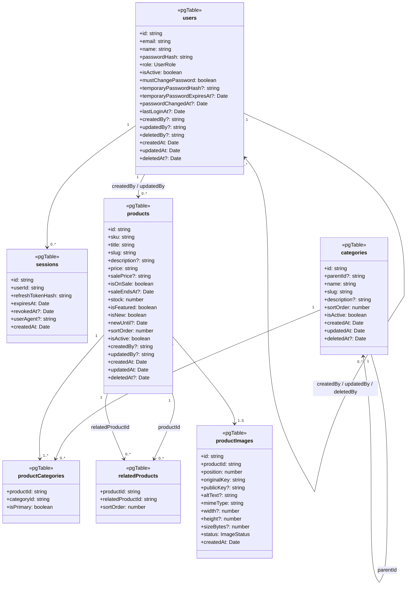

### Tablas del schema

El schema declara las siete tablas del modelo de datos, con los mismos nombres de columnas y tipos definidos en el diagrama entidad-relación:

| Tabla               | Contenido                                                                                       |
| :------------------ | :---------------------------------------------------------------------------------------------- |
| `users`             | Usuarios del panel, con sus datos de acceso, rol, estado, claves temporales y auditoría.        |
| `sessions`          | Sesiones iniciadas por cada usuario, identificadas por el hash del refresh token.               |
| `categories`        | Categorías del catálogo, con su jerarquía de categorías y subcategorías.                        |
| `products`          | Productos a la venta, con precios, ofertas, stock, marcas y auditoría.                          |
| `productCategories` | Asignación de categorías a cada producto, con la indicación de la categoría principal.          |
| `relatedProducts`   | Productos similares cargados manualmente para cada producto.                                    |
| `productImages`     | Imágenes de cada producto, con su posición, claves de almacenamiento y estado de procesamiento. |

### Relaciones

El diagrama refleja las mismas relaciones y cardinalidades del modelo de datos:

- Un usuario puede crear, modificar o dar de baja a otros usuarios, tener múltiples sesiones y crear o modificar múltiples productos.
- Una categoría puede tener múltiples subcategorías y estar asignada a múltiples productos.
- Un producto tiene al menos una categoría asignada, entre 1 y 5 imágenes, y puede tener múltiples productos similares, así como figurar como similar de otros productos.

### Detalles de implementación

- **Ubicación y alcance**: el schema se encuentra en la carpeta `shared/infrastructure/database/schema` y solo es utilizado por clases de la capa de infraestructura. Ningún componente del dominio o de la aplicación depende de él.

- **Declaración de las tablas**: las tablas se declaran dentro del schema `libreria` mediante `pgSchema('libreria')`. Cada columna indica explícitamente su nombre en formato `snake_case`, tal como figura en la base de datos, mientras que en el código TypeScript se utilizan los nombres en formato `camelCase`. De esta forma, cada lenguaje respeta sus propias convenciones de nombres.

- **Tipo `citext`**: Drizzle no incluye de forma nativa el tipo de texto sin distinción de mayúsculas utilizado para el email de los usuarios, por lo que se define como un tipo personalizado.

- **Tipo `numeric`**: las columnas de precios se representan en TypeScript como texto y no como números, ya que el tipo numérico de JavaScript puede introducir errores de redondeo en valores decimales. Los mappers convierten luego esos valores al value object `Money`, que opera internamente con centavos enteros.

- **Funciones, triggers e índices especiales**: Drizzle genera automáticamente las migraciones de tablas, columnas, claves e índices convencionales, pero no las funciones, los triggers, la secuencia del SKU ni el índice de búsqueda por título. Estos elementos se incorporan mediante una migración SQL escrita manualmente (`drizzle-kit generate --custom`), que forma parte del mismo historial de migraciones y se aplica en el mismo orden que las demás.

### Relación con el resto del sistema

- **Con la base de datos**: el schema es el reflejo en código del DDL presentado en el diagrama entidad-relación. Las migraciones generadas a partir de él, junto con la migración SQL manual, permiten crear y actualizar la base de datos de forma reproducible en cualquier entorno.

- **Con la capa de infraestructura**: los repositorios, las consultas y los generadores de ambos módulos utilizan el schema para construir sus consultas con verificación de tipos. Si una columna cambia de nombre o de tipo, el error se detecta al compilar y no durante la ejecución.

- **Con el dominio**: los mappers traducen los registros del schema en entidades del dominio y viceversa. Son el único punto en el que ambos modelos se conectan, lo que permite modificar la estructura de las tablas sin afectar las reglas de negocio.

- **Con la evolución del sistema**: la incorporación futura de las tablas de pedidos y pagos se realizará agregando nuevas declaraciones al schema y sus migraciones correspondientes, sin modificar las tablas existentes.

---

## 12. Decisiones de diseño

Esta sección reúne las decisiones de diseño más relevantes del backend que no se desprenden directamente de los diagramas, junto con los motivos que las justifican y las alternativas consideradas. Su objetivo es explicar por qué la solución se construyó de esta manera, especialmente en los aspectos vinculados a la seguridad y a la elección de servicios externos.

### Manejo de la sesión: access token en memoria y refresh token en cookie

La autenticación combina dos tokens con características y formas de almacenamiento diferentes, con el objetivo de reducir el impacto de un eventual robo de credenciales.

**Access token.** Se entrega en el cuerpo de la respuesta, tiene una duración de 15 minutos y el frontend lo conserva únicamente en memoria, nunca en `localStorage`. Se envía en cada solicitud mediante el encabezado `Authorization: Bearer`. Al no persistirse en el navegador, un script malicioso inyectado en la página no puede leerlo desde el almacenamiento local, y su corta duración limita el tiempo durante el cual podría utilizarse si fuera interceptado.

**Refresh token.** Se entrega en una cookie con la siguiente configuración:

| Atributo   | Valor                    | Propósito                                                                                                                            |
| :--------- | :----------------------- | :----------------------------------------------------------------------------------------------------------------------------------- |
| `HttpOnly` | Activado                 | La cookie no es accesible desde JavaScript, lo que la protege ante ataques de inyección de scripts (XSS).                            |
| `Secure`   | Activado                 | La cookie solo se transmite por conexiones HTTPS.                                                                                    |
| `SameSite` | `Strict`                 | La cookie no se envía en solicitudes originadas en otros sitios, lo que protege ante ataques de falsificación de solicitudes (CSRF). |
| `Path`     | `/api/v1/auth`           | La cookie solo se envía a los endpoints de autenticación y no al resto de la API.                                                    |
| `Domain`   | Sin definir              | La cookie solo se envía al servidor de la API y no a otros subdominios.                                                              |
| Nombre     | `__Secure-refresh_token` | El prefijo `__Secure-` obliga al navegador a rechazar la cookie si no fue establecida mediante HTTPS.                                |
| Duración   | 7 días                   | Rota en cada uso, con detección de reutilización.                                                                                    |

**Endpoints de renovación y cierre de sesión.** Estos dos endpoints leen la cookie y no requieren el access token. Esto permite, por ejemplo, cerrar la sesión aun cuando el access token ya venció. Como defensa adicional ante ataques CSRF, ambos aplican `OriginGuard`, que rechaza toda solicitud cuyo origen no corresponda al dominio del frontend.

**CORS.** La API solo acepta solicitudes provenientes del dominio del frontend, declarado de forma explícita, y habilita el envío de credenciales para que el navegador pueda incluir la cookie.

**Dominio compartido.** Dado que la cookie utiliza `SameSite=Strict`, el frontend y la API deben pertenecer al mismo dominio registrado: el sitio en el dominio principal (`libreriamisueno.com.ar`) y la API en un subdominio (`api.libreriamisueno.com.ar`). Por este motivo, el registro del dominio propio es un requisito para la puesta en producción del sistema.

**Recarga de la página.** Como el access token se conserva solo en memoria, se pierde al recargar la página o abrir una nueva pestaña. En ese momento, el frontend solicita automáticamente la renovación de la sesión y obtiene un access token nuevo, sin que el usuario deba volver a iniciar sesión.

**Alternativa descartada.** Se evaluó almacenar ambos tokens en `localStorage`, una opción más simple de implementar y que no requiere un dominio compartido. Se descartó porque cualquier script ejecutado en la página podría leer los tokens y utilizarlos desde otro dispositivo, lo que representa un riesgo mayor para un panel con permisos de administración.

### Cantidad de destacados y novedades

El límite de 5 productos destacados y 5 novedades se aplica a la cantidad que se muestra en la página de inicio y no a la cantidad de productos que pueden marcarse. De esta forma, el usuario puede marcar todos los productos que desee y controlar cuáles se muestran primero mediante su posición, sin necesidad de desmarcar uno para incorporar otro. El detalle de esta regla se describe en la sección 8.

### Proveedor de envío de mails: Resend

El sistema envía dos tipos de mail, ambos con la misma estructura: la clave temporal solicitada por el propio usuario mediante "olvidé mi contraseña" y la clave temporal generada cuando un administrador restablece la contraseña de otro usuario. En los dos casos, el volumen esperado es muy bajo.

Se eligió Resend por los siguientes motivos:

- Cuenta con un SDK oficial para Node.js, lo que simplifica su integración con NestJS.
- Su plan gratuito incluye 3.000 mails por mes, con un límite de 100 por día y un dominio propio verificado, capacidad suficiente para el volumen previsto (condiciones consultadas en septiembre de 2026).

Para enviar mails a cualquier destinatario, Resend exige verificar el dominio propio mediante registros DNS (SPF y DKIM), que certifican que los mails se envían con autorización del titular del dominio. Por lo tanto, al igual que la cookie de sesión, este servicio depende del registro previo del dominio `.com.ar`.

Gracias a la arquitectura del sistema, el proveedor puede reemplazarse sin modificar la lógica de negocio: basta con desarrollar una nueva implementación del contrato `PasswordResetNotifier` y registrarla en el módulo `identity`.

## 13. Endpoints

Esta sección presenta el listado completo de los endpoints de la API REST, organizados por módulo. Para cada uno se indica el método HTTP, la ruta, el nivel de acceso requerido y el caso de uso que lo resuelve, lo que permite rastrear cada operación desde la API hasta la lógica de negocio que la implementa.

### Convenciones generales

- **Versionado**: todas las rutas se exponen bajo el prefijo `/api/v1`, que se omite en las tablas por legibilidad. Por ejemplo, la ruta `/auth/login` corresponde a `https://api.libreriamisueno.com.ar/api/v1/auth/login`. El versionado permite incorporar cambios futuros en la API sin afectar a los clientes existentes.
- **Rutas públicas y del panel**: las rutas que comienzan con `/admin` corresponden al panel de administración y requieren autenticación. Las demás rutas del catálogo y la búsqueda son públicas.
- **Bajas lógicas**: los endpoints que utilizan el método `DELETE` no eliminan los registros de la base de datos, sino que realizan una baja lógica. Se utiliza este método porque, desde el punto de vista del cliente de la API, el recurso deja de estar disponible. La reactivación se realiza mediante el endpoint `restore` correspondiente.
- **Acceso**: los niveles indicados son _Público_ (sin autenticación), _Autenticado_ (cualquier usuario con sesión iniciada), _ADMIN_ y _ADMIN, SELLER_ (roles habilitados para la operación).

### Autenticación

| Método | Ruta                    | Acceso                                                  | Caso de uso                   |
| :----- | :---------------------- | :------------------------------------------------------ | :---------------------------- |
| POST   | `/auth/login`           | Público                                                 | `LoginUseCase`                |
| POST   | `/auth/refresh`         | Cookie de sesión y verificación de origen               | `RefreshSessionUseCase`       |
| POST   | `/auth/logout`          | Cookie de sesión y verificación de origen               | `LogoutUseCase`               |
| POST   | `/auth/forgot-password` | Público                                                 | `RequestPasswordResetUseCase` |
| POST   | `/auth/change-password` | Autenticado, incluso con cambio de contraseña pendiente | `ChangePasswordUseCase`       |
| GET    | `/auth/me`              | Autenticado, incluso con cambio de contraseña pendiente | `GetCurrentUserUseCase`       |

Los endpoints de cambio de contraseña y de consulta del usuario actual son los únicos habilitados para un usuario que tiene pendiente el cambio de su contraseña temporal; el resto de la API le queda bloqueado hasta que lo complete. El endpoint de cambio de contraseña es, además, el único endpoint de gestión de cuenta disponible para el rol `SELLER`.

### Usuarios

| Método | Ruta                              | Acceso | Caso de uso                |
| :----- | :-------------------------------- | :----- | :------------------------- |
| GET    | `/admin/users`                    | ADMIN  | `ListUsersUseCase`         |
| GET    | `/admin/users/:id`                | ADMIN  | `GetUserUseCase`           |
| POST   | `/admin/users`                    | ADMIN  | `CreateUserUseCase`        |
| PATCH  | `/admin/users/:id`                | ADMIN  | `UpdateUserUseCase`        |
| POST   | `/admin/users/:id/reset-password` | ADMIN  | `ResetUserPasswordUseCase` |
| DELETE | `/admin/users/:id`                | ADMIN  | `DeleteUserUseCase`        |
| POST   | `/admin/users/:id/restore`        | ADMIN  | `RestoreUserUseCase`       |

El endpoint de restablecimiento de contraseña no recibe datos: el sistema genera la clave temporal y la envía por mail al usuario.

### Categorías

| Método | Ruta                            | Acceso        | Caso de uso                  |
| :----- | :------------------------------ | :------------ | :--------------------------- |
| GET    | `/categories`                   | Público       | `ListCategoryTreeUseCase`    |
| GET    | `/admin/categories`             | ADMIN, SELLER | `ListAdminCategoriesUseCase` |
| GET    | `/admin/categories/:id`         | ADMIN, SELLER | `GetAdminCategoryUseCase`    |
| POST   | `/admin/categories`             | ADMIN, SELLER | `CreateCategoryUseCase`      |
| PATCH  | `/admin/categories/:id`         | ADMIN, SELLER | `UpdateCategoryUseCase`      |
| DELETE | `/admin/categories/:id`         | ADMIN, SELLER | `DeleteCategoryUseCase`      |
| POST   | `/admin/categories/:id/restore` | ADMIN, SELLER | `RestoreCategoryUseCase`     |

### Productos

| Método | Ruta                          | Acceso        | Caso de uso                   |
| :----- | :---------------------------- | :------------ | :---------------------------- |
| GET    | `/products`                   | Público       | `SearchCatalogUseCase`        |
| GET    | `/products/featured`          | Público       | `ListFeaturedProductsUseCase` |
| GET    | `/products/new`               | Público       | `ListNewProductsUseCase`      |
| GET    | `/products/:slug`             | Público       | `GetProductDetailUseCase`     |
| GET    | `/admin/products`             | ADMIN, SELLER | `ListAdminProductsUseCase`    |
| GET    | `/admin/products/:id`         | ADMIN, SELLER | `GetAdminProductUseCase`      |
| POST   | `/admin/products`             | ADMIN, SELLER | `CreateProductUseCase`        |
| PATCH  | `/admin/products/:id`         | ADMIN, SELLER | `UpdateProductUseCase`        |
| DELETE | `/admin/products/:id`         | ADMIN, SELLER | `DeleteProductUseCase`        |
| POST   | `/admin/products/:id/restore` | ADMIN, SELLER | `RestoreProductUseCase`       |

El alta de producto recibe los datos y las imágenes en una única solicitud de tipo `multipart/form-data`, con un mínimo de 1 y un máximo de 5 imágenes. Los endpoints públicos identifican al producto por su slug, para generar URL legibles y favorables al posicionamiento en buscadores; los del panel, por su identificador interno.

### Imágenes de producto

| Método | Ruta                                               | Acceso        | Caso de uso                          |
| :----- | :------------------------------------------------- | :------------ | :----------------------------------- |
| GET    | `/admin/products/:productId/images`                | ADMIN, SELLER | `ListProductImagesUseCase`           |
| POST   | `/admin/products/:productId/images`                | ADMIN, SELLER | `AddProductImageUseCase`             |
| PATCH  | `/admin/products/:productId/images/order`          | ADMIN, SELLER | `ReorderProductImagesUseCase`        |
| PATCH  | `/admin/products/:productId/images/:imageId`       | ADMIN, SELLER | `UpdateProductImageUseCase`          |
| PUT    | `/admin/products/:productId/images/:imageId/file`  | ADMIN, SELLER | `ReplaceProductImageFileUseCase`     |
| POST   | `/admin/products/:productId/images/:imageId/retry` | ADMIN, SELLER | `RetryProductImageProcessingUseCase` |
| DELETE | `/admin/products/:productId/images/:imageId`       | ADMIN, SELLER | `DeleteProductImageUseCase`          |

Los endpoints de alta y reemplazo de imagen reciben el archivo mediante `multipart/form-data`. El reemplazo utiliza el método `PUT` porque sustituye por completo el archivo de la imagen, mientras que la edición utiliza `PATCH` porque modifica solo algunos de sus datos, como el texto alternativo.

### Búsqueda

| Método | Ruta      | Acceso  | Caso de uso           |
| :----- | :-------- | :------ | :-------------------- |
| GET    | `/search` | Público | `GlobalSearchUseCase` |

### Límites de solicitudes

Toda la API aplica un límite general de solicitudes por dirección IP, como protección ante usos abusivos. Los endpoints más expuestos a ataques de fuerza bruta tienen, además, límites específicos más estrictos:

| Endpoint                     | Límite                               |
| :--------------------------- | :----------------------------------- |
| `POST /auth/login`           | 5 solicitudes por minuto por IP      |
| `POST /auth/forgot-password` | 3 solicitudes cada 15 minutos por IP |
| `POST /auth/refresh`         | Límite general de la API             |

El límite del inicio de sesión dificulta los intentos de adivinar contraseñas, y el de recuperación de contraseña evita el envío masivo de mails, que además consumiría el cupo diario del proveedor de correo.

---

## 14. Reglas de negocio y dónde se aplican

Esta sección reúne las principales reglas de negocio del sistema e indica en qué capa se aplica cada una. Su objetivo es mostrar de forma consolidada la estrategia de validación adoptada: las reglas más importantes no dependen de un único punto de control, sino que se verifican en varias capas de forma complementaria.

Cada capa cumple un rol distinto:

- **Presentación**: rechaza de forma temprana las solicitudes inválidas o no autorizadas, antes de ejecutar cualquier lógica. Mejora la experiencia de uso, ya que devuelve errores claros y específicos.
- **Aplicación y dominio**: es la fuente principal de las reglas de negocio. Aquí se decide si una operación es válida, con independencia de cómo se haya invocado.
- **Base de datos**: actúa como última barrera. Garantiza la integridad de los datos aun ante un error en la aplicación o una modificación realizada directamente sobre la base.

Cuando una capa no interviene en una regla, se indica como _No aplica_. Los nombres de restricciones, índices y funciones corresponden a los definidos en el schema `libreria`.

### Usuarios y autenticación

| Regla                                                                                      | Presentación                                                                                                          | Aplicación / Dominio                                                    | Base de datos                                           |
| :----------------------------------------------------------------------------------------- | :-------------------------------------------------------------------------------------------------------------------- | :---------------------------------------------------------------------- | :------------------------------------------------------ |
| Solo el rol ADMIN gestiona usuarios                                                        | `RolesGuard` y restricción de `UsersController` al rol ADMIN                                                          | No aplica                                                               | No aplica                                               |
| El rol SELLER solo puede cambiar su propia contraseña                                      | Los endpoints de usuarios están restringidos al rol ADMIN; el cambio de contraseña es el único disponible para SELLER | `ChangePasswordUseCase` opera solo sobre el usuario autenticado         | No aplica                                               |
| Email único entre usuarios vigentes                                                        | Validación de formato en el DTO                                                                                       | `Email`, `CreateUserUseCase`, `UpdateUserUseCase`, `RestoreUserUseCase` | `chk_users_email_format` y `uq_users_email_not_deleted` |
| Contraseña de entre 8 y 128 caracteres                                                     | Validación del DTO                                                                                                    | `PasswordPolicy`                                                        | No aplica                                               |
| Cambio obligatorio de contraseña tras recibir una clave temporal                           | `MustChangePasswordGuard`                                                                                             | `User.assignTemporaryPassword` y `User.consumeTemporaryPassword`        | No aplica                                               |
| La clave temporal por olvido no invalida la contraseña actual                              | No aplica                                                                                                             | `User.issueTemporaryPassword` y `LoginUseCase`                          | `chk_users_temporary_password_pair`                     |
| La clave temporal es de un solo uso y vence a los 30 minutos                               | No aplica                                                                                                             | `TemporaryPassword` y `User.consumeTemporaryPassword`                   | No aplica                                               |
| Un administrador no puede darse de baja, desactivarse ni cambiar su propio rol             | No aplica                                                                                                             | `UserAdministrationPolicy`                                              | No aplica                                               |
| Siempre debe existir al menos un administrador activo                                      | No aplica                                                                                                             | `UserAdministrationPolicy`                                              | Trigger con la función `prevent_last_admin_removal`     |
| El restablecimiento de contraseña por un administrador genera la clave y la envía por mail | Endpoint sin datos de entrada                                                                                         | `ResetUserPasswordUseCase`                                              | Trigger con la función `revoke_user_sessions`           |
| Las sesiones se revocan al cambiar la contraseña, el rol o el estado, o ante una baja      | No aplica                                                                                                             | `SessionIssuer` crea la nueva sesión después de guardar el cambio       | Trigger con la función `revoke_user_sessions`           |
| Refresh token rotativo con detección de reutilización                                      | Cookie `HttpOnly` y `OriginGuard`                                                                                     | `RefreshSessionUseCase`                                                 | `uq_sessions_refresh_token_hash`                        |
| Límite de solicitudes en los endpoints sensibles                                           | `ThrottlerGuard`                                                                                                      | No aplica                                                               | No aplica                                               |

### Categorías

| Regla                                                                      | Presentación           | Aplicación / Dominio                                                        | Base de datos                                                                                   |
| :------------------------------------------------------------------------- | :--------------------- | :-------------------------------------------------------------------------- | :---------------------------------------------------------------------------------------------- |
| Nombre único entre categorías vigentes                                     | No aplica              | `CreateCategoryUseCase`, `UpdateCategoryUseCase` y `RestoreCategoryUseCase` | `uq_categories_name_not_deleted`                                                                |
| Slug inmutable                                                             | Los DTOs no lo aceptan | `Category` no ofrece un método para modificarlo                             | Trigger con la función `prevent_immutable_update('slug')`                                       |
| Sin ciclos en la jerarquía de categorías                                   | No aplica              | `Category.moveTo`, a partir de los ancestros de la nueva categoría padre    | `chk_categories_not_own_parent`, que cubre solo el caso de una categoría como padre de sí misma |
| No se puede dar de baja una categoría con subcategorías activas            | No aplica              | `CategoryDeletionPolicy`                                                    | No aplica                                                                                       |
| No se puede dar de baja la única categoría de un producto                  | No aplica              | `CategoryDeletionPolicy`                                                    | No aplica                                                                                       |
| No se puede reactivar una categoría cuya categoría padre está dada de baja | No aplica              | `Category.restore`                                                          | No aplica                                                                                       |

### Productos e imágenes

| Regla                                                                                             | Presentación                                                                              | Aplicación / Dominio                                                     | Base de datos                                                                                                                  |
| :------------------------------------------------------------------------------------------------ | :---------------------------------------------------------------------------------------- | :----------------------------------------------------------------------- | :----------------------------------------------------------------------------------------------------------------------------- |
| SKU generado por el sistema e inmutable                                                           | Los DTOs no lo aceptan                                                                    | `SkuGenerator`; `Product` no ofrece un método para modificarlo           | Secuencia `product_sku_seq`, `chk_products_sku_format` y trigger con la función `prevent_immutable_update('sku')`              |
| Slug inmutable                                                                                    | Los DTOs de edición no lo aceptan                                                         | `Product` no ofrece un método para modificarlo                           | Trigger con la función `prevent_immutable_update('slug')`                                                                      |
| Precio positivo y stock no negativo                                                               | Validación del DTO                                                                        | `Money`, `Product.changePrice` y `Product.setStock`                      | `chk_products_price_positive` y `chk_products_stock_non_negative`                                                              |
| Precio de oferta menor al precio regular                                                          | Validación del DTO                                                                        | `Product.startSale` y `Product.changePrice`                              | `chk_products_sale_price_range` y `chk_products_on_sale_requires_sale_price`                                                   |
| Al menos una categoría y exactamente una categoría principal                                      | Validación del DTO                                                                        | `CategoryAssignment.fromIds` y `Product.assignCategories`                | Constraint trigger diferido con la función `check_product_has_category` e índice único parcial `uq_product_categories_primary` |
| Un producto no puede ser similar de sí mismo                                                      | No aplica                                                                                 | `Product.setRelatedProducts`                                             | `chk_related_products_not_self`                                                                                                |
| Al menos una imagen por producto                                                                  | `ImageFileValidationPipe` exige entre 1 y 5 archivos en el alta                           | `ProductImagePolicy.assertCanAdd` y `ProductImagePolicy.assertCanRemove` | Constraint trigger diferido con la función `check_product_has_image`                                                           |
| Máximo 5 imágenes por producto                                                                    | `ImageFileValidationPipe`                                                                 | `ProductImagePolicy.assertCanAdd`                                        | `chk_product_images_position_range` y restricción única diferible `uq_product_images_position`                                 |
| Solo se admiten imágenes JPEG, PNG y WebP de hasta 10 MB                                          | `ImageFileValidationPipe`, que verifica el tipo declarado y el contenido real del archivo | `ImageSettings`                                                          | `chk_product_images_mime_type`                                                                                                 |
| Una imagen procesada debe tener su versión pública                                                | No aplica                                                                                 | `ProductImage.markProcessed`                                             | `chk_product_images_processed_has_public_key`                                                                                  |
| Solo se muestran en la tienda los productos activos, vigentes y con al menos una imagen procesada | No aplica                                                                                 | `CatalogQueries`, mediante `CatalogSqlFilters`                           | Índices parciales de productos visibles, destacados y novedades                                                                |
| No se puede reactivar un producto sin categorías vigentes                                         | No aplica                                                                                 | `RestoreProductUseCase`                                                  | No aplica                                                                                                                      |

### Bajas lógicas

| Regla                                                                                  | Presentación                                                                                     | Aplicación / Dominio                             | Base de datos                                                                                     |
| :------------------------------------------------------------------------------------- | :----------------------------------------------------------------------------------------------- | :----------------------------------------------- | :------------------------------------------------------------------------------------------------ |
| Todas las bajas son lógicas y pueden revertirse, para usuarios, categorías y productos | No existen endpoints de eliminación definitiva; los endpoints `restore` permiten la reactivación | Métodos `softDelete` y `restore` de cada entidad | Columna `deleted_at` en cada tabla y restricciones de unicidad limitadas a los registros vigentes |
