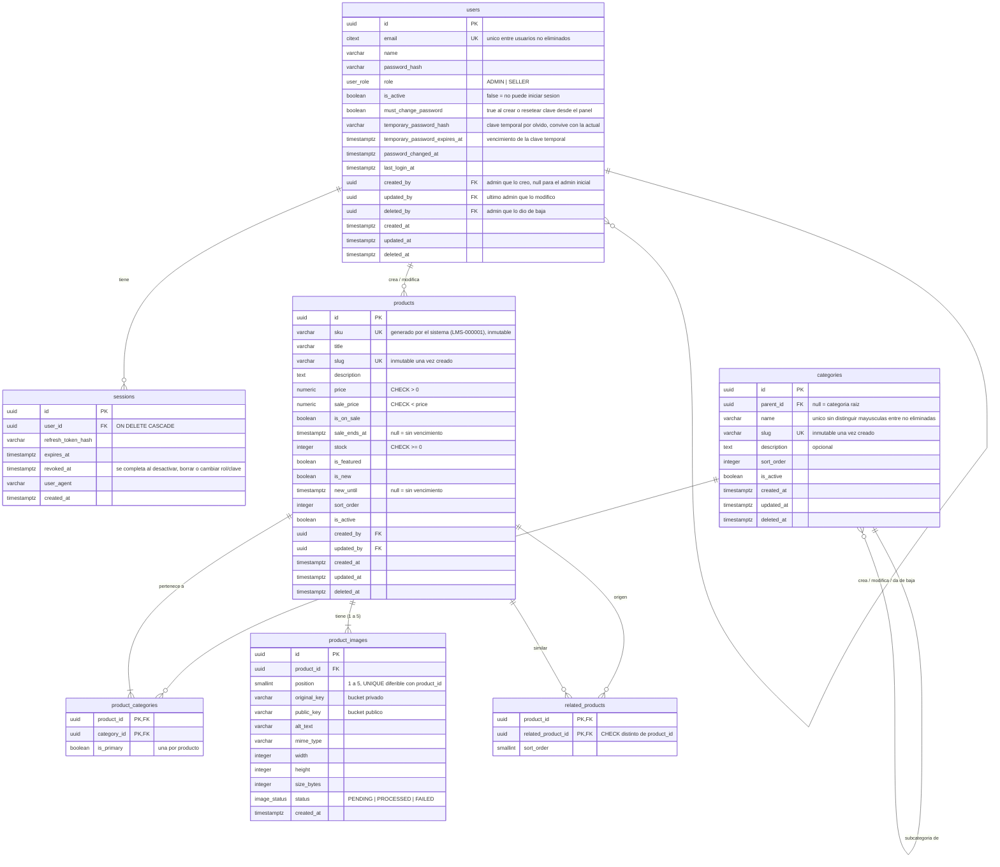

# Diagrama entidad-relación · Librería Mi Sueño

## Introducción

Este documento presenta el diagrama entidad-relación y el modelo de datos del sistema de e-commerce para Librería Mi Sueño.

El modelo contempla siete entidades —usuarios, sesiones, categorías, productos, la relación producto-categoría, productos relacionados e imágenes de producto— sobre las que se apoyan el catálogo público y el panel de administración con control de acceso por roles.

El diseño incorpora reglas de negocio a nivel de base de datos (bajas lógicas, inmutabilidad de identificadores, límites de imágenes por producto y validación de categoría e imagen obligatorias, entre otras), de modo que la integridad de los datos no dependa exclusivamente de la lógica de la aplicación. Estas reglas se detallan en las secciones siguientes junto con el script de creación (DDL) correspondiente.



---

## Descripción de las tablas

### `users`

Almacena las cuentas del panel de administración, con dos roles posibles: `ADMIN` y `SELLER`. Guarda el hash de la contraseña (nunca la contraseña en texto plano), el estado de actividad, la marca de cambio de contraseña obligatorio y los datos de la clave temporal usada en el flujo de "olvidé mi contraseña". Se relaciona consigo misma (`created_by`, `updated_by`, `deleted_by`) porque el alta, la modificación y la baja de un usuario las realiza otro usuario con rol `ADMIN`, y se necesita dejar registro de quién hizo cada acción.

### `sessions`

Registra las sesiones activas de cada usuario a partir del refresh token (guardado como hash, nunca el token real). Se relaciona con `users` mediante `user_id`, con borrado en cascada: si se elimina un usuario, sus sesiones dejan de tener sentido. Permite revocar sesiones puntuales cuando cambian la contraseña, el rol o el estado del usuario, o cuando se detecta reuso de un refresh token.

### `categories`

Organiza los productos en categorías, con soporte para subcategorías mediante `parent_id`, que referencia a la misma tabla (relación reflexiva). Tiene baja lógica y reactivación, y el nombre es único entre las categorías no eliminadas para evitar duplicados visibles en el catálogo.

### `products`

Es la entidad central del catálogo: contiene título, descripción, precio, precio de oferta, stock y las marcas de destacado/novedad/oferta. Se relaciona con `users` a través de `created_by` y `updated_by`, para saber qué usuario del panel cargó o modificó cada producto. El SKU y el slug son inmutables una vez generados, protegidos por trigger, porque se usan como identificadores externos (URL, referencia en WhatsApp) y no deben cambiar con el tiempo.

### `product_categories`

Es la tabla intermedia que resuelve la relación muchos a muchos entre `products` y `categories`: un producto puede pertenecer a varias categorías, y una categoría agrupa varios productos. El campo `is_primary` identifica cuál es la categoría principal de cada producto (con un índice único que garantiza que haya como máximo una), dato necesario para el breadcrumb y para completar "productos similares" cuando no hay suficientes cargados a mano.

### `related_products`

Modela la relación de "productos similares" como una relación muchos a muchos del producto consigo mismo: cada fila conecta un producto (`product_id`) con otro que se muestra como similar (`related_product_id`). Se carga a mano desde el panel, por eso necesita su propia tabla en lugar de inferirse solo por categoría.

### `product_images`

Guarda hasta 5 imágenes por producto, cada una con su posición, sus claves de almacenamiento (original en bucket privado, variante procesada en bucket público) y su estado de procesamiento (`PENDING`, `PROCESSED`, `FAILED`). Se relaciona con `products` mediante `product_id`, con borrado en cascada, porque una imagen no tiene sentido sin el producto al que pertenece. La combinación `product_id` + `position` es única (y diferible) para poder reordenar las imágenes dentro de una misma transacción sin violar la restricción.

## Por qué estas relaciones

- **`users` y `products`/`sessions`/`users`** son relaciones 1 a N: un usuario puede crear muchos productos o tener muchas sesiones, pero cada producto o sesión pertenece a un único usuario. Esto permite trazabilidad (quién hizo qué) sin duplicar datos de usuario en cada tabla.
- **`products` y `categories`** necesitan una tabla intermedia (`product_categories`) porque la relación es N a N: un producto puede estar en varias categorías y una categoría agrupa varios productos, algo que una relación 1 a N no podría representar.
- **`related_products`** también es N a N, pero autorreferenciada (producto-producto), por eso tiene su propia tabla en lugar de una simple columna de clave foránea.
- **`product_images`** es 1 a N respecto de `products` (cada imagen pertenece a un solo producto), pero con un límite de negocio (máximo 5) que se refuerza con un constraint trigger diferido, no solo con una clave foránea simple.

## Introducción al DDL

A continuación se presenta el script DDL (Data Definition Language) que implementa el modelo entidad-relación descripto, probado sobre PostgreSQL 16 y pensado para ejecutarse en Supabase.

El script crea las siete tablas en el schema `libreria` (no expuesto por la Data API de Supabase, por seguridad), junto con las extensiones, tipos enumerados, funciones auxiliares, índices y triggers necesarios para que ciertas reglas de negocio —como la inmutabilidad del SKU y el slug, el límite de 5 imágenes por producto, la categoría principal única o la exigencia de al menos una categoría e imagen por producto— se cumplan a nivel de base de datos y no dependan únicamente de la validación en el backend.

```sql
BEGIN;

-- =====================================================================
-- SCHEMAS Y EXTENSIONES
-- =====================================================================
CREATE SCHEMA IF NOT EXISTS extensions;
CREATE SCHEMA IF NOT EXISTS libreria;

CREATE EXTENSION IF NOT EXISTS citext   WITH SCHEMA extensions;
CREATE EXTENSION IF NOT EXISTS pg_trgm  WITH SCHEMA extensions;
CREATE EXTENSION IF NOT EXISTS unaccent WITH SCHEMA extensions;

-- =====================================================================
-- TIPOS ENUMERADOS
-- =====================================================================
CREATE TYPE libreria.user_role    AS ENUM ('ADMIN', 'SELLER');
CREATE TYPE libreria.image_status AS ENUM ('PENDING', 'PROCESSED', 'FAILED');

-- =====================================================================
-- FUNCIONES AUXILIARES
-- =====================================================================

-- unaccent no es IMMUTABLE; este envoltorio permite usarlo en indices
CREATE OR REPLACE FUNCTION libreria.immutable_unaccent(text)
RETURNS text
LANGUAGE sql IMMUTABLE PARALLEL SAFE STRICT
AS $$
  SELECT extensions.unaccent('extensions.unaccent'::regdictionary, $1)
$$;

-- Actualiza updated_at en cada modificacion
CREATE OR REPLACE FUNCTION libreria.set_updated_at()
RETURNS trigger
LANGUAGE plpgsql
AS $$
BEGIN
  NEW.updated_at := now();
  RETURN NEW;
END;
$$;

-- Impide modificar una columna inmutable; el nombre de la columna llega como argumento del trigger
CREATE OR REPLACE FUNCTION libreria.prevent_immutable_update()
RETURNS trigger
LANGUAGE plpgsql
AS $$
BEGIN
  RAISE EXCEPTION 'La columna % de % es inmutable', TG_ARGV[0], TG_TABLE_NAME
    USING ERRCODE = 'check_violation';
END;
$$;

-- =====================================================================
-- USERS
-- =====================================================================
CREATE TABLE libreria.users (
  id                    uuid          PRIMARY KEY DEFAULT gen_random_uuid(),
  email                 extensions.citext NOT NULL,
  name                  varchar(120)  NOT NULL,
  password_hash         varchar(255)  NOT NULL,
  role                  libreria.user_role NOT NULL DEFAULT 'SELLER',
  is_active             boolean       NOT NULL DEFAULT true,
  must_change_password  boolean       NOT NULL DEFAULT true,
  -- Clave temporal generada por "olvidé mi contraseña"; la clave actual sigue siendo válida
  temporary_password_hash        varchar(255),
  temporary_password_expires_at  timestamptz,
  password_changed_at   timestamptz,
  last_login_at         timestamptz,
  created_by            uuid          REFERENCES libreria.users (id) ON DELETE SET NULL,
  updated_by            uuid          REFERENCES libreria.users (id) ON DELETE SET NULL,
  deleted_by            uuid          REFERENCES libreria.users (id) ON DELETE SET NULL,
  created_at            timestamptz   NOT NULL DEFAULT now(),
  updated_at            timestamptz   NOT NULL DEFAULT now(),
  deleted_at            timestamptz,

  CONSTRAINT chk_users_email_format
    CHECK (email ~ '^[^@\s]+@[^@\s]+\.[^@\s]+$'),
  CONSTRAINT chk_users_name_not_blank
    CHECK (btrim(name) <> ''),
  CONSTRAINT chk_users_deleted_by_requires_deleted_at
    CHECK (deleted_by IS NULL OR deleted_at IS NOT NULL),
  -- Hash y vencimiento de la clave temporal van juntos
  CONSTRAINT chk_users_temporary_password_pair
    CHECK ((temporary_password_hash IS NULL) = (temporary_password_expires_at IS NULL))
);

-- Email unico solo entre usuarios no eliminados (permite re-alta)
CREATE UNIQUE INDEX uq_users_email_not_deleted
  ON libreria.users (email)
  WHERE deleted_at IS NULL;

CREATE INDEX idx_users_role_active
  ON libreria.users (role)
  WHERE is_active AND deleted_at IS NULL;

CREATE TRIGGER trg_users_set_updated_at
  BEFORE UPDATE ON libreria.users
  FOR EACH ROW EXECUTE FUNCTION libreria.set_updated_at();

-- Registra la fecha de cambio de clave
CREATE OR REPLACE FUNCTION libreria.set_password_changed_at()
RETURNS trigger
LANGUAGE plpgsql
AS $$
BEGIN
  NEW.password_changed_at := now();
  RETURN NEW;
END;
$$;

CREATE TRIGGER trg_users_password_changed_at
  BEFORE UPDATE OF password_hash ON libreria.users
  FOR EACH ROW
  WHEN (OLD.password_hash IS DISTINCT FROM NEW.password_hash)
  EXECUTE FUNCTION libreria.set_password_changed_at();

-- Impide borrar, desactivar o quitar el rol al ultimo ADMIN activo
CREATE OR REPLACE FUNCTION libreria.prevent_last_admin_removal()
RETURNS trigger
LANGUAGE plpgsql
AS $$
BEGIN
  IF OLD.role = 'ADMIN' AND OLD.is_active AND OLD.deleted_at IS NULL
     AND (
       TG_OP = 'DELETE'
       OR NEW.role <> 'ADMIN'
       OR NOT NEW.is_active
       OR NEW.deleted_at IS NOT NULL
     )
  THEN
    -- Serializa la verificacion para evitar que dos admins se quiten entre si en simultaneo
    PERFORM pg_advisory_xact_lock(hashtext('libreria.users.last_admin'));

    IF NOT EXISTS (
      SELECT 1
      FROM libreria.users
      WHERE id <> OLD.id
        AND role = 'ADMIN'
        AND is_active
        AND deleted_at IS NULL
    ) THEN
      RAISE EXCEPTION 'No se puede quitar al ultimo administrador activo'
        USING ERRCODE = 'check_violation';
    END IF;
  END IF;

  IF TG_OP = 'DELETE' THEN
    RETURN OLD;
  END IF;
  RETURN NEW;
END;
$$;

CREATE TRIGGER trg_users_prevent_last_admin_removal
  BEFORE UPDATE OR DELETE ON libreria.users
  FOR EACH ROW EXECUTE FUNCTION libreria.prevent_last_admin_removal();

-- =====================================================================
-- SESSIONS
-- =====================================================================
CREATE TABLE libreria.sessions (
  id                  uuid         PRIMARY KEY DEFAULT gen_random_uuid(),
  user_id             uuid         NOT NULL REFERENCES libreria.users (id) ON DELETE CASCADE,
  refresh_token_hash  varchar(255) NOT NULL,
  expires_at          timestamptz  NOT NULL,
  revoked_at          timestamptz,
  user_agent          varchar(500),
  created_at          timestamptz  NOT NULL DEFAULT now(),

  CONSTRAINT uq_sessions_refresh_token_hash UNIQUE (refresh_token_hash),
  CONSTRAINT chk_sessions_expires_after_created CHECK (expires_at > created_at)
);

CREATE INDEX idx_sessions_user_active
  ON libreria.sessions (user_id)
  WHERE revoked_at IS NULL;

-- Revoca las sesiones al desactivar, dar de baja o cambiar rol o clave
CREATE OR REPLACE FUNCTION libreria.revoke_user_sessions()
RETURNS trigger
LANGUAGE plpgsql
AS $$
BEGIN
  UPDATE libreria.sessions
     SET revoked_at = now()
   WHERE user_id = NEW.id
     AND revoked_at IS NULL;
  RETURN NULL;
END;
$$;

CREATE TRIGGER trg_users_revoke_sessions
  AFTER UPDATE OF role, is_active, deleted_at, password_hash ON libreria.users
  FOR EACH ROW
  WHEN (
    OLD.role          IS DISTINCT FROM NEW.role
    OR OLD.is_active  IS DISTINCT FROM NEW.is_active
    OR OLD.deleted_at IS DISTINCT FROM NEW.deleted_at
    OR OLD.password_hash IS DISTINCT FROM NEW.password_hash
  )
  EXECUTE FUNCTION libreria.revoke_user_sessions();

-- =====================================================================
-- CATEGORIES
-- =====================================================================
CREATE TABLE libreria.categories (
  id           uuid         PRIMARY KEY DEFAULT gen_random_uuid(),
  parent_id    uuid         REFERENCES libreria.categories (id) ON DELETE RESTRICT,
  name         varchar(100) NOT NULL,
  slug         varchar(120) NOT NULL,
  description  text,
  sort_order   integer      NOT NULL DEFAULT 0,
  is_active    boolean      NOT NULL DEFAULT true,
  created_at   timestamptz  NOT NULL DEFAULT now(),
  updated_at   timestamptz  NOT NULL DEFAULT now(),
  deleted_at   timestamptz,

  CONSTRAINT uq_categories_slug UNIQUE (slug),
  CONSTRAINT chk_categories_slug_format
    CHECK (slug ~ '^[a-z0-9]+(-[a-z0-9]+)*$'),
  CONSTRAINT chk_categories_not_own_parent
    CHECK (parent_id IS NULL OR parent_id <> id)
);

-- Nombre unico sin distinguir mayusculas, solo entre categorias no eliminadas
CREATE UNIQUE INDEX uq_categories_name_not_deleted
  ON libreria.categories (lower(name))
  WHERE deleted_at IS NULL;

CREATE INDEX idx_categories_parent_id
  ON libreria.categories (parent_id);

CREATE INDEX idx_categories_visible
  ON libreria.categories (sort_order)
  WHERE is_active AND deleted_at IS NULL;

CREATE TRIGGER trg_categories_set_updated_at
  BEFORE UPDATE ON libreria.categories
  FOR EACH ROW EXECUTE FUNCTION libreria.set_updated_at();

CREATE TRIGGER trg_categories_prevent_slug_update
  BEFORE UPDATE OF slug ON libreria.categories
  FOR EACH ROW
  WHEN (OLD.slug IS DISTINCT FROM NEW.slug)
  EXECUTE FUNCTION libreria.prevent_immutable_update('slug');

-- =====================================================================
-- PRODUCTS
-- =====================================================================
-- SKU generado por el sistema: LMS- seguido de al menos 6 digitos (LMS-000001, ..., LMS-1000000)
CREATE SEQUENCE libreria.product_sku_seq AS bigint START WITH 1 INCREMENT BY 1;

CREATE OR REPLACE FUNCTION libreria.next_product_sku()
RETURNS varchar
LANGUAGE sql
VOLATILE
AS $$
  SELECT 'LMS-' || lpad(n::text, greatest(6, length(n::text)), '0')
  FROM (SELECT nextval('libreria.product_sku_seq') AS n) AS seq
$$;

CREATE TABLE libreria.products (
  id            uuid          PRIMARY KEY DEFAULT gen_random_uuid(),
  sku           varchar(64)   NOT NULL DEFAULT libreria.next_product_sku(),
  title         varchar(200)  NOT NULL,
  slug          varchar(220)  NOT NULL,
  description   text,
  price         numeric(12,2) NOT NULL,
  sale_price    numeric(12,2),
  is_on_sale    boolean       NOT NULL DEFAULT false,
  sale_ends_at  timestamptz,
  stock         integer       NOT NULL DEFAULT 0,
  is_featured   boolean       NOT NULL DEFAULT false,
  is_new        boolean       NOT NULL DEFAULT false,
  new_until     timestamptz,
  sort_order    integer       NOT NULL DEFAULT 0,
  is_active     boolean       NOT NULL DEFAULT true,
  created_by    uuid          REFERENCES libreria.users (id) ON DELETE SET NULL,
  updated_by    uuid          REFERENCES libreria.users (id) ON DELETE SET NULL,
  created_at    timestamptz   NOT NULL DEFAULT now(),
  updated_at    timestamptz   NOT NULL DEFAULT now(),
  deleted_at    timestamptz,

  CONSTRAINT uq_products_sku  UNIQUE (sku),
  CONSTRAINT chk_products_sku_format
    CHECK (sku ~ '^LMS-[0-9]{6,}$'),
  CONSTRAINT uq_products_slug UNIQUE (slug),
  CONSTRAINT chk_products_slug_format
    CHECK (slug ~ '^[a-z0-9]+(-[a-z0-9]+)*$'),
  CONSTRAINT chk_products_title_not_blank
    CHECK (btrim(title) <> ''),
  CONSTRAINT chk_products_price_positive
    CHECK (price > 0),
  CONSTRAINT chk_products_sale_price_range
    CHECK (sale_price IS NULL OR (sale_price > 0 AND sale_price < price)),
  CONSTRAINT chk_products_on_sale_requires_sale_price
    CHECK (NOT is_on_sale OR sale_price IS NOT NULL),
  CONSTRAINT chk_products_stock_non_negative
    CHECK (stock >= 0)
);

-- Busqueda por titulo tolerante a tildes y errores de tipeo
-- Uso: WHERE libreria.immutable_unaccent(title) ILIKE libreria.immutable_unaccent('%texto%')
CREATE INDEX idx_products_title_trgm
  ON libreria.products
  USING gin (libreria.immutable_unaccent(title) extensions.gin_trgm_ops);

-- Listados publicos (catalogo, destacados, novedades, ofertas)
CREATE INDEX idx_products_visible
  ON libreria.products (sort_order, created_at DESC)
  WHERE is_active AND deleted_at IS NULL;

-- Destacados y novedades: ordenados por sort_order y, a igual posicion, por fecha de creacion
CREATE INDEX idx_products_featured
  ON libreria.products (sort_order, created_at DESC)
  WHERE is_featured AND is_active AND deleted_at IS NULL;

CREATE INDEX idx_products_new
  ON libreria.products (sort_order, created_at DESC)
  WHERE is_new AND is_active AND deleted_at IS NULL;

CREATE INDEX idx_products_on_sale
  ON libreria.products (sort_order)
  WHERE is_on_sale AND is_active AND deleted_at IS NULL;

CREATE INDEX idx_products_created_by ON libreria.products (created_by);
CREATE INDEX idx_products_updated_by ON libreria.products (updated_by);

CREATE TRIGGER trg_products_set_updated_at
  BEFORE UPDATE ON libreria.products
  FOR EACH ROW EXECUTE FUNCTION libreria.set_updated_at();

CREATE TRIGGER trg_products_prevent_slug_update
  BEFORE UPDATE OF slug ON libreria.products
  FOR EACH ROW
  WHEN (OLD.slug IS DISTINCT FROM NEW.slug)
  EXECUTE FUNCTION libreria.prevent_immutable_update('slug');

CREATE TRIGGER trg_products_prevent_sku_update
  BEFORE UPDATE OF sku ON libreria.products
  FOR EACH ROW
  WHEN (OLD.sku IS DISTINCT FROM NEW.sku)
  EXECUTE FUNCTION libreria.prevent_immutable_update('sku');

-- =====================================================================
-- PRODUCT_CATEGORIES
-- =====================================================================
CREATE TABLE libreria.product_categories (
  product_id   uuid    NOT NULL REFERENCES libreria.products (id)   ON DELETE CASCADE,
  category_id  uuid    NOT NULL REFERENCES libreria.categories (id) ON DELETE RESTRICT,
  is_primary   boolean NOT NULL DEFAULT false,

  CONSTRAINT pk_product_categories PRIMARY KEY (product_id, category_id)
);

-- Una sola categoria principal por producto
CREATE UNIQUE INDEX uq_product_categories_primary
  ON libreria.product_categories (product_id)
  WHERE is_primary;

CREATE INDEX idx_product_categories_category_id
  ON libreria.product_categories (category_id);

-- Todo producto debe tener al menos una categoria (se valida al COMMIT)
CREATE OR REPLACE FUNCTION libreria.check_product_has_category()
RETURNS trigger
LANGUAGE plpgsql
AS $$
DECLARE
  v_product_id uuid;
BEGIN
  IF TG_TABLE_NAME = 'products' THEN
    v_product_id := NEW.id;
  ELSE
    v_product_id := OLD.product_id;
  END IF;

  -- Si el producto fue borrado en la misma transaccion no hay nada que validar
  IF NOT EXISTS (SELECT 1 FROM libreria.products WHERE id = v_product_id) THEN
    RETURN NULL;
  END IF;

  IF NOT EXISTS (
    SELECT 1 FROM libreria.product_categories WHERE product_id = v_product_id
  ) THEN
    RAISE EXCEPTION 'El producto % debe tener al menos una categoria', v_product_id
      USING ERRCODE = 'check_violation';
  END IF;

  RETURN NULL;
END;
$$;

CREATE CONSTRAINT TRIGGER trg_products_require_category
  AFTER INSERT ON libreria.products
  DEFERRABLE INITIALLY DEFERRED
  FOR EACH ROW EXECUTE FUNCTION libreria.check_product_has_category();

CREATE CONSTRAINT TRIGGER trg_product_categories_require_category
  AFTER UPDATE OR DELETE ON libreria.product_categories
  DEFERRABLE INITIALLY DEFERRED
  FOR EACH ROW EXECUTE FUNCTION libreria.check_product_has_category();

-- =====================================================================
-- RELATED_PRODUCTS
-- =====================================================================
CREATE TABLE libreria.related_products (
  product_id          uuid     NOT NULL REFERENCES libreria.products (id) ON DELETE CASCADE,
  related_product_id  uuid     NOT NULL REFERENCES libreria.products (id) ON DELETE CASCADE,
  sort_order          smallint NOT NULL DEFAULT 0,

  CONSTRAINT pk_related_products PRIMARY KEY (product_id, related_product_id),
  CONSTRAINT chk_related_products_not_self
    CHECK (product_id <> related_product_id)
);

CREATE INDEX idx_related_products_related_product_id
  ON libreria.related_products (related_product_id);

-- =====================================================================
-- PRODUCT_IMAGES
-- =====================================================================
CREATE TABLE libreria.product_images (
  id            uuid             PRIMARY KEY DEFAULT gen_random_uuid(),
  product_id    uuid             NOT NULL REFERENCES libreria.products (id) ON DELETE CASCADE,
  position      smallint         NOT NULL,
  original_key  varchar(500)     NOT NULL,
  public_key    varchar(500),
  alt_text      varchar(255),
  mime_type     varchar(50)      NOT NULL,
  width         integer,
  height        integer,
  size_bytes    integer,
  status        libreria.image_status NOT NULL DEFAULT 'PENDING',
  created_at    timestamptz      NOT NULL DEFAULT now(),

  -- El UNIQUE junto con el rango 1-5 limita a 5 imagenes por producto.
  -- Es diferible para poder reordenar: SET CONSTRAINTS libreria.uq_product_images_position DEFERRED
  CONSTRAINT uq_product_images_position UNIQUE (product_id, position)
    DEFERRABLE INITIALLY IMMEDIATE,
  CONSTRAINT uq_product_images_original_key UNIQUE (original_key),
  CONSTRAINT uq_product_images_public_key UNIQUE (public_key),
  CONSTRAINT chk_product_images_position_range
    CHECK (position BETWEEN 1 AND 5),
  CONSTRAINT chk_product_images_mime_type
    CHECK (mime_type IN ('image/jpeg', 'image/png', 'image/webp')),
  CONSTRAINT chk_product_images_dimensions
    CHECK ((width IS NULL OR width > 0) AND (height IS NULL OR height > 0)),
  CONSTRAINT chk_product_images_size
    CHECK (size_bytes IS NULL OR size_bytes > 0),
  -- Una imagen procesada debe tener su version publica
  CONSTRAINT chk_product_images_processed_has_public_key
    CHECK (status <> 'PROCESSED' OR public_key IS NOT NULL)
);

-- Todo producto debe tener al menos una imagen (se valida al COMMIT)
CREATE OR REPLACE FUNCTION libreria.check_product_has_image()
RETURNS trigger
LANGUAGE plpgsql
AS $$
DECLARE
  v_product_id uuid;
BEGIN
  IF TG_TABLE_NAME = 'products' THEN
    v_product_id := NEW.id;
  ELSE
    v_product_id := OLD.product_id;
  END IF;

  -- Si el producto fue borrado en la misma transaccion no hay nada que validar
  IF NOT EXISTS (SELECT 1 FROM libreria.products WHERE id = v_product_id) THEN
    RETURN NULL;
  END IF;

  IF NOT EXISTS (
    SELECT 1 FROM libreria.product_images WHERE product_id = v_product_id
  ) THEN
    RAISE EXCEPTION 'El producto % debe tener al menos una imagen', v_product_id
      USING ERRCODE = 'check_violation';
  END IF;

  RETURN NULL;
END;
$$;

CREATE CONSTRAINT TRIGGER trg_products_require_image
  AFTER INSERT ON libreria.products
  DEFERRABLE INITIALLY DEFERRED
  FOR EACH ROW EXECUTE FUNCTION libreria.check_product_has_image();

CREATE CONSTRAINT TRIGGER trg_product_images_require_image
  AFTER UPDATE OR DELETE ON libreria.product_images
  DEFERRABLE INITIALLY DEFERRED
  FOR EACH ROW EXECUTE FUNCTION libreria.check_product_has_image();

COMMIT;
```
