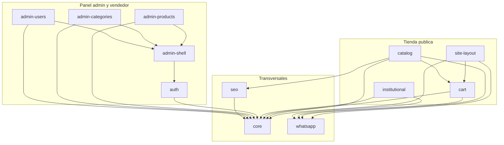

# Módulos del frontend · Librería Mi Sueño

|  |  |
| :---- | :---- |
| **Estado** | propuesta pendiente de confirmación |
| **Versión** | v2 |
| **Alcance** | Opción 2 |
| **Frontend** | Next.js 14 (App Router) + TypeScript + Tailwind CSS + shadcn/ui |
| **Hosting** | Vercel |
| **Consume** | API NestJS (`diagrama-clases-libreria-mi-sueno-v3.md`) |
| **Base de datos** | `diagrama-er-libreria-mi-sueno-v6.md` |
| **Referencia visual** | prototipo `libreria-mi-sueno.html` (solo como guía) |

> **Cambios respecto de v1**
>
> 1. Formulario de producto: sin subtítulo (se usa la descripción), SKU generado por el sistema y solo de lectura, oferta cargada por el usuario y estado como selector.
> 2. Carrito sin revalidación masiva: muestra los datos guardados y los actualiza cuando el cliente visita la ficha del producto.
> 3. Íconos de categorías resueltos en el frontend; sin contadores de productos por categoría.
> 4. Home con 5 destacados y 5 novedades.
> 5. Botón "Reactivar" en los listados del panel para productos, categorías y usuarios dados de baja.
> 6. Reseteo de contraseña de otro usuario: la clave temporal la genera el sistema y la envía por mail.

---

## Índice

1. [Criterios de arquitectura](#1-criterios-de-arquitectura)
2. [Mapa de rutas](#2-mapa-de-rutas)
3. [Módulos](#3-módulos)
   - [3.1 `core`](#31-core-transversal) · [3.2 `site-layout`](#32-site-layout) · [3.3 `catalog`](#33-catalog) · [3.4 `cart`](#34-cart)
   - [3.5 `whatsapp`](#35-whatsapp-transversal) · [3.6 `institutional`](#36-institutional) · [3.7 `seo`](#37-seo-transversal) · [3.8 `auth`](#38-auth)
   - [3.9 `admin-shell`](#39-admin-shell) · [3.10 `admin-products`](#310-admin-products) · [3.11 `admin-categories`](#311-admin-categories) · [3.12 `admin-users`](#312-admin-users-solo-admin)
4. [Pantallas y módulos](#4-pantallas-y-módulos)
5. [Estructura de carpetas](#5-estructura-de-carpetas)
6. [Decisiones tomadas](#6-decisiones-tomadas)

---

## 1. Criterios de arquitectura

### Organización por módulo funcional

Cada módulo agrupa todo lo de una funcionalidad (tipos, reglas, llamadas a la API, estado y componentes). Las rutas de `app/` solo componen módulos; no contienen lógica.

### Capas dentro de cada módulo

Con la misma regla de dependencias que el backend (de afuera hacia adentro):

| Capa | Contenido |
| :---- | :---- |
| `domain/` | Tipos y funciones puras (cálculo de totales, armado del mensaje de WhatsApp, reglas de stock). Sin React ni fetch; se testean con tests unitarios simples. |
| `application/` | Hooks, stores y acciones que orquestan el caso de uso (por ejemplo `useAddToCart`, `useLogin`). |
| `infrastructure/` | Llamadas a la API y conversión de las respuestas del backend a tipos del dominio. |
| `ui/` | Componentes. Solo usan `application` y `domain`; nunca llaman a la API directamente. |

### Tienda pública renderizada en el servidor

Las páginas públicas se generan con SSR/ISR para SEO y velocidad, con revalidación cada 60 segundos. Un cambio hecho en el panel se ve en la tienda en, como máximo, un minuto.

### Panel renderizado en el cliente

El refresh token vive en una cookie `HttpOnly` del dominio de la API (`api.libreriamisueno.com.ar`), así que el servidor de Next.js no la ve. El panel se protege del lado del cliente: al cargar pide un access token nuevo y, si falla, redirige al login.

> La seguridad real la aplica la API en cada endpoint.

### Librerías

| Uso | Librería |
| :---- | :---- |
| Formularios y validación | React Hook Form + Zod |
| Datos del panel (listados, mutaciones, caché) | TanStack Query |
| Carrito | Zustand + persistencia en `localStorage` |
| Ordenar imágenes con arrastre | dnd-kit |
| Íconos | lucide-react |

---

## 2. Mapa de rutas

### Tienda pública

| Ruta | Pantalla | Render | Acceso |
| :---- | :---- | :---- | :---- |
| `/` | Inicio | ISR | Público |
| `/productos` | Catálogo (`?q=&categoria=&pagina=`) | SSR | Público |
| `/productos/[slug]` | Ficha de producto | ISR | Público |
| `/sobre-nosotros` | Sobre nosotros | Estático | Público |
| Drawer global | Carrito | Cliente | Público |

### Autenticación

| Ruta | Pantalla | Render | Acceso |
| :---- | :---- | :---- | :---- |
| `/admin/login` | Login | Cliente | Público |
| `/admin/olvide-mi-contrasena` | Pedido de clave temporal | Cliente | Público |
| `/admin/cambiar-contrasena` | Cambio de contraseña (obligatorio o voluntario) | Cliente | Autenticado |

### Panel

| Ruta | Pantalla | Render | Acceso |
| :---- | :---- | :---- | :---- |
| `/admin/productos` | Listado de productos | Cliente | ADMIN, SELLER |
| `/admin/productos/nuevo` | Alta de producto | Cliente | ADMIN, SELLER |
| `/admin/productos/[id]` | Edición de producto | Cliente | ADMIN, SELLER |
| `/admin/categorias` | Listado de categorías | Cliente | ADMIN, SELLER |
| `/admin/categorias/nueva` | Alta de categoría | Cliente | ADMIN, SELLER |
| `/admin/categorias/[id]` | Edición de categoría | Cliente | ADMIN, SELLER |
| `/admin/usuarios` | Listado de usuarios | Cliente | ADMIN |
| `/admin/usuarios/nuevo` | Alta de usuario | Cliente | ADMIN |
| `/admin/usuarios/[id]` | Edición de usuario | Cliente | ADMIN |
| `/admin` | Redirige a `/admin/productos` | Cliente | Autenticado |

### SEO

| Ruta | Pantalla | Render | Acceso |
| :---- | :---- | :---- | :---- |
| `/sitemap.xml`, `/robots.txt` | SEO | Servidor | Público |

> Las rutas públicas usan slugs en español para SEO. El filtro de categoría usa el slug (`/productos?categoria=cuadernos`).

---

## 3. Módulos



---

### 3.1 `core` (transversal)

Base compartida por todos los módulos.

| Parte | Contenido |
| :---- | :---- |
| **Configuración del sitio (`site-config`)** | Nombre, número de WhatsApp, Instagram, dirección, horarios y mail de contacto, tomados de variables de entorno públicas. Los usan header, footer, "Sobre nosotros" y WhatsApp, así hay un único lugar para cambiarlos. |
| **Formateadores** | Precio en pesos (`Intl.NumberFormat('es-AR', { currency: 'ARS' })`) y fechas. |
| **Imágenes** | Loader propio de `next/image` que elige la variante WebP ya generada por el backend (400, 800 o 1200 px) según el ancho pedido. Evita pasar por la optimización de imágenes de Vercel, que tiene cupo limitado en el plan gratuito. |
| **Páginas de sistema** | `not-found`, `error` y `loading` globales. |

#### Cliente HTTP

`fetch` con la URL base de la API (`/api/v1`) y conversión de los errores del backend (400, 401, 403, 404, 409, 422) a un `ApiError` con mensaje en español.

- En el panel agrega el header `Authorization`.
- Ante un `401` pide un access token nuevo **una sola vez**, aunque fallen varias requests a la vez, y reintenta. Si el refresh también falla, cierra la sesión.

#### Componentes base

- **shadcn/ui:** botón, input, select, dialog, sheet, table, toast y skeleton.
- **Propios:** `Pagination`, `SearchInput` con debounce, `EmptyState` y `PriceTag` (precio con precio anterior tachado si hay oferta).

---

### 3.2 `site-layout`

Estructura común de la tienda pública.

| Parte | Contenido |
| :---- | :---- |
| **Header** | Logo y nombre, navegación (Inicio, Productos, Sobre nosotros), botón de WhatsApp, botón de carrito con contador y menú desplegable para mobile. Es sticky y marca la sección activa. |
| **Footer** | Descripción del local, redes (Instagram y WhatsApp), enlaces de tienda (catálogo y las categorías principales, traídas de la API con caché), servicios (impresiones, anillado, Rapipago), contacto, dirección y horarios. |
| **Layout público** (`app/(public)/layout.tsx`) | Monta header, footer y el drawer del carrito una sola vez para todas las páginas públicas. |

> **Requisitos que cubre:** header y footer iguales en todas las páginas, menú responsive, botón de WhatsApp y botón de carrito.

---

### 3.3 `catalog`

Todo lo que muestra productos y categorías al cliente.

#### Componente compartido

| Parte | Contenido |
| :---- | :---- |
| `ProductCard` | Imagen principal, categoría, título, precio (con precio anterior si hay oferta), badges Destacado / Nuevo / Oferta y botón "Agregar", que suma 1 unidad y abre el carrito. Toda la card enlaza a la ficha. |

#### Home

| Parte | Contenido |
| :---- | :---- |
| `HeroSection` | Título, buscador (redirige a `/productos?q=`), botón "Ver catálogo" y botón de WhatsApp. |
| `ServicesStrip` | Franja de servicios del prototipo (impresiones, anillado, Rapipago, retiro en el local). Contenido estático. |
| `FeaturedSection` / `NewArrivalsSection` | Hasta 5 destacados y 5 novedades (`GET /products/featured` y `/products/new`), en el orden que define `sortOrder`, con "Ver todo" al catálogo filtrado. En escritorio, grilla de 5 columnas; en tablet, 3; en mobile, fila con desplazamiento horizontal. |
| `CategoriesSection` | Tiles de categorías (`GET /categories`) que enlazan al catálogo filtrado. El ícono sale de un mapa local `slug → ícono` (lucide-react) con un ícono genérico para las categorías que no estén en el mapa. Como el slug es inmutable, la asociación no se rompe si se renombra la categoría. |

#### Catálogo

| Parte | Contenido |
| :---- | :---- |
| `CatalogPage` | Título, buscador, filtro de categorías (sidebar en escritorio, chips horizontales en mobile), contador de resultados, grilla de 20 productos, paginación y estado "Sin resultados". |
| Estado en la URL | Búsqueda, categoría y página viven en los query params: se puede compartir el enlace, el botón "atrás" funciona y Google indexa las páginas de categorías. |

#### Ficha de producto

| Parte | Contenido |
| :---- | :---- |
| `ProductGallery` | Imagen grande y miniaturas; al tocar una miniatura pasa a la vista grande. En mobile se desliza con el dedo. |
| `ProductInfo` | Breadcrumb (Inicio › Categoría principal › Producto), categoría, título, precio, stock ("¡Últimas N unidades!" si quedan 6 o menos; "Sin stock" si es 0), descripción, selector de cantidad (limitado al stock), "Agregar al carrito" y "Consultar por WhatsApp". |
| `RelatedProducts` | Productos similares que devuelve la API. |

#### Acceso a datos

| Parte | Contenido |
| :---- | :---- |
| `infrastructure` | Llamadas públicas con revalidación de 60 s: búsqueda, destacados, novedades, detalle por slug y árbol de categorías. |

> **Requisitos que cubre:** secciones de la home, catálogo con buscador, categorías y paginado, ficha completa y productos similares.

---

### 3.4 `cart`

Carrito del lado del cliente; no tiene tablas en la base.

#### Dominio

- `CartItem` con `productId`, `slug`, `title`, `unitPrice`, `imageUrl`, `quantity` y `stock`.
- Funciones puras para agregar, sumar, restar, quitar, calcular subtotal y total, y limitar la cantidad al stock.

#### Store

Zustand con persistencia en `localStorage` (clave versionada `lms-cart-v1`). Guarda una copia de los datos del producto (precio vigente, stock, imagen, slug) para mostrar el carrito sin llamar a la API.

#### Actualización de datos

El carrito no consulta la API por su cuenta. Cuando el cliente abre la ficha de un producto que ya está en el carrito, se actualizan precio, oferta y stock del ítem con los datos recién traídos; si el stock bajó, se ajusta la cantidad y se avisa.

#### Aviso en el drawer

"Precios y disponibilidad sujetos a confirmación por WhatsApp", porque los datos guardados pueden haber cambiado. La confirmación final la hace el vendedor al responder el pedido.

#### `CartDrawer`

- Panel lateral con botón de cierre, listado (imagen, título, precio unitario, selector +/−, subtotal y "Quitar"), total y botón "Reservar por WhatsApp".
- Estado vacío con acceso al catálogo.
- Se cierra con `Esc` o tocando fuera, y mantiene el foco dentro mientras está abierto (accesibilidad).

#### Contador del header

Cantidad total de unidades.

> **Requisitos que cubre:** carrito con cantidades, precios, subtotal y total, guardado en el navegador y envío por WhatsApp.

---

### 3.5 `whatsapp` (transversal)

Funciones puras que arman los enlaces `wa.me` con el número de `site-config`:

| Enlace | Mensaje |
| :---- | :---- |
| Consulta general | "¡Hola Librería Mi Sueño! Quería hacer una consulta." |
| Consulta por producto | "¡Hola! Quería consultar por: {título} ({precio}). ¿Está disponible?" + enlace a la ficha |
| Pedido del carrito | Encabezado, una línea por ítem con `• {cantidad}× {título} — {subtotal}`, total y pregunta de retiro, igual a lo que muestra el carrito |

**Ejemplo del mensaje del pedido:**

```text
¡Hola Librería Mi Sueño! 🌼 Quiero reservar este pedido:

• 2× Cuaderno Rivadavia A4 rayado — $ 9.800
• 1× Caja de lápices de colores x24 — $ 6.500

Total: $ 16.300

¿Está disponible para pasar a buscarlo por el local?
```

> Los productos en oferta se envían con el precio de oferta vigente. Después de enviar, el carrito **no** se vacía solo (el cliente puede no completar el envío en WhatsApp); ofrece un botón "Vaciar carrito".

---

### 3.6 `institutional`

| Parte | Contenido |
| :---- | :---- |
| **`AboutTeaser`** | Bloque resumido de "Sobre nosotros" en la home, con botón a la página completa. |
| **`AboutPage`** | Título, descripción, botones "Escribinos" (WhatsApp) y "Ver productos", tres cards de valores (atención cercana, servicios al instante, reservá y retirá) y sección de visita con dirección, horarios y botón para hablar por WhatsApp. |
| **Textos** | En un archivo de contenido dentro del módulo, fácil de editar sin tocar componentes. |

---

### 3.7 `seo` (transversal)

| Parte | Contenido |
| :---- | :---- |
| **Metadatos** | Título, descripción y Open Graph por página; en la ficha usan título, descripción e imagen del producto. |
| **Datos estructurados** | JSON-LD `Product` (precio, disponibilidad) en la ficha y `LocalBusiness` (dirección, horarios, teléfono) en inicio y "Sobre nosotros". |
| **Sitemap y robots** | `sitemap.xml` generado desde la API (productos y categorías visibles) y `robots.txt` que excluye `/admin`. |
| **URL canónica** | El catálogo filtrado declara su canónica para no generar contenido duplicado por combinaciones de filtros. |

---

### 3.8 `auth`

#### Sesión

Store en memoria con access token, usuario (id, nombre, email, rol, `mustChangePassword`) y estado (`cargando`, `autenticado`, `anónimo`). El access token nunca se guarda en `localStorage`.

#### Arranque del panel

Al entrar a cualquier ruta `/admin`, llama a `POST /auth/refresh` (la cookie viaja sola con `credentials: 'include'`) y muestra un loader mientras tanto.

#### Guards de ruta

| Guard | Comportamiento |
| :---- | :---- |
| `RequireAuth` | Sin sesión, redirige a `/admin/login?next=...`. |
| `RequirePasswordChange` | Con `mustChangePassword`, redirige a `/admin/cambiar-contrasena` desde cualquier otra ruta. |
| `RequireRole` | Un vendedor que entra a `/admin/usuarios` ve "Sin permisos". |

#### Pantallas y acciones

| Pantalla / acción | Contenido |
| :---- | :---- |
| **`LoginPage`** | Email, contraseña (con mostrar/ocultar), botón "Iniciar sesión", enlace "Olvidé mi contraseña", mensaje genérico ante credenciales inválidas y aviso ante demasiados intentos (`429`). |
| **`ForgotPasswordPage`** | Campo email; siempre muestra el mismo mensaje ("Si el email existe, te enviamos una contraseña temporal") para no revelar qué cuentas existen. |
| **`ChangePasswordPage`** | Contraseña actual (o la temporal), nueva y confirmación, con las reglas visibles (8 a 128 caracteres, distinta de la actual). En modo obligatorio no se puede salir salvo cerrando sesión. |
| **Logout** | `POST /auth/logout`, limpia la sesión y vuelve al login. |

---

### 3.9 `admin-shell`

#### Layout del panel

- Sidebar con Productos, Categorías y Usuarios (este último solo para ADMIN); en mobile se colapsa en menú.
- Barra superior con nombre, rol, "Cambiar contraseña" y "Cerrar sesión".

#### Componentes compartidos del panel

| Componente | Contenido |
| :---- | :---- |
| `DataTable` | Tabla con columnas configurables; en mobile pasa a cards. |
| `ListToolbar` | Buscador con debounce, filtro de estado (Activos, Inactivos, Dados de baja, Todos) y botón "Agregar". |
| Paginación y ordenamiento | — |
| `ConfirmDialog` | Para bajas. |
| Toasts | De éxito y error. |
| `StatusBadge` | — |
| `FormActions` | Guardar / Cancelar, con aviso si se sale con cambios sin guardar. |

#### Errores de la API

Los `409` y `422` se muestran como mensaje del formulario o del campo afectado (por ejemplo, "Ya existe un producto con ese SKU").

---

### 3.10 `admin-products`

#### Listado

- **Columnas:** miniatura, SKU (generado por el sistema), título, categoría principal, precio (y precio de oferta), stock, badges Destacado / Nuevo / Oferta, estado y fecha de modificación.
- Buscador por título o SKU, filtros por categoría y estado, orden por columna y paginación.
- Botón "Agregar producto".
- **Por fila:** "Editar" y "Dar de baja", con confirmación. En los productos dados de baja (filtro "Dados de baja" o "Todos"), el botón es "Reactivar".

#### Formulario

Alta y edición comparten componente.

| Campo | Comportamiento |
| :---- | :---- |
| **Datos** | Título, descripción, precio y stock. No hay subtítulo. |
| **SKU** | Lo genera el sistema al crear el producto. En la edición se muestra como dato de solo lectura; no aparece en el alta. |
| **Oferta** | La carga el usuario con un check "En oferta" que habilita el precio de oferta (debe ser menor al precio) y un vencimiento opcional. |
| **Marcas** | Destacado, nuevo con vencimiento opcional ("nuevo hasta") y posición (`sortOrder`). |
| **Categorías** | Selector múltiple con elección de la categoría principal. |
| **Productos similares** | Selector con búsqueda asíncrona que excluye al propio producto. |
| **Estado** | Selector con "Activo" (visible en la tienda) e "Inactivo" (oculto). La baja y la reactivación son acciones del listado, no opciones del selector. |

#### `ImageManager`

- Carga desde la PC o la galería/cámara del celular (`accept="image/jpeg,image/png,image/webp"`), de 1 a 5 imágenes.
- Vista previa inmediata y reordenamiento por arrastre (con botones ↑ ↓ como alternativa accesible). La primera es la principal.
- Texto alternativo por imagen.
- Validación de tipo y tamaño (10 MB) antes de subir.
- En **alta**, las imágenes viajan junto con el producto en un único envío multipart.
- En **edición**, cada acción usa su endpoint: agregar, reemplazar, reordenar, editar texto alternativo y eliminar. No permite eliminar la última imagen.
- Muestra el estado de cada imagen (Procesando / Lista / Error) y ofrece "Reintentar" en las que fallaron. Mientras haya imágenes procesándose, consulta el estado cada pocos segundos.

---

### 3.11 `admin-categories`

#### Listado

Nombre (con sangría según el nivel), categoría padre, cantidad de productos, posición, estado, buscador, filtro de estado y paginación. Botón "Agregar categoría"; por fila, "Editar" y "Dar de baja", o "Reactivar" si está dada de baja.

> Si la reactivación falla (el nombre lo usa otra categoría o el padre está dado de baja), muestra el motivo.

#### Formulario

Nombre, descripción, categoría padre (el selector excluye a la propia categoría y a sus descendientes), posición y estado activo.

#### Baja

Si la API la rechaza (tiene subcategorías activas o es la única categoría de algún producto), muestra el motivo y cuántos elementos la bloquean.

---

### 3.12 `admin-users` (solo ADMIN)

#### Listado

Nombre, email, rol, estado (activo / inactivo / dado de baja), "debe cambiar contraseña" y último acceso, con buscador, filtro de rol y estado, y paginación. Botón "Agregar usuario"; por fila, "Editar", "Enviar contraseña temporal" y "Dar de baja", o "Reactivar" si está dado de baja.

#### Alta

Nombre, email, contraseña, confirmación de contraseña y rol. La contraseña ingresada es temporal: el usuario debe cambiarla en su primer ingreso.

#### Edición

Nombre, email, rol y estado. La contraseña **no** se edita acá: se usa "Enviar contraseña temporal", que envía un mail con una clave nueva y obliga a cambiarla al entrar.

#### Protecciones de interfaz

En la fila del propio usuario se deshabilitan "Dar de baja", el cambio de rol y la desactivación, con un texto que explica por qué.

> La API aplica las mismas reglas igual.

---

## 4. Pantallas y módulos

| Pantalla | Módulos | Componentes principales |
| :---- | :---- | :---- |
| Inicio | `site-layout`, `catalog`, `institutional`, `cart`, `whatsapp`, `seo` | Header, HeroSection, ServicesStrip, FeaturedSection, CategoriesSection, NewArrivalsSection, AboutTeaser, Footer |
| Catálogo | `site-layout`, `catalog`, `cart`, `seo` | Header, SearchInput, CategoryFilter, ProductGrid, Pagination, Footer |
| Producto | `site-layout`, `catalog`, `cart`, `whatsapp`, `seo` | Header, Breadcrumb, ProductGallery, ProductInfo, RelatedProducts, Footer |
| Sobre nosotros | `site-layout`, `institutional`, `whatsapp`, `seo` | Header, AboutPage, Footer |
| Carrito | `cart`, `whatsapp` | CartDrawer |
| Login / Olvidé mi contraseña / Cambiar contraseña | `auth` | LoginPage, ForgotPasswordPage, ChangePasswordPage |
| Listado de productos | `admin-shell`, `admin-products` | DataTable, ListToolbar, ConfirmDialog |
| ABM de producto | `admin-shell`, `admin-products` | ProductForm, ImageManager |
| Listado de categorías | `admin-shell`, `admin-categories` | DataTable, ListToolbar, ConfirmDialog |
| ABM de categoría | `admin-shell`, `admin-categories` | CategoryForm |
| Listado de usuarios | `admin-shell`, `admin-users` | DataTable, ListToolbar, ConfirmDialog |
| ABM de usuario | `admin-shell`, `admin-users` | UserForm |

---

## 5. Estructura de carpetas

```text
src/
├── app/
│   ├── (public)/
│   │   ├── layout.tsx                  # Header, Footer, CartDrawer
│   │   ├── page.tsx                    # Inicio
│   │   ├── productos/page.tsx
│   │   ├── productos/[slug]/page.tsx
│   │   └── sobre-nosotros/page.tsx
│   ├── admin/
│   │   ├── layout.tsx                  # AuthProvider (arranque de sesión)
│   │   ├── login/page.tsx
│   │   ├── olvide-mi-contrasena/page.tsx
│   │   ├── cambiar-contrasena/page.tsx
│   │   └── (panel)/
│   │       ├── layout.tsx              # AdminShell + guards
│   │       ├── page.tsx                # redirige a productos
│   │       ├── productos/  page.tsx  nuevo/page.tsx  [id]/page.tsx
│   │       ├── categorias/ page.tsx  nueva/page.tsx  [id]/page.tsx
│   │       └── usuarios/   page.tsx  nuevo/page.tsx  [id]/page.tsx
│   ├── sitemap.ts
│   ├── robots.ts
│   ├── not-found.tsx
│   └── error.tsx
└── modules/
    ├── core/               config/ http/ formatters/ images/ ui/
    ├── site-layout/        ui/
    ├── catalog/            domain/ application/ infrastructure/ ui/
    ├── cart/               domain/ application/ infrastructure/ ui/
    ├── whatsapp/           domain/
    ├── institutional/      content/ ui/
    ├── seo/                domain/ ui/
    ├── auth/               domain/ application/ infrastructure/ ui/
    ├── admin-shell/        application/ ui/
    ├── admin-products/     domain/ application/ infrastructure/ ui/
    ├── admin-categories/   domain/ application/ infrastructure/ ui/
    └── admin-users/        domain/ application/ infrastructure/ ui/
```

---

## 6. Decisiones tomadas

| # | Tema | Decisión | Impacto |
| :---- | :---- | :---- | :---- |
| 1 | Subtítulo del producto | No existe: el campo es la descripción | Sin cambios en backend ni DDL |
| 2 | SKU, oferta y estado en el formulario | SKU generado por el sistema, no editable; oferta y estado los carga el usuario; estado como selector Activo / Inactivo | DDL v6 (secuencia, formato y trigger de inmutabilidad) y diagrama de clases v3 (`SkuGenerator`) |
| 3 | Posición de destacados y novedades | `sort_order` para ambos, con la fecha de creación como desempate | DDL v6 (índices) y reglas de `CatalogQueries` |
| 4 | Login | Con email; "usuario" en el ABM es el nombre visible | Sin cambios |
| 5 | Reseteo de contraseña por el admin | El sistema genera la clave temporal y la envía por mail; obliga a cambiarla al entrar | `ResetUserPasswordUseCase` en el diagrama de clases v3 |
| 6 | Pantallas de olvido y cambio de contraseña | Incluidas | Módulo `auth` |
| 7 | Revalidación del carrito | Sin endpoint por ids; el carrito usa sus datos guardados y se actualiza al visitar la ficha | Sin cambios en backend |
| 8 | Íconos de categorías | Resueltos en el frontend por slug; sin contadores de productos | Sin cambios en backend ni DDL |
| 9 | Cantidad de destacados y novedades | 5 de cada uno | Sin cambios (ya era el límite del backend) |
| 10 | Bajas | Lógicas, con opción de reactivar, para productos, categorías y usuarios | Endpoints `restore` en el diagrama de clases v3 |
